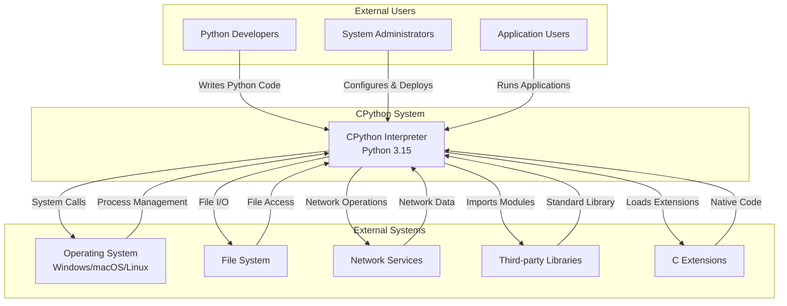
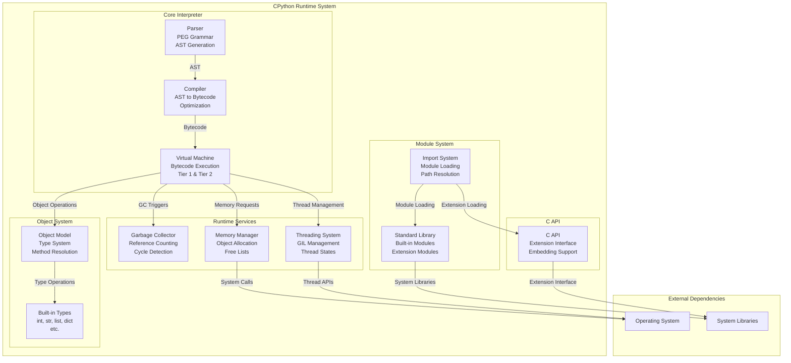
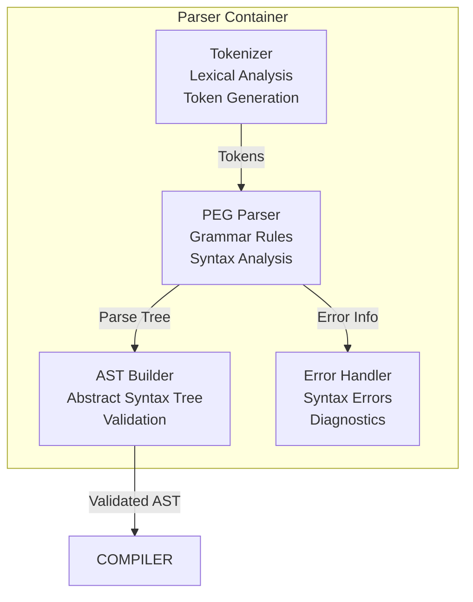
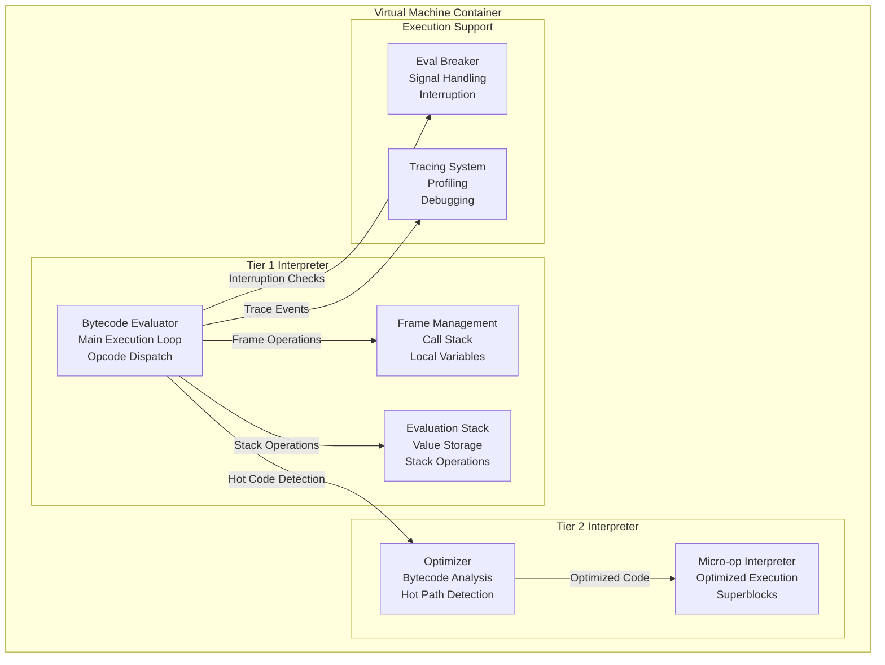
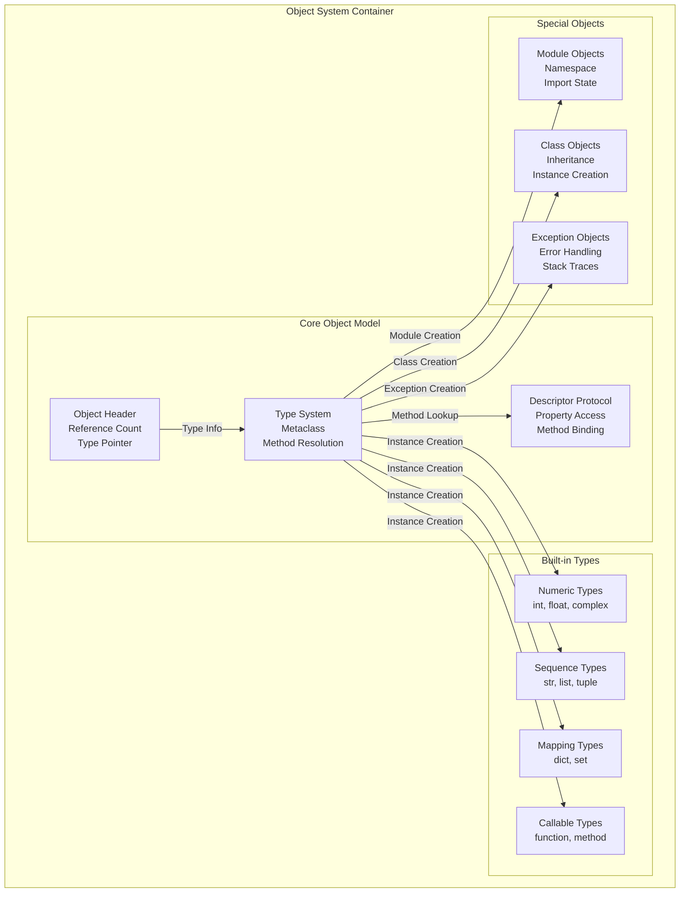
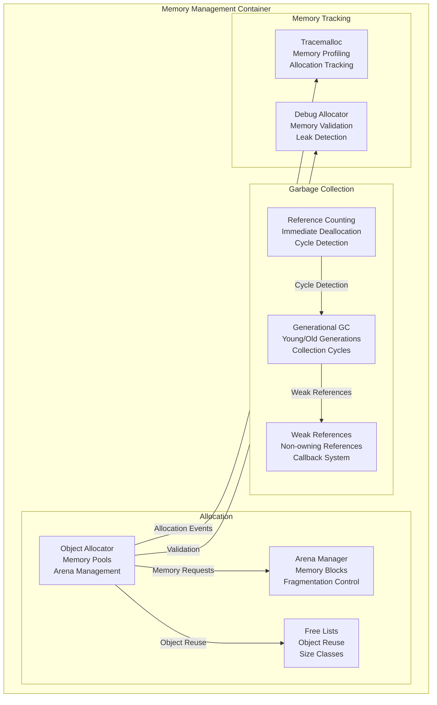
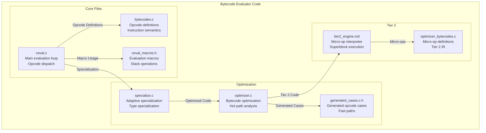
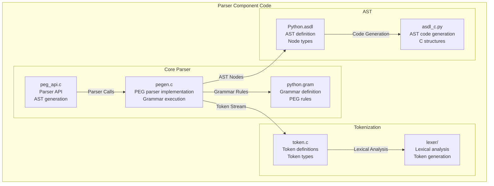
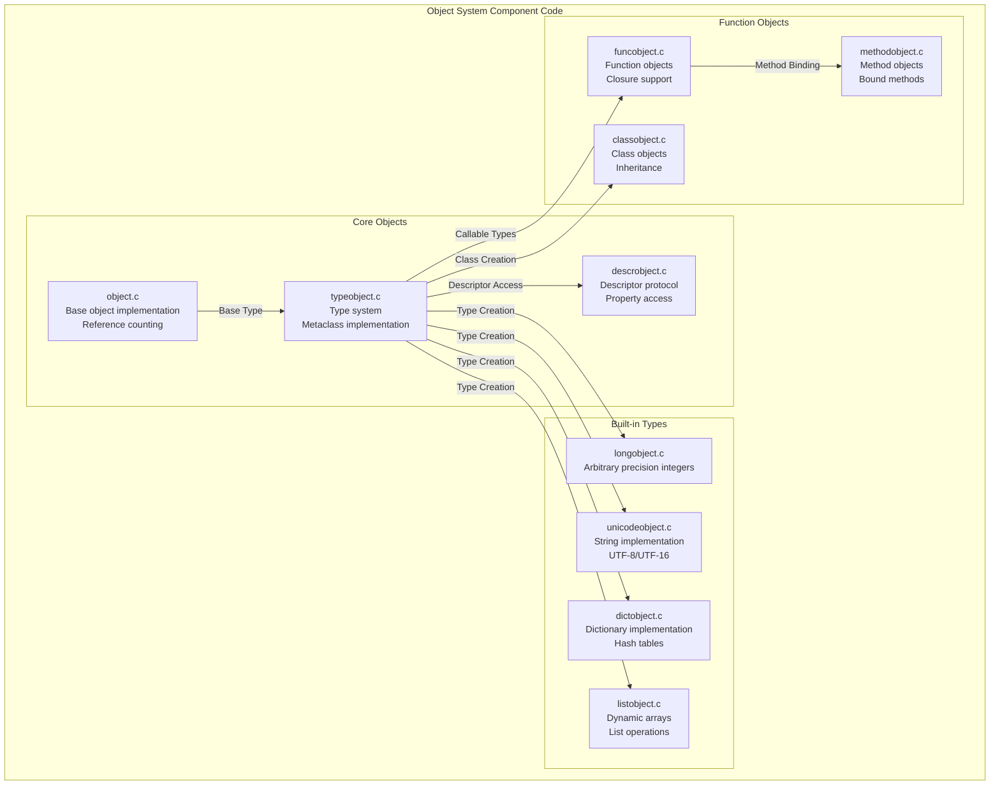
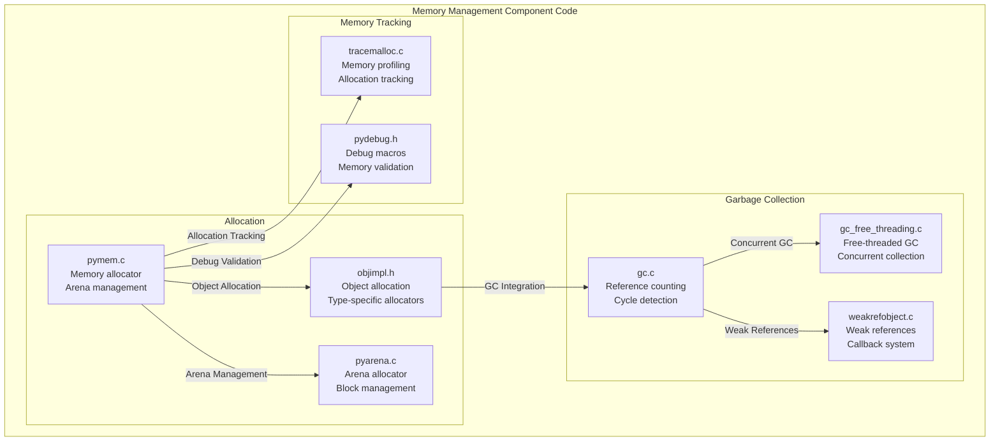

# CPython C4 Model Architecture Diagrams

This document contains comprehensive C4 model diagrams for the CPython codebase, from high-level system context down to detailed code structure.

## Level 1: System Context Diagram

## Level 2: Container Diagram

## Level 3: Component Diagrams

### Parser Container Components

### Virtual Machine Container Components

### Object System Container Components

### Memory Management Container Components

## Level 4: Code Diagrams

### Bytecode Evaluator Component Code Structure

### Parser Component Code Structure

### Object System Component Code Structure

### Memory Management Component Code Structure

## Key Architectural Patterns

### 1. Layered Architecture
- **Parser Layer**: Converts source code to AST
- **Compiler Layer**: Transforms AST to bytecode
- **VM Layer**: Executes bytecode
- **Object Layer**: Manages Python objects
- **Memory Layer**: Handles allocation and garbage collection

### 2. Interpreter Pattern
- **Tier 1**: Traditional bytecode interpreter with adaptive specialization
- **Tier 2**: Micro-op interpreter for hot code paths
- **JIT**: Future machine code generation for performance-critical code

### 3. Object-Oriented Design
- **Everything is an Object**: All Python values are objects
- **Type System**: Dynamic typing with runtime type checking
- **Method Resolution**: Dynamic method lookup and binding

### 4. Memory Management
- **Reference Counting**: Immediate deallocation for most objects
- **Generational GC**: Cycle detection for complex object graphs
- **Arena Allocation**: Efficient memory management for small objects

### 5. Extension System
- **C API**: Rich interface for C extensions
- **Module System**: Dynamic loading of Python and C modules
- **Import System**: Flexible module discovery and loading

## Performance Optimizations

### 1. Adaptive Specialization
- **Type Specialization**: Optimized code paths for common types
- **Inline Caching**: Fast method and attribute access
- **Superinstructions**: Combined bytecode operations

### 2. Memory Optimizations
- **Free Lists**: Object reuse to reduce allocation overhead
- **Arena Allocation**: Reduced fragmentation and improved locality
- **Copy-on-Write**: Efficient string and tuple operations

### 3. Execution Optimizations
- **Computed Gotos**: Fast opcode dispatch
- **Stack Caching**: Reduced memory access for local variables
- **Tier 2 Interpreter**: Optimized execution for hot code paths

This comprehensive C4 model provides a complete view of the CPython architecture, from high-level system interactions down to detailed code structure, enabling effective contribution to the CPython codebase.
