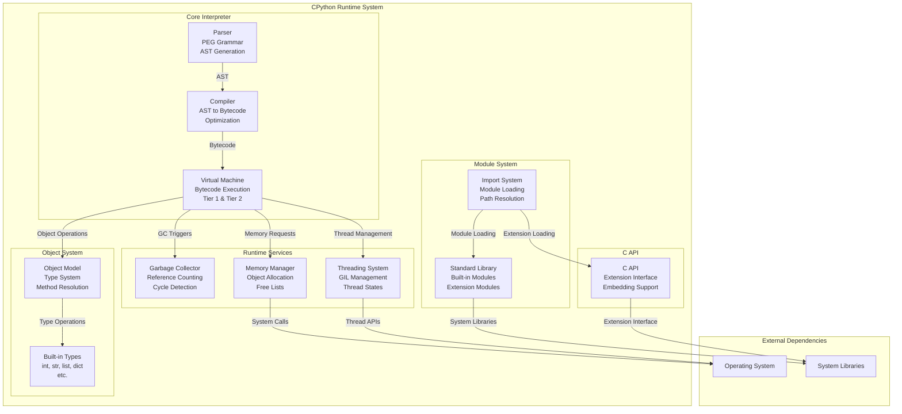

## Level 2: Container Diagram

```mermaid
graph TB
    subgraph "CPython Runtime System"
        subgraph "Core Interpreter"
            PARSER[Parser<br/>PEG Grammar<br/>AST Generation]
            COMPILER[Compiler<br/>AST to Bytecode<br/>Optimization]
            VM[Virtual Machine<br/>Bytecode Execution<br/>Tier 1 & Tier 2]
        end
        
        subgraph "Runtime Services"
            GC[Garbage Collector<br/>Reference Counting<br/>Cycle Detection]
            MEM[Memory Manager<br/>Object Allocation<br/>Free Lists]
            THREAD[Threading System<br/>GIL Management<br/>Thread States]
        end
        
        subgraph "Object System"
            OBJ[Object Model<br/>Type System<br/>Method Resolution]
            BUILTIN[Built-in Types<br/>int, str, list, dict<br/>etc.]
        end
        
        subgraph "Module System"
            IMPORT[Import System<br/>Module Loading<br/>Path Resolution]
            STDLIB[Standard Library<br/>Built-in Modules<br/>Extension Modules]
        end
        
        subgraph "C API"
            CAPI[C API<br/>Extension Interface<br/>Embedding Support]
        end
    end
    
    subgraph "External Dependencies"
        OS2[Operating System]
        LIBS[System Libraries]
    end
    
    PARSER -->|"AST"| COMPILER
    COMPILER -->|"Bytecode"| VM
    VM -->|"Object Operations"| OBJ
    VM -->|"Memory Requests"| MEM
    VM -->|"GC Triggers"| GC
    VM -->|"Thread Management"| THREAD
    
    OBJ -->|"Type Operations"| BUILTIN
    IMPORT -->|"Module Loading"| STDLIB
    IMPORT -->|"Extension Loading"| CAPI
    
    MEM -->|"System Calls"| OS2
    THREAD -->|"Thread APIs"| OS2
    STDLIB -->|"System Libraries"| LIBS
    CAPI -->|"Extension Interface"| LIBS
```
