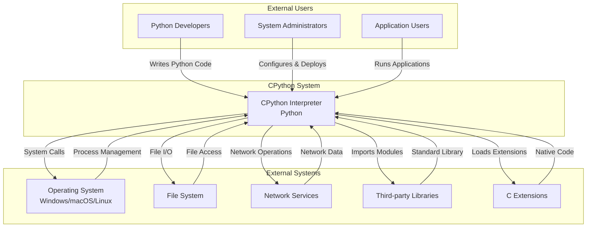

## Level 1: System Context Diagram

```mermaid
graph TB
    subgraph "External Users"
        DEV[Python Developers]
        SYS[System Administrators]
        APP[Application Users]
    end
    
    subgraph "External Systems"
        OS[Operating System<br/>Windows/macOS/Linux]
        FS[File System]
        NET[Network Services]
        LIB[Third-party Libraries]
        EXT[C Extensions]
    end
    
    subgraph "CPython System"
        CPY[CPython Interpreter<br/>Python]
    end
    
    DEV -->|"Writes Python Code"| CPY
    SYS -->|"Configures & Deploys"| CPY
    APP -->|"Runs Applications"| CPY
    
    CPY -->|"System Calls"| OS
    CPY -->|"File I/O"| FS
    CPY -->|"Network Operations"| NET
    CPY -->|"Imports Modules"| LIB
    CPY -->|"Loads Extensions"| EXT
    
    OS -->|"Process Management"| CPY
    FS -->|"File Access"| CPY
    NET -->|"Network Data"| CPY
    LIB -->|"Standard Library"| CPY
    EXT -->|"Native Code"| CPY
```