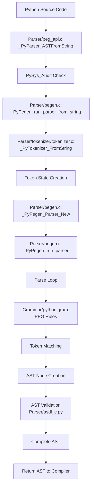
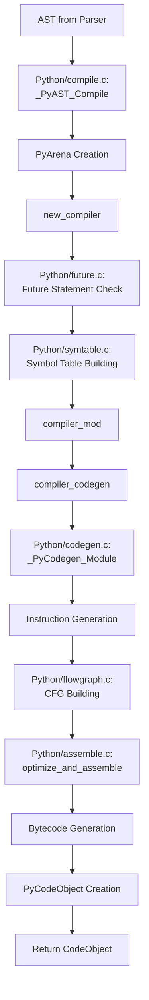
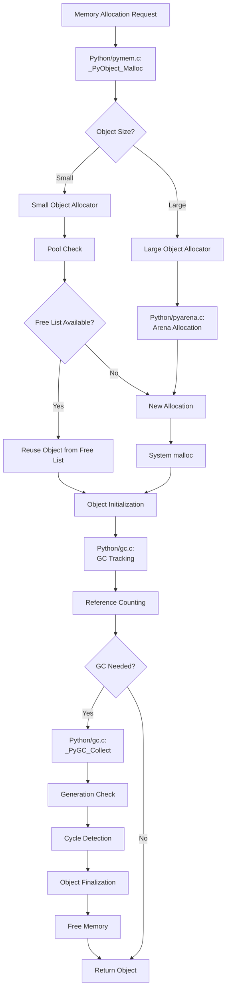
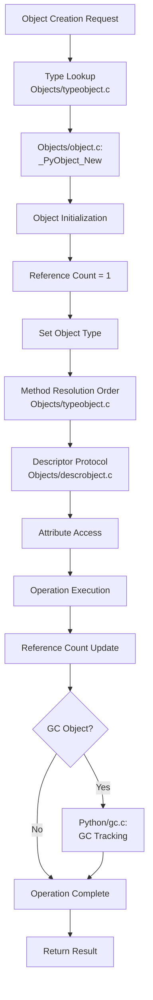
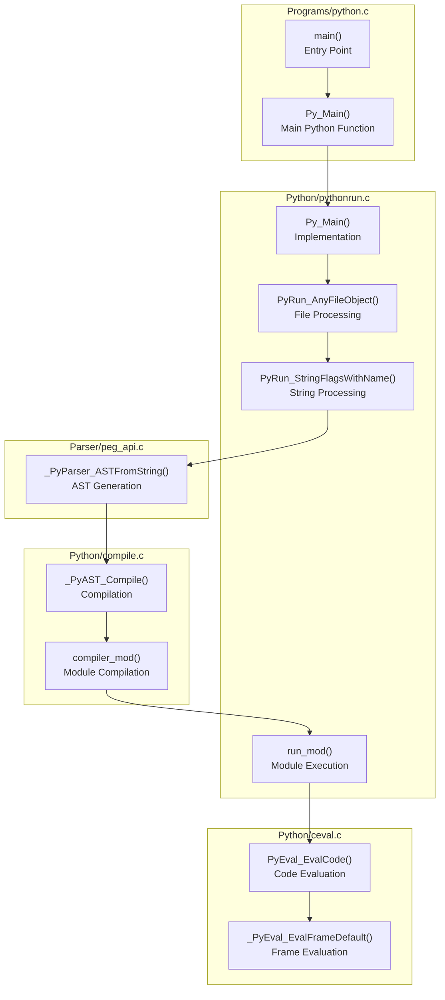
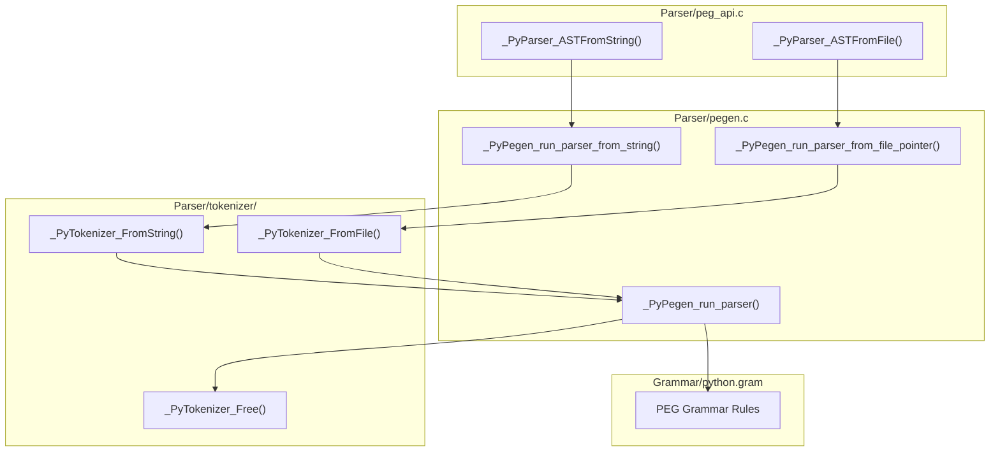
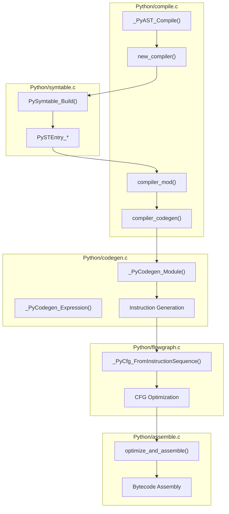
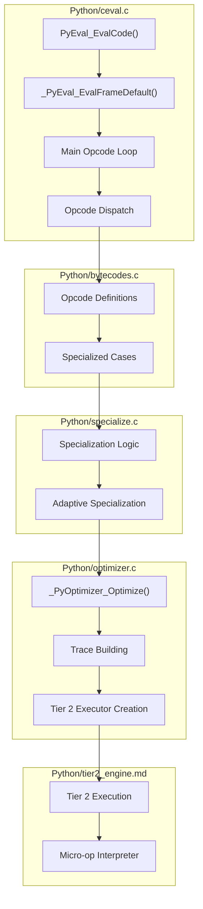

# CPython Extended C4 Model with Detailed Execution Flowcharts

This document extends the original C4 model with detailed flowcharts showing the complete execution flow from Python source code to the lowest level, including specific file names and function calls.

## Level 1: System Context with Execution Flow

```mermaid
graph TB
    subgraph "External Users"
        DEV[Python Developers<br/>Writing Python Code]
    end
    
    subgraph "CPython System - Complete Execution Flow"
        MAIN[Program Entry Point<br/>Programs/python.c:main()]
        PYTHONRUN[Python Runtime<br/>Python/pythonrun.c]
        PARSER[Parser System<br/>Parser/]
        COMPILER[Compiler System<br/>Python/compile.c]
        VM[Virtual Machine<br/>Python/ceval.c]
        OBJECTS[Object System<br/>Objects/]
        MEMORY[Memory Management<br/>Python/gc.c, pymem.c]
    end
    
    DEV -->|"Python Source Code"| MAIN
    MAIN -->|"Py_Main()"| PYTHONRUN
    PYTHONRUN -->|"Parse & Compile"| PARSER
    PARSER -->|"AST"| COMPILER
    COMPILER -->|"Bytecode"| VM
    VM -->|"Object Operations"| OBJECTS
    OBJECTS -->|"Memory Requests"| MEMORY
```

## Level 2: Container Diagram with File-Level Flow

```mermaid
graph TB
    subgraph "CPython Execution Pipeline"
        subgraph "Entry & Runtime"
            MAIN_FILE["Programs/python.c<br/>main() → Py_Main()"]
            RUN_FILE["Python/pythonrun.c<br/>PyRun_AnyFileObject()"]
        end
        
        subgraph "Parsing Pipeline"
            PARSE_API["Parser/peg_api.c<br/>_PyParser_ASTFromString()"]
            PEGEN["Parser/pegen.c<br/>_PyPegen_run_parser()"]
            TOKENIZER["Parser/tokenizer/<br/>Token Generation"]
            GRAMMAR["Grammar/python.gram<br/>PEG Grammar Rules"]
        end
        
        subgraph "Compilation Pipeline"
            COMPILE["Python/compile.c<br/>_PyAST_Compile()"]
            CODEGEN["Python/codegen.c<br/>Instruction Generation"]
            FLOWGRAPH["Python/flowgraph.c<br/>Control Flow Graph"]
            ASSEMBLER["Python/assemble.c<br/>Bytecode Assembly"]
        end
        
        subgraph "Execution Pipeline"
            CEVAL["Python/ceval.c<br/>_PyEval_EvalFrameDefault()"]
            OPTIMIZER["Python/optimizer.c<br/>_PyOptimizer_Optimize()"]
            BYTECODES["Python/bytecodes.c<br/>Opcode Definitions"]
        end
        
        subgraph "Object & Memory"
            OBJECTS_FILE["Objects/object.c<br/>PyObject Operations"]
            GC_FILE["Python/gc.c<br/>Garbage Collection"]
            MEM_FILE["Python/pymem.c<br/>Memory Allocation"]
        end
    end
    
    MAIN_FILE -->|"File Processing"| RUN_FILE
    RUN_FILE -->|"Source → AST"| PARSE_API
    PARSE_API -->|"Parse Tree"| PEGEN
    PEGEN -->|"Tokens"| TOKENIZER
    TOKENIZER -->|"Grammar Rules"| GRAMMAR
    PEGEN -->|"AST"| COMPILE
    COMPILE -->|"Instructions"| CODEGEN
    CODEGEN -->|"CFG"| FLOWGRAPH
    FLOWGRAPH -->|"Bytecode"| ASSEMBLER
    ASSEMBLER -->|"CodeObject"| CEVAL
    CEVAL -->|"Hot Code"| OPTIMIZER
    CEVAL -->|"Opcode Dispatch"| BYTECODES
    CEVAL -->|"Object Creation"| OBJECTS_FILE
    OBJECTS_FILE -->|"GC Triggers"| GC_FILE
    OBJECTS_FILE -->|"Memory Requests"| MEM_FILE
```



## Level 3: Detailed Execution Flowcharts

### Complete Python Code Execution Flow

```mermaid
flowchart TD
    START([Python Source Code<br/>print('Hello World')]) --> MAIN_ENTRY[Programs/python.c:main]
    
    MAIN_ENTRY --> PY_MAIN[Py_Main in Python/pythonrun.c]
    PY_MAIN --> RUN_FILE[PyRun_AnyFileObject]
    
    RUN_FILE --> CHECK_INTERACTIVE{Interactive Mode?}
    CHECK_INTERACTIVE -->|Yes| INTERACTIVE[PyRun_InteractiveLoopObject]
    CHECK_INTERACTIVE -->|No| SIMPLE_FILE[PyRun_SimpleFileObject]
    
    INTERACTIVE --> PARSE_STRING[PyRun_StringFlagsWithName]
    SIMPLE_FILE --> PARSE_STRING
    
    PARSE_STRING --> PARSE_API[Parser/peg_api.c:<br/>_PyParser_ASTFromString]
    
    PARSE_API --> TOKENIZE[Parser/tokenizer/tokenizer.c:<br/>_PyTokenizer_FromString]
    TOKENIZE --> TOKENS[Token Stream]
    
    TOKENS --> PEG_PARSE[Parser/pegen.c:<br/>_PyPegen_run_parser]
    PEG_PARSE --> GRAMMAR_CHECK[Grammar/python.gram:<br/>PEG Grammar Rules]
    GRAMMAR_CHECK --> AST_BUILD[AST Construction]
    
    AST_BUILD --> AST_VALIDATE[AST Validation]
    AST_VALIDATE --> COMPILE_ENTRY[Python/compile.c:<br/>_PyAST_Compile]
    
    COMPILE_ENTRY --> SYMTABLE[Python/symtable.c:<br/>Symbol Table Building]
    SYMTABLE --> CODEGEN_ENTRY[Python/codegen.c:<br/>Instruction Generation]
    
    CODEGEN_ENTRY --> FLOWGRAPH_BUILD[Python/flowgraph.c:<br/>Control Flow Graph]
    FLOWGRAPH_BUILD --> OPTIMIZE[Python/assemble.c:<br/>Optimize and Assemble]
    OPTIMIZE --> BYTECODE[Bytecode Generation]
    
    BYTECODE --> CODE_OBJECT[PyCodeObject Creation]
    CODE_OBJECT --> EXEC_ENTRY[Python/pythonrun.c:<br/>run_eval_code_obj]
    
    EXEC_ENTRY --> EVAL_CODE[Python/ceval.c:<br/>PyEval_EvalCode]
    EVAL_CODE --> FRAME_CREATE[Frame Creation]
    FRAME_CREATE --> EVAL_FRAME[Python/ceval.c:<br/>_PyEval_EvalFrameDefault]
    
    EVAL_FRAME --> OPCODE_LOOP[Main Opcode Loop]
    OPCODE_LOOP --> DISPATCH[Opcode Dispatch<br/>Python/bytecodes.c]
    
    DISPATCH --> CHECK_HOT{Hot Code?}
    CHECK_HOT -->|Yes| OPTIMIZER[Python/optimizer.c:<br/>_PyOptimizer_Optimize]
    CHECK_HOT -->|No| EXECUTE_OP[Execute Opcode]
    
    OPTIMIZER --> TIER2[Python/tier2_engine.md:<br/>Tier 2 Interpreter]
    TIER2 --> EXECUTE_OP
    
    EXECUTE_OP --> OBJECT_OPS[Objects/object.c:<br/>Object Operations]
    OBJECT_OPS --> MEMORY_ALLOC[Python/pymem.c:<br/>Memory Allocation]
    MEMORY_ALLOC --> GC_CHECK[Python/gc.c:<br/>Garbage Collection]
    
    GC_CHECK --> STACK_UPDATE[Stack Operations]
    STACK_UPDATE --> NEXT_OPCODE{More Opcodes?}
    NEXT_OPCODE -->|Yes| OPCODE_LOOP
    NEXT_OPCODE -->|No| RETURN_RESULT[Return Result]
    
    RETURN_RESULT --> END([Execution Complete])
```

### Parser Detailed Flow



### Compiler Detailed Flow



### Virtual Machine Execution Flow

```mermaid
flowchart TD
    CODE_OBJECT[PyCodeObject] --> EVAL_ENTRY[Python/ceval.c:<br/>PyEval_EvalCode]
    
    EVAL_ENTRY --> FRAME_CREATE[Frame Creation<br/>Python/frame.c]
    FRAME_CREATE --> EVAL_FRAME[Python/ceval.c:<br/>_PyEval_EvalFrameDefault]
    
    EVAL_FRAME --> RECURSION_CHECK[Recursion Check]
    RECURSION_CHECK --> FRAME_SETUP[Frame Setup]
    
    FRAME_SETUP --> OPCODE_LOOP[Main Opcode Loop]
    OPCODE_LOOP --> FETCH_OPCODE[Fetch Opcode]
    
    FETCH_OPCODE --> DISPATCH[Opcode Dispatch<br/>Python/bytecodes.c]
    DISPATCH --> SPECIALIZE{Specialized?}
    
    SPECIALIZE -->|Yes| SPECIALIZED_EXEC[Specialized Execution<br/>Python/specialize.c]
    SPECIALIZE -->|No| GENERIC_EXEC[Generic Execution]
    
    SPECIALIZED_EXEC --> HOT_CHECK{Hot Code?}
    GENERIC_EXEC --> HOT_CHECK
    
    HOT_CHECK -->|Yes| OPTIMIZER_CALL[Python/optimizer.c:<br/>_PyOptimizer_Optimize]
    HOT_CHECK -->|No| EXECUTE_INSTR[Execute Instruction]
    
    OPTIMIZER_CALL --> TIER2_CREATE[Tier 2 Executor Creation]
    TIER2_CREATE --> TIER2_EXEC[Python/tier2_engine.md:<br/>Tier 2 Execution]
    TIER2_EXEC --> EXECUTE_INSTR
    
    EXECUTE_INSTR --> OBJECT_CREATE[Objects/object.c:<br/>Object Creation]
    OBJECT_CREATE --> MEMORY_ALLOC[Python/pymem.c:<br/>Memory Allocation]
    
    MEMORY_ALLOC --> GC_TRIGGER[Python/gc.c:<br/>GC Check]
    GC_TRIGGER --> STACK_OP[Stack Operations]
    
    STACK_OP --> EXCEPTION_CHECK{Exception?}
    EXCEPTION_CHECK -->|Yes| EXCEPTION_HANDLE[Exception Handling]
    EXCEPTION_CHECK -->|No| NEXT_INSTR{More Instructions?}
    
    EXCEPTION_HANDLE --> UNWIND[Stack Unwinding]
    UNWIND --> NEXT_INSTR
    
    NEXT_INSTR -->|Yes| OPCODE_LOOP
    NEXT_INSTR -->|No| RETURN_VALUE[Return Value]
```



### Memory Management Flow



### Object System Flow



## Level 4: File-Level Code Structure with Execution Paths

### Main Entry Point Code Flow



### Parser Code Flow



### Compiler Code Flow



### Virtual Machine Code Flow



## Key Execution Paths Summary

### 1. **Source Code to Execution Path**
```
Programs/python.c:main()
  ↓
Python/pythonrun.c:Py_Main()
  ↓
Python/pythonrun.c:PyRun_AnyFileObject()
  ↓
Parser/peg_api.c:_PyParser_ASTFromString()
  ↓
Parser/pegen.c:_PyPegen_run_parser()
  ↓
Python/compile.c:_PyAST_Compile()
  ↓
Python/ceval.c:PyEval_EvalCode()
  ↓
Python/ceval.c:_PyEval_EvalFrameDefault()
```

### 2. **Memory Allocation Path**
```
Objects/object.c:_PyObject_New()
  ↓
Python/pymem.c:_PyObject_Malloc()
  ↓
Python/gc.c:_PyObject_GC_Link()
  ↓
Python/pyarena.c:Arena Management
```

### 3. **Optimization Path**
```
Python/ceval.c:Hot Code Detection
  ↓
Python/optimizer.c:_PyOptimizer_Optimize()
  ↓
Python/tier2_engine.md:Tier 2 Execution
  ↓
Python/jit.c:JIT Compilation (Future)
```

This comprehensive flowchart shows the complete execution path from Python source code through parsing, compilation, optimization, and execution, with specific file names and function calls at each level.
