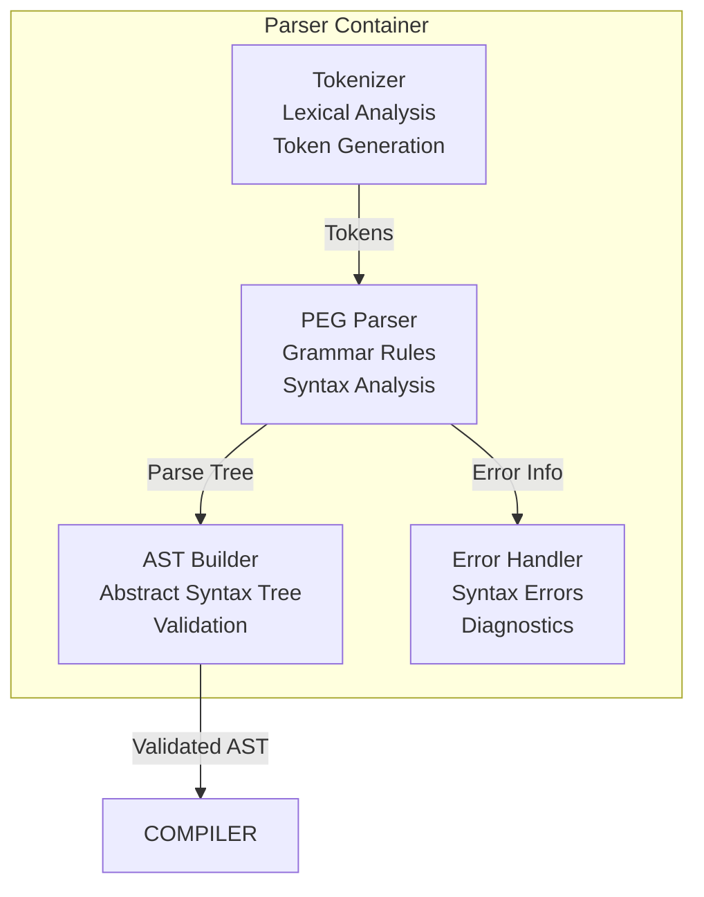

## Level 3: Component Diagrams

### Parser Container Components

```mermaid
graph TB
    subgraph "Parser Container"
        TOKENIZER[Tokenizer<br/>Lexical Analysis<br/>Token Generation]
        PEG[PEG Parser<br/>Grammar Rules<br/>Syntax Analysis]
        AST[AST Builder<br/>Abstract Syntax Tree<br/>Validation]
        ERROR[Error Handler<br/>Syntax Errors<br/>Diagnostics]
    end
    
    TOKENIZER -->|"Tokens"| PEG
    PEG -->|"Parse Tree"| AST
    PEG -->|"Error Info"| ERROR
    AST -->|"Validated AST"| COMPILER
```