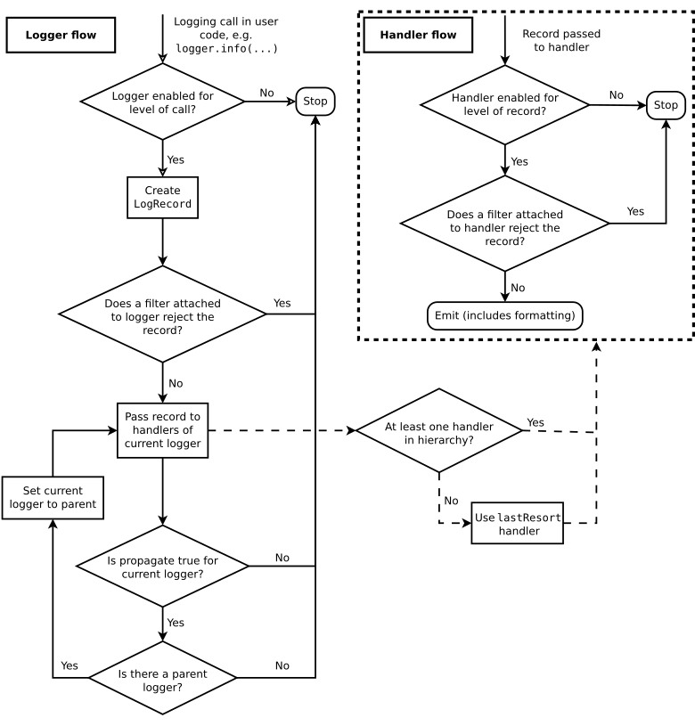

=============
Logging HOWTO
=============

:Author: Vinay Sajip <vinay_sajip at red-dove dot com>

.. _logging-basic-tutorial:

.. currentmodule:: logging

Basic Logging Tutorial
----------------------

Logging is a means of tracking events that happen when some software runs. The
software's developer adds logging calls to their code to indicate that certain
events have occurred. An event is described by a descriptive message which can
optionally contain variable data (i.e. data that is potentially different for
each occurrence of the event). Events also have an importance which the
developer ascribes to the event; the importance can also be called the *level*
or *severity*.

When to use logging
^^^^^^^^^^^^^^^^^^^

Logging provides a set of convenience functions for simple logging usage. These
are :func:`debug`, :func:`info`, :func:`warning`, :func:`error` and
:func:`critical`. To determine when to use logging, see the table below, which
states, for each of a set of common tasks, the best tool to use for it.

+-------------------------------------+--------------------------------------+
| Task you want to perform            | The best tool for the task           |
+=====================================+======================================+
| Display console output for ordinary | :func:`print`                        |
| usage of a command line script or   |                                      |
| program                             |                                      |
+-------------------------------------+--------------------------------------+
| Report events that occur during     | :func:`logging.info` (or             |
| normal operation of a program (e.g. | :func:`logging.debug` for very       |
| for status monitoring or fault      | detailed output for diagnostic       |
| investigation)                      | purposes)                            |
+-------------------------------------+--------------------------------------+
| Issue a warning regarding a         | :func:`warnings.warn` in library     |
| particular runtime event            | code if the issue is avoidable and   |
|                                     | the client application should be     |
|                                     | modified to eliminate the warning    |
|                                     |                                      |
|                                     | :func:`logging.warning` if there is  |
|                                     | nothing the client application can do|
|                                     | about the situation, but the event   |
|                                     | should still be noted                |
+-------------------------------------+--------------------------------------+
| Report an error regarding a         | Raise an exception                   |
| particular runtime event            |                                      |
+-------------------------------------+--------------------------------------+
| Report suppression of an error      | :func:`logging.error`,               |
| without raising an exception (e.g.  | :func:`logging.exception` or         |
| error handler in a long-running     | :func:`logging.critical` as          |
| server process)                     | appropriate for the specific error   |
|                                     | and application domain               |
+-------------------------------------+--------------------------------------+

The logging functions are named after the level or severity of the events
they are used to track. The standard levels and their applicability are
described below (in increasing order of severity):

.. tabularcolumns:: |l|L|

+--------------+---------------------------------------------+
| Level        | When it's used                              |
+==============+=============================================+
| ``DEBUG``    | Detailed information, typically of interest |
|              | only when diagnosing problems.              |
+--------------+---------------------------------------------+
| ``INFO``     | Confirmation that things are working as     |
|              | expected.                                   |
+--------------+---------------------------------------------+
| ``WARNING``  | An indication that something unexpected     |
|              | happened, or indicative of some problem in  |
|              | the near future (e.g. 'disk space low').    |
|              | The software is still working as expected.  |
+--------------+---------------------------------------------+
| ``ERROR``    | Due to a more serious problem, the software |
|              | has not been able to perform some function. |
+--------------+---------------------------------------------+
| ``CRITICAL`` | A serious error, indicating that the program|
|              | itself may be unable to continue running.   |
+--------------+---------------------------------------------+

The default level is ``WARNING``, which means that only events of this level
and above will be tracked, unless the logging package is configured to do
otherwise.

Events that are tracked can be handled in different ways. The simplest way of
handling tracked events is to print them to the console. Another common way
is to write them to a disk file.

.. _howto-minimal-example:

A simple example
^^^^^^^^^^^^^^^^

A very simple example is::

   import logging
   logging.warning('Watch out!')  # will print a message to the console
   logging.info('I told you so')  # will not print anything

If you type these lines into a script and run it, you'll see:

.. code-block:: none

   WARNING:root:Watch out!

printed out on the console. The ``INFO`` message doesn't appear because the
default level is ``WARNING``. The printed message includes the indication of
the level and the description of the event provided in the logging call, i.e.
'Watch out!'. Don't worry about the 'root' part for now: it will be explained
later. The actual output can be formatted quite flexibly if you need that;
formatting options will also be explained later.

Logging to a file
^^^^^^^^^^^^^^^^^

A very common situation is that of recording logging events in a file, so let's
look at that next. Be sure to try the following in a newly-started Python
interpreter, and don't just continue from the session described above::

   import logging
   logging.basicConfig(filename='example.log',level=logging.DEBUG)
   logging.debug('This message should go to the log file')
   logging.info('So should this')
   logging.warning('And this, too')

And now if we open the file and look at what we have, we should find the log
messages:

.. code-block:: none

   DEBUG:root:This message should go to the log file
   INFO:root:So should this
   WARNING:root:And this, too

This example also shows how you can set the logging level which acts as the
threshold for tracking. In this case, because we set the threshold to
``DEBUG``, all of the messages were printed.

If you want to set the logging level from a command-line option such as:

.. code-block:: none

   --log=INFO

and you have the value of the parameter passed for ``--log`` in some variable
*loglevel*, you can use::

   getattr(logging, loglevel.upper())

to get the value which you'll pass to :func:`basicConfig` via the *level*
argument. You may want to error check any user input value, perhaps as in the
following example::

   # assuming loglevel is bound to the string value obtained from the
   # command line argument. Convert to upper case to allow the user to
   # specify --log=DEBUG or --log=debug
   numeric_level = getattr(logging, loglevel.upper(), None)
   if not isinstance(numeric_level, int):
       raise ValueError('Invalid log level: %s' % loglevel)
   logging.basicConfig(level=numeric_level, ...)

The call to :func:`basicConfig` should come *before* any calls to :func:`debug`,
:func:`info` etc. As it's intended as a one-off simple configuration facility,
only the first call will actually do anything: subsequent calls are effectively
no-ops.

If you run the above script several times, the messages from successive runs
are appended to the file *example.log*. If you want each run to start afresh,
not remembering the messages from earlier runs, you can specify the *filemode*
argument, by changing the call in the above example to::

   logging.basicConfig(filename='example.log', filemode='w', level=logging.DEBUG)

The output will be the same as before, but the log file is no longer appended
to, so the messages from earlier runs are lost.

Logging from multiple modules
^^^^^^^^^^^^^^^^^^^^^^^^^^^^^

If your program consists of multiple modules, here's an example of how you
could organize logging in it::

   # myapp.py
   import logging
   import mylib

   def main():
       logging.basicConfig(filename='myapp.log', level=logging.INFO)
       logging.info('Started')
       mylib.do_something()
       logging.info('Finished')

   if __name__ == '__main__':
       main()

::

   # mylib.py
   import logging

   def do_something():
       logging.info('Doing something')

If you run *myapp.py*, you should see this in *myapp.log*:

.. code-block:: none

   INFO:root:Started
   INFO:root:Doing something
   INFO:root:Finished

which is hopefully what you were expecting to see. You can generalize this to
multiple modules, using the pattern in *mylib.py*. Note that for this simple
usage pattern, you won't know, by looking in the log file, *where* in your
application your messages came from, apart from looking at the event
description. If you want to track the location of your messages, you'll need
to refer to the documentation beyond the tutorial level -- see
:ref:`logging-advanced-tutorial`.

Logging variable data
^^^^^^^^^^^^^^^^^^^^^

To log variable data, use a format string for the event description message and
append the variable data as arguments. For example::

   import logging
   logging.warning('%s before you %s', 'Look', 'leap!')

will display:

.. code-block:: none

   WARNING:root:Look before you leap!

As you can see, merging of variable data into the event description message
uses the old, %-style of string formatting. This is for backwards
compatibility: the logging package pre-dates newer formatting options such as
:meth:`str.format` and :class:`string.Template`. These newer formatting
options *are* supported, but exploring them is outside the scope of this
tutorial: see :ref:`formatting-styles` for more information.

Changing the format of displayed messages
^^^^^^^^^^^^^^^^^^^^^^^^^^^^^^^^^^^^^^^^^

To change the format which is used to display messages, you need to
specify the format you want to use::

   import logging
   logging.basicConfig(format='%(levelname)s:%(message)s', level=logging.DEBUG)
   logging.debug('This message should appear on the console')
   logging.info('So should this')
   logging.warning('And this, too')

which would print:

.. code-block:: none

   DEBUG:This message should appear on the console
   INFO:So should this
   WARNING:And this, too

Notice that the 'root' which appeared in earlier examples has disappeared. For
a full set of things that can appear in format strings, you can refer to the
documentation for :ref:`logrecord-attributes`, but for simple usage, you just
need the *levelname* (severity), *message* (event description, including
variable data) and perhaps to display when the event occurred. This is
described in the next section.

Displaying the date/time in messages
^^^^^^^^^^^^^^^^^^^^^^^^^^^^^^^^^^^^

To display the date and time of an event, you would place '%(asctime)s' in
your format string::

   import logging
   logging.basicConfig(format='%(asctime)s %(message)s')
   logging.warning('is when this event was logged.')

which should print something like this:

.. code-block:: none

   2010-12-12 11:41:42,612 is when this event was logged.

The default format for date/time display (shown above) is like ISO8601 or
:rfc:`3339`. If you need more control over the formatting of the date/time, provide
a *datefmt* argument to ``basicConfig``, as in this example::

   import logging
   logging.basicConfig(format='%(asctime)s %(message)s', datefmt='%m/%d/%Y %I:%M:%S %p')
   logging.warning('is when this event was logged.')

which would display something like this:

.. code-block:: none

   12/12/2010 11:46:36 AM is when this event was logged.

The format of the *datefmt* argument is the same as supported by
:func:`time.strftime`.

Next Steps
^^^^^^^^^^

That concludes the basic tutorial. It should be enough to get you up and
running with logging. There's a lot more that the logging package offers, but
to get the best out of it, you'll need to invest a little more of your time in
reading the following sections. If you're ready for that, grab some of your
favourite beverage and carry on.

If your logging needs are simple, then use the above examples to incorporate
logging into your own scripts, and if you run into problems or don't
understand something, please post a question on the comp.lang.python Usenet
group (available at https://groups.google.com/group/comp.lang.python) and you
should receive help before too long.

Still here? You can carry on reading the next few sections, which provide a
slightly more advanced/in-depth tutorial than the basic one above. After that,
you can take a look at the :ref:`logging-cookbook`.

.. _logging-advanced-tutorial:

Advanced Logging Tutorial
-------------------------

The logging library takes a modular approach and offers several categories
of components: loggers, handlers, filters, and formatters.

* Loggers expose the interface that application code directly uses.
* Handlers send the log records (created by loggers) to the appropriate
  destination.
* Filters provide a finer grained facility for determining which log records
  to output.
* Formatters specify the layout of log records in the final output.

Log event information is passed between loggers, handlers, filters and
formatters in a :class:`LogRecord` instance.

Logging is performed by calling methods on instances of the :class:`Logger`
class (hereafter called :dfn:`loggers`). Each instance has a name, and they are
conceptually arranged in a namespace hierarchy using dots (periods) as
separators. For example, a logger named 'scan' is the parent of loggers
'scan.text', 'scan.html' and 'scan.pdf'. Logger names can be anything you want,
and indicate the area of an application in which a logged message originates.

A good convention to use when naming loggers is to use a module-level logger,
in each module which uses logging, named as follows::

   logger = logging.getLogger(__name__)

This means that logger names track the package/module hierarchy, and it's
intuitively obvious where events are logged just from the logger name.

The root of the hierarchy of loggers is called the root logger. That's the
logger used by the functions :func:`debug`, :func:`info`, :func:`warning`,
:func:`error` and :func:`critical`, which just call the same-named method of
the root logger. The functions and the methods have the same signatures. The
root logger's name is printed as 'root' in the logged output.

It is, of course, possible to log messages to different destinations. Support
is included in the package for writing log messages to files, HTTP GET/POST
locations, email via SMTP, generic sockets, queues, or OS-specific logging
mechanisms such as syslog or the Windows NT event log. Destinations are served
by :dfn:`handler` classes. You can create your own log destination class if
you have special requirements not met by any of the built-in handler classes.

By default, no destination is set for any logging messages. You can specify
a destination (such as console or file) by using :func:`basicConfig` as in the
tutorial examples. If you call the functions  :func:`debug`, :func:`info`,
:func:`warning`, :func:`error` and :func:`critical`, they will check to see
if no destination is set; and if one is not set, they will set a destination
of the console (``sys.stderr``) and a default format for the displayed
message before delegating to the root logger to do the actual message output.

The default format set by :func:`basicConfig` for messages is:

.. code-block:: none

   severity:logger name:message

You can change this by passing a format string to :func:`basicConfig` with the
*format* keyword argument. For all options regarding how a format string is
constructed, see :ref:`formatter-objects`.

Logging Flow
^^^^^^^^^^^^

The flow of log event information in loggers and handlers is illustrated in the
following diagram.

Loggers
^^^^^^^

:class:`Logger` objects have a threefold job.  First, they expose several
methods to application code so that applications can log messages at runtime.
Second, logger objects determine which log messages to act upon based upon
severity (the default filtering facility) or filter objects.  Third, logger
objects pass along relevant log messages to all interested log handlers.

The most widely used methods on logger objects fall into two categories:
configuration and message sending.

These are the most common configuration methods:

* :meth:`Logger.setLevel` specifies the lowest-severity log message a logger
  will handle, where debug is the lowest built-in severity level and critical
  is the highest built-in severity.  For example, if the severity level is
  INFO, the logger will handle only INFO, WARNING, ERROR, and CRITICAL messages
  and will ignore DEBUG messages.

* :meth:`Logger.addHandler` and :meth:`Logger.removeHandler` add and remove
  handler objects from the logger object.  Handlers are covered in more detail
  in :ref:`handler-basic`.

* :meth:`Logger.addFilter` and :meth:`Logger.removeFilter` add and remove filter
  objects from the logger object.  Filters are covered in more detail in
  :ref:`filter`.

You don't need to always call these methods on every logger you create. See the
last two paragraphs in this section.

With the logger object configured, the following methods create log messages:

* :meth:`Logger.debug`, :meth:`Logger.info`, :meth:`Logger.warning`,
  :meth:`Logger.error`, and :meth:`Logger.critical` all create log records with
  a message and a level that corresponds to their respective method names. The
  message is actually a format string, which may contain the standard string
  substitution syntax of ``%s``, ``%d``, ``%f``, and so on.  The
  rest of their arguments is a list of objects that correspond with the
  substitution fields in the message.  With regard to ``**kwargs``, the
  logging methods care only about a keyword of ``exc_info`` and use it to
  determine whether to log exception information.

* :meth:`Logger.exception` creates a log message similar to
  :meth:`Logger.error`.  The difference is that :meth:`Logger.exception` dumps a
  stack trace along with it.  Call this method only from an exception handler.

* :meth:`Logger.log` takes a log level as an explicit argument.  This is a
  little more verbose for logging messages than using the log level convenience
  methods listed above, but this is how to log at custom log levels.

:func:`getLogger` returns a reference to a logger instance with the specified
name if it is provided, or ``root`` if not.  The names are period-separated
hierarchical structures.  Multiple calls to :func:`getLogger` with the same name
will return a reference to the same logger object.  Loggers that are further
down in the hierarchical list are children of loggers higher up in the list.
For example, given a logger with a name of ``foo``, loggers with names of
``foo.bar``, ``foo.bar.baz``, and ``foo.bam`` are all descendants of ``foo``.

Loggers have a concept of *effective level*. If a level is not explicitly set
on a logger, the level of its parent is used instead as its effective level.
If the parent has no explicit level set, *its* parent is examined, and so on -
all ancestors are searched until an explicitly set level is found. The root
logger always has an explicit level set (``WARNING`` by default). When deciding
whether to process an event, the effective level of the logger is used to
determine whether the event is passed to the logger's handlers.

Child loggers propagate messages up to the handlers associated with their
ancestor loggers. Because of this, it is unnecessary to define and configure
handlers for all the loggers an application uses. It is sufficient to
configure handlers for a top-level logger and create child loggers as needed.
(You can, however, turn off propagation by setting the *propagate*
attribute of a logger to ``False``.)

.. _handler-basic:

Handlers
^^^^^^^^

:class:`~logging.Handler` objects are responsible for dispatching the
appropriate log messages (based on the log messages' severity) to the handler's
specified destination.  :class:`Logger` objects can add zero or more handler
objects to themselves with an :meth:`~Logger.addHandler` method.  As an example
scenario, an application may want to send all log messages to a log file, all
log messages of error or higher to stdout, and all messages of critical to an
email address. This scenario requires three individual handlers where each
handler is responsible for sending messages of a specific severity to a specific
location.

The standard library includes quite a few handler types (see
:ref:`useful-handlers`); the tutorials use mainly :class:`StreamHandler` and
:class:`FileHandler` in its examples.

There are very few methods in a handler for application developers to concern
themselves with.  The only handler methods that seem relevant for application
developers who are using the built-in handler objects (that is, not creating
custom handlers) are the following configuration methods:

* The :meth:`~Handler.setLevel` method, just as in logger objects, specifies the
  lowest severity that will be dispatched to the appropriate destination.  Why
  are there two :func:`setLevel` methods?  The level set in the logger
  determines which severity of messages it will pass to its handlers.  The level
  set in each handler determines which messages that handler will send on.

* :meth:`~Handler.setFormatter` selects a Formatter object for this handler to
  use.

* :meth:`~Handler.addFilter` and :meth:`~Handler.removeFilter` respectively
  configure and deconfigure filter objects on handlers.

Application code should not directly instantiate and use instances of
:class:`Handler`.  Instead, the :class:`Handler` class is a base class that
defines the interface that all handlers should have and establishes some
default behavior that child classes can use (or override).

Formatters
^^^^^^^^^^

Formatter objects configure the final order, structure, and contents of the log
message.  Unlike the base :class:`logging.Handler` class, application code may
instantiate formatter classes, although you could likely subclass the formatter
if your application needs special behavior.  The constructor takes three
optional arguments -- a message format string, a date format string and a style
indicator.

.. method:: logging.Formatter.__init__(fmt=None, datefmt=None, style='%')

If there is no message format string, the default is to use the
raw message.  If there is no date format string, the default date format is:

.. code-block:: none

    %Y-%m-%d %H:%M:%S

with the milliseconds tacked on at the end. The ``style`` is one of `%`, '{'
or '$'. If one of these is not specified, then '%' will be used.

If the ``style`` is '%', the message format string uses
``%(<dictionary key>)s`` styled string substitution; the possible keys are
documented in :ref:`logrecord-attributes`. If the style is '{', the message
format string is assumed to be compatible with :meth:`str.format` (using
keyword arguments), while if the style is '$' then the message format string
should conform to what is expected by :meth:`string.Template.substitute`.

.. versionchanged:: 3.2
   Added the ``style`` parameter.

The following message format string will log the time in a human-readable
format, the severity of the message, and the contents of the message, in that
order::

    '%(asctime)s - %(levelname)s - %(message)s'

Formatters use a user-configurable function to convert the creation time of a
record to a tuple. By default, :func:`time.localtime` is used; to change this
for a particular formatter instance, set the ``converter`` attribute of the
instance to a function with the same signature as :func:`time.localtime` or
:func:`time.gmtime`. To change it for all formatters, for example if you want
all logging times to be shown in GMT, set the ``converter`` attribute in the
Formatter class (to ``time.gmtime`` for GMT display).

Configuring Logging
^^^^^^^^^^^^^^^^^^^

.. currentmodule:: logging.config

Programmers can configure logging in three ways:

1. Creating loggers, handlers, and formatters explicitly using Python
   code that calls the configuration methods listed above.
2. Creating a logging config file and reading it using the :func:`fileConfig`
   function.
3. Creating a dictionary of configuration information and passing it
   to the :func:`dictConfig` function.

For the reference documentation on the last two options, see
:ref:`logging-config-api`.  The following example configures a very simple
logger, a console handler, and a simple formatter using Python code::

    import logging

    # create logger
    logger = logging.getLogger('simple_example')
    logger.setLevel(logging.DEBUG)

    # create console handler and set level to debug
    ch = logging.StreamHandler()
    ch.setLevel(logging.DEBUG)

    # create formatter
    formatter = logging.Formatter('%(asctime)s - %(name)s - %(levelname)s - %(message)s')

    # add formatter to ch
    ch.setFormatter(formatter)

    # add ch to logger
    logger.addHandler(ch)

    # 'application' code
    logger.debug('debug message')
    logger.info('info message')
    logger.warn('warn message')
    logger.error('error message')
    logger.critical('critical message')

Running this module from the command line produces the following output:

.. code-block:: shell-session

    $ python simple_logging_module.py
    2005-03-19 15:10:26,618 - simple_example - DEBUG - debug message
    2005-03-19 15:10:26,620 - simple_example - INFO - info message
    2005-03-19 15:10:26,695 - simple_example - WARNING - warn message
    2005-03-19 15:10:26,697 - simple_example - ERROR - error message
    2005-03-19 15:10:26,773 - simple_example - CRITICAL - critical message

The following Python module creates a logger, handler, and formatter nearly
identical to those in the example listed above, with the only difference being
the names of the objects::

    import logging
    import logging.config

    logging.config.fileConfig('logging.conf')

    # create logger
    logger = logging.getLogger('simpleExample')

    # 'application' code
    logger.debug('debug message')
    logger.info('info message')
    logger.warn('warn message')
    logger.error('error message')
    logger.critical('critical message')

Here is the logging.conf file:

.. code-block:: ini

    [loggers]
    keys=root,simpleExample

    [handlers]
    keys=consoleHandler

    [formatters]
    keys=simpleFormatter

    [logger_root]
    level=DEBUG
    handlers=consoleHandler

    [logger_simpleExample]
    level=DEBUG
    handlers=consoleHandler
    qualname=simpleExample
    propagate=0

    [handler_consoleHandler]
    class=StreamHandler
    level=DEBUG
    formatter=simpleFormatter
    args=(sys.stdout,)

    [formatter_simpleFormatter]
    format=%(asctime)s - %(name)s - %(levelname)s - %(message)s
    datefmt=

The output is nearly identical to that of the non-config-file-based example:

.. code-block:: shell-session

    $ python simple_logging_config.py
    2005-03-19 15:38:55,977 - simpleExample - DEBUG - debug message
    2005-03-19 15:38:55,979 - simpleExample - INFO - info message
    2005-03-19 15:38:56,054 - simpleExample - WARNING - warn message
    2005-03-19 15:38:56,055 - simpleExample - ERROR - error message
    2005-03-19 15:38:56,130 - simpleExample - CRITICAL - critical message

You can see that the config file approach has a few advantages over the Python
code approach, mainly separation of configuration and code and the ability of
noncoders to easily modify the logging properties.

.. warning:: The :func:`fileConfig` function takes a default parameter,
   ``disable_existing_loggers``, which defaults to ``True`` for reasons of
   backward compatibility. This may or may not be what you want, since it
   will cause any loggers existing before the :func:`fileConfig` call to
   be disabled unless they (or an ancestor) are explicitly named in the
   configuration.  Please refer to the reference documentation for more
   information, and specify ``False`` for this parameter if you wish.

   The dictionary passed to :func:`dictConfig` can also specify a Boolean
   value with key ``disable_existing_loggers``, which if not specified
   explicitly in the dictionary also defaults to being interpreted as
   ``True``.  This leads to the logger-disabling behaviour described above,
   which may not be what you want - in which case, provide the key
   explicitly with a value of ``False``.

.. currentmodule:: logging

Note that the class names referenced in config files need to be either relative
to the logging module, or absolute values which can be resolved using normal
import mechanisms. Thus, you could use either
:class:`~logging.handlers.WatchedFileHandler` (relative to the logging module) or
``mypackage.mymodule.MyHandler`` (for a class defined in package ``mypackage``
and module ``mymodule``, where ``mypackage`` is available on the Python import
path).

In Python 3.2, a new means of configuring logging has been introduced, using
dictionaries to hold configuration information. This provides a superset of the
functionality of the config-file-based approach outlined above, and is the
recommended configuration method for new applications and deployments. Because
a Python dictionary is used to hold configuration information, and since you
can populate that dictionary using different means, you have more options for
configuration. For example, you can use a configuration file in JSON format,
or, if you have access to YAML processing functionality, a file in YAML
format, to populate the configuration dictionary. Or, of course, you can
construct the dictionary in Python code, receive it in pickled form over a
socket, or use whatever approach makes sense for your application.

Here's an example of the same configuration as above, in YAML format for
the new dictionary-based approach:

.. code-block:: yaml

    version: 1
    formatters:
      simple:
        format: '%(asctime)s - %(name)s - %(levelname)s - %(message)s'
    handlers:
      console:
        class: logging.StreamHandler
        level: DEBUG
        formatter: simple
        stream: ext://sys.stdout
    loggers:
      simpleExample:
        level: DEBUG
        handlers: [console]
        propagate: no
    root:
      level: DEBUG
      handlers: [console]

For more information about logging using a dictionary, see
:ref:`logging-config-api`.

What happens if no configuration is provided
^^^^^^^^^^^^^^^^^^^^^^^^^^^^^^^^^^^^^^^^^^^^

If no logging configuration is provided, it is possible to have a situation
where a logging event needs to be output, but no handlers can be found to
output the event. The behaviour of the logging package in these
circumstances is dependent on the Python version.

For versions of Python prior to 3.2, the behaviour is as follows:

* If *logging.raiseExceptions* is ``False`` (production mode), the event is
  silently dropped.

* If *logging.raiseExceptions* is ``True`` (development mode), a message
  'No handlers could be found for logger X.Y.Z' is printed once.

In Python 3.2 and later, the behaviour is as follows:

* The event is output using a 'handler of last resort', stored in
  ``logging.lastResort``. This internal handler is not associated with any
  logger, and acts like a :class:`~logging.StreamHandler` which writes the
  event description message to the current value of ``sys.stderr`` (therefore
  respecting any redirections which may be in effect). No formatting is
  done on the message - just the bare event description message is printed.
  The handler's level is set to ``WARNING``, so all events at this and
  greater severities will be output.

To obtain the pre-3.2 behaviour, ``logging.lastResort`` can be set to ``None``.

.. _library-config:

Configuring Logging for a Library
^^^^^^^^^^^^^^^^^^^^^^^^^^^^^^^^^

When developing a library which uses logging, you should take care to
document how the library uses logging - for example, the names of loggers
used. Some consideration also needs to be given to its logging configuration.
If the using application does not use logging, and library code makes logging
calls, then (as described in the previous section) events of severity
``WARNING`` and greater will be printed to ``sys.stderr``. This is regarded as
the best default behaviour.

If for some reason you *don't* want these messages printed in the absence of
any logging configuration, you can attach a do-nothing handler to the top-level
logger for your library. This avoids the message being printed, since a handler
will be always be found for the library's events: it just doesn't produce any
output. If the library user configures logging for application use, presumably
that configuration will add some handlers, and if levels are suitably
configured then logging calls made in library code will send output to those
handlers, as normal.

A do-nothing handler is included in the logging package:
:class:`~logging.NullHandler` (since Python 3.1). An instance of this handler
could be added to the top-level logger of the logging namespace used by the
library (*if* you want to prevent your library's logged events being output to
``sys.stderr`` in the absence of logging configuration). If all logging by a
library *foo* is done using loggers with names matching 'foo.x', 'foo.x.y',
etc. then the code::

    import logging
    logging.getLogger('foo').addHandler(logging.NullHandler())

should have the desired effect. If an organisation produces a number of
libraries, then the logger name specified can be 'orgname.foo' rather than
just 'foo'.

.. note:: It is strongly advised that you *do not add any handlers other
   than* :class:`~logging.NullHandler` *to your library's loggers*. This is
   because the configuration of handlers is the prerogative of the application
   developer who uses your library. The application developer knows their
   target audience and what handlers are most appropriate for their
   application: if you add handlers 'under the hood', you might well interfere
   with their ability to carry out unit tests and deliver logs which suit their
   requirements.

Logging Levels
--------------

The numeric values of logging levels are given in the following table. These are
primarily of interest if you want to define your own levels, and need them to
have specific values relative to the predefined levels. If you define a level
with the same numeric value, it overwrites the predefined value; the predefined
name is lost.

+--------------+---------------+
| Level        | Numeric value |
+==============+===============+
| ``CRITICAL`` | 50            |
+--------------+---------------+
| ``ERROR``    | 40            |
+--------------+---------------+
| ``WARNING``  | 30            |
+--------------+---------------+
| ``INFO``     | 20            |
+--------------+---------------+
| ``DEBUG``    | 10            |
+--------------+---------------+
| ``NOTSET``   | 0             |
+--------------+---------------+

Levels can also be associated with loggers, being set either by the developer or
through loading a saved logging configuration. When a logging method is called
on a logger, the logger compares its own level with the level associated with
the method call. If the logger's level is higher than the method call's, no
logging message is actually generated. This is the basic mechanism controlling
the verbosity of logging output.

Logging messages are encoded as instances of the :class:`~logging.LogRecord`
class. When a logger decides to actually log an event, a
:class:`~logging.LogRecord` instance is created from the logging message.

Logging messages are subjected to a dispatch mechanism through the use of
:dfn:`handlers`, which are instances of subclasses of the :class:`Handler`
class. Handlers are responsible for ensuring that a logged message (in the form
of a :class:`LogRecord`) ends up in a particular location (or set of locations)
which is useful for the target audience for that message (such as end users,
support desk staff, system administrators, developers). Handlers are passed
:class:`LogRecord` instances intended for particular destinations. Each logger
can have zero, one or more handlers associated with it (via the
:meth:`~Logger.addHandler` method of :class:`Logger`). In addition to any
handlers directly associated with a logger, *all handlers associated with all
ancestors of the logger* are called to dispatch the message (unless the
*propagate* flag for a logger is set to a false value, at which point the
passing to ancestor handlers stops).

Just as for loggers, handlers can have levels associated with them. A handler's
level acts as a filter in the same way as a logger's level does. If a handler
decides to actually dispatch an event, the :meth:`~Handler.emit` method is used
to send the message to its destination. Most user-defined subclasses of
:class:`Handler` will need to override this :meth:`~Handler.emit`.

.. _custom-levels:

Custom Levels
^^^^^^^^^^^^^

Defining your own levels is possible, but should not be necessary, as the
existing levels have been chosen on the basis of practical experience.
However, if you are convinced that you need custom levels, great care should
be exercised when doing this, and it is possibly *a very bad idea to define
custom levels if you are developing a library*. That's because if multiple
library authors all define their own custom levels, there is a chance that
the logging output from such multiple libraries used together will be
difficult for the using developer to control and/or interpret, because a
given numeric value might mean different things for different libraries.

.. _useful-handlers:

Useful Handlers
---------------

In addition to the base :class:`Handler` class, many useful subclasses are
provided:

#. :class:`StreamHandler` instances send messages to streams (file-like
   objects).

#. :class:`FileHandler` instances send messages to disk files.

#. :class:`~handlers.BaseRotatingHandler` is the base class for handlers that
   rotate log files at a certain point. It is not meant to be  instantiated
   directly. Instead, use :class:`~handlers.RotatingFileHandler` or
   :class:`~handlers.TimedRotatingFileHandler`.

#. :class:`~handlers.RotatingFileHandler` instances send messages to disk
   files, with support for maximum log file sizes and log file rotation.

#. :class:`~handlers.TimedRotatingFileHandler` instances send messages to
   disk files, rotating the log file at certain timed intervals.

#. :class:`~handlers.SocketHandler` instances send messages to TCP/IP
   sockets. Since 3.4, Unix domain sockets are also supported.

#. :class:`~handlers.DatagramHandler` instances send messages to UDP
   sockets. Since 3.4, Unix domain sockets are also supported.

#. :class:`~handlers.SMTPHandler` instances send messages to a designated
   email address.

#. :class:`~handlers.SysLogHandler` instances send messages to a Unix
   syslog daemon, possibly on a remote machine.

#. :class:`~handlers.NTEventLogHandler` instances send messages to a
   Windows NT/2000/XP event log.

#. :class:`~handlers.MemoryHandler` instances send messages to a buffer
   in memory, which is flushed whenever specific criteria are met.

#. :class:`~handlers.HTTPHandler` instances send messages to an HTTP
   server using either ``GET`` or ``POST`` semantics.

#. :class:`~handlers.WatchedFileHandler` instances watch the file they are
   logging to. If the file changes, it is closed and reopened using the file
   name. This handler is only useful on Unix-like systems; Windows does not
   support the underlying mechanism used.

#. :class:`~handlers.QueueHandler` instances send messages to a queue, such as
   those implemented in the :mod:`queue` or :mod:`multiprocessing` modules.

#. :class:`NullHandler` instances do nothing with error messages. They are used
   by library developers who want to use logging, but want to avoid the 'No
   handlers could be found for logger XXX' message which can be displayed if
   the library user has not configured logging. See :ref:`library-config` for
   more information.

.. versionadded:: 3.1
   The :class:`NullHandler` class.

.. versionadded:: 3.2
   The :class:`~handlers.QueueHandler` class.

The :class:`NullHandler`, :class:`StreamHandler` and :class:`FileHandler`
classes are defined in the core logging package. The other handlers are
defined in a sub- module, :mod:`logging.handlers`. (There is also another
sub-module, :mod:`logging.config`, for configuration functionality.)

Logged messages are formatted for presentation through instances of the
:class:`Formatter` class. They are initialized with a format string suitable for
use with the % operator and a dictionary.

For formatting multiple messages in a batch, instances of
:class:`~handlers.BufferingFormatter` can be used. In addition to the format
string (which is applied to each message in the batch), there is provision for
header and trailer format strings.

When filtering based on logger level and/or handler level is not enough,
instances of :class:`Filter` can be added to both :class:`Logger` and
:class:`Handler` instances (through their :meth:`~Handler.addFilter` method).
Before deciding to process a message further, both loggers and handlers consult
all their filters for permission. If any filter returns a false value, the
message is not processed further.

The basic :class:`Filter` functionality allows filtering by specific logger
name. If this feature is used, messages sent to the named logger and its
children are allowed through the filter, and all others dropped.

.. _logging-exceptions:

Exceptions raised during logging
--------------------------------

The logging package is designed to swallow exceptions which occur while logging
in production. This is so that errors which occur while handling logging events
- such as logging misconfiguration, network or other similar errors - do not
cause the application using logging to terminate prematurely.

:class:`SystemExit` and :class:`KeyboardInterrupt` exceptions are never
swallowed. Other exceptions which occur during the :meth:`~Handler.emit` method
of a :class:`Handler` subclass are passed to its :meth:`~Handler.handleError`
method.

The default implementation of :meth:`~Handler.handleError` in :class:`Handler`
checks to see if a module-level variable, :data:`raiseExceptions`, is set. If
set, a traceback is printed to :data:`sys.stderr`. If not set, the exception is
swallowed.

.. note:: The default value of :data:`raiseExceptions` is ``True``. This is
   because during development, you typically want to be notified of any
   exceptions that occur. It's advised that you set :data:`raiseExceptions` to
   ``False`` for production usage.

.. currentmodule:: logging

.. _arbitrary-object-messages:

Using arbitrary objects as messages
-----------------------------------

In the preceding sections and examples, it has been assumed that the message
passed when logging the event is a string. However, this is not the only
possibility. You can pass an arbitrary object as a message, and its
:meth:`~object.__str__` method will be called when the logging system needs to
convert it to a string representation. In fact, if you want to, you can avoid
computing a string representation altogether - for example, the
:class:`~handlers.SocketHandler` emits an event by pickling it and sending it
over the wire.

Optimization
------------

Formatting of message arguments is deferred until it cannot be avoided.
However, computing the arguments passed to the logging method can also be
expensive, and you may want to avoid doing it if the logger will just throw
away your event. To decide what to do, you can call the
:meth:`~Logger.isEnabledFor` method which takes a level argument and returns
true if the event would be created by the Logger for that level of call.
You can write code like this::

    if logger.isEnabledFor(logging.DEBUG):
        logger.debug('Message with %s, %s', expensive_func1(),
                                            expensive_func2())

so that if the logger's threshold is set above ``DEBUG``, the calls to
:func:`expensive_func1` and :func:`expensive_func2` are never made.

.. note:: In some cases, :meth:`~Logger.isEnabledFor` can itself be more
   expensive than you'd like (e.g. for deeply nested loggers where an explicit
   level is only set high up in the logger hierarchy). In such cases (or if you
   want to avoid calling a method in tight loops), you can cache the result of a
   call to :meth:`~Logger.isEnabledFor` in a local or instance variable, and use
   that instead of calling the method each time. Such a cached value would only
   need to be recomputed when the logging configuration changes dynamically
   while the application is running (which is not all that common).

There are other optimizations which can be made for specific applications which
need more precise control over what logging information is collected. Here's a
list of things you can do to avoid processing during logging which you don't
need:

+-----------------------------------------------+----------------------------------------+
| What you don't want to collect                | How to avoid collecting it             |
+===============================================+========================================+
| Information about where calls were made from. | Set ``logging._srcfile`` to ``None``.  |
|                                               | This avoids calling                    |
|                                               | :func:`sys._getframe`, which may help  |
|                                               | to speed up your code in environments  |
|                                               | like PyPy (which can't speed up code   |
|                                               | that uses :func:`sys._getframe`), if   |
|                                               | and when PyPy supports Python 3.x.     |
+-----------------------------------------------+----------------------------------------+
| Threading information.                        | Set ``logging.logThreads`` to ``0``.   |
+-----------------------------------------------+----------------------------------------+
| Process information.                          | Set ``logging.logProcesses`` to ``0``. |
+-----------------------------------------------+----------------------------------------+

Also note that the core logging module only includes the basic handlers. If
you don't import :mod:`logging.handlers` and :mod:`logging.config`, they won't
take up any memory.

.. seealso::

   Module :mod:`logging`
      API reference for the logging module.

   Module :mod:`logging.config`
      Configuration API for the logging module.

   Module :mod:`logging.handlers`
      Useful handlers included with the logging module.

   :ref:`A logging cookbook <logging-cookbook>`
