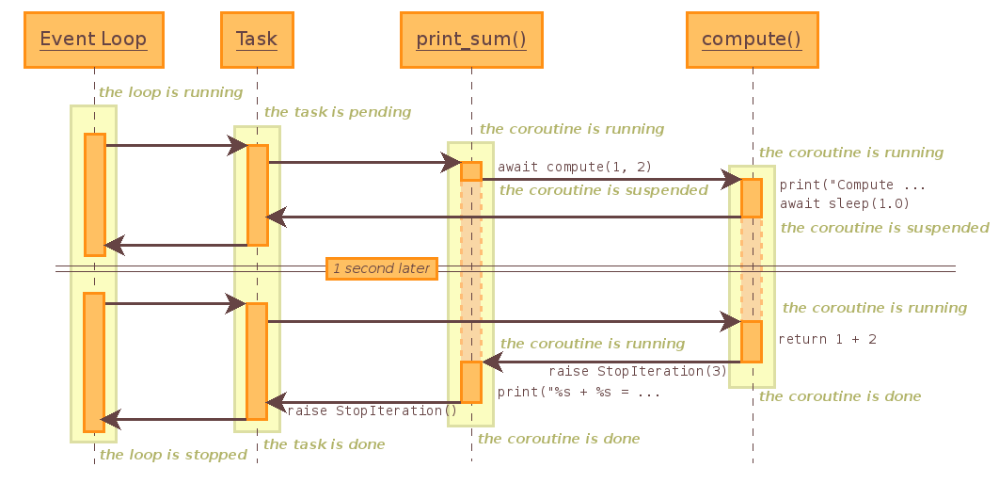

.. currentmodule:: asyncio

Tasks and coroutines
====================

**Source code:** :source:`Lib/asyncio/tasks.py`

**Source code:** :source:`Lib/asyncio/coroutines.py`

.. _coroutine:

Coroutines
----------

Coroutines used with :mod:`asyncio` may be implemented using the
:keyword:`async def` statement, or by using :term:`generators <generator>`.
The :keyword:`async def` type of coroutine was added in Python 3.5, and
is recommended if there is no need to support older Python versions.

Generator-based coroutines should be decorated with :func:`@asyncio.coroutine
<asyncio.coroutine>`, although this is not strictly enforced.
The decorator enables compatibility with :keyword:`async def` coroutines,
and also serves as documentation.  Generator-based
coroutines use the ``yield from`` syntax introduced in :pep:`380`,
instead of the original ``yield`` syntax.

The word "coroutine", like the word "generator", is used for two
different (though related) concepts:

- The function that defines a coroutine
  (a function definition using :keyword:`async def` or
  decorated with ``@asyncio.coroutine``).  If disambiguation is needed
  we will call this a *coroutine function* (:func:`iscoroutinefunction`
  returns ``True``).

- The object obtained by calling a coroutine function.  This object
  represents a computation or an I/O operation (usually a combination)
  that will complete eventually.  If disambiguation is needed we will
  call it a *coroutine object* (:func:`iscoroutine` returns ``True``).

Things a coroutine can do:

- ``result = await future`` or ``result = yield from future`` --
  suspends the coroutine until the
  future is done, then returns the future's result, or raises an
  exception, which will be propagated.  (If the future is cancelled,
  it will raise a ``CancelledError`` exception.)  Note that tasks are
  futures, and everything said about futures also applies to tasks.

- ``result = await coroutine`` or ``result = yield from coroutine`` --
  wait for another coroutine to
  produce a result (or raise an exception, which will be propagated).
  The ``coroutine`` expression must be a *call* to another coroutine.

- ``return expression`` -- produce a result to the coroutine that is
  waiting for this one using :keyword:`await` or ``yield from``.

- ``raise exception`` -- raise an exception in the coroutine that is
  waiting for this one using :keyword:`await` or ``yield from``.

Calling a coroutine does not start its code running --
the coroutine object returned by the call doesn't do anything until you
schedule its execution.  There are two basic ways to start it running:
call ``await coroutine`` or ``yield from coroutine`` from another coroutine
(assuming the other coroutine is already running!), or schedule its execution
using the :func:`ensure_future` function or the :meth:`AbstractEventLoop.create_task`
method.

Coroutines (and tasks) can only run when the event loop is running.

.. decorator:: coroutine

    Decorator to mark generator-based coroutines.  This enables
    the generator use :keyword:`!yield from` to call :keyword:`async
    def` coroutines, and also enables the generator to be called by
    :keyword:`async def` coroutines, for instance using an
    :keyword:`await` expression.

    There is no need to decorate :keyword:`async def` coroutines themselves.

    If the generator is not yielded from before it is destroyed, an error
    message is logged. See :ref:`Detect coroutines never scheduled
    <asyncio-coroutine-not-scheduled>`.

.. note::

    In this documentation, some methods are documented as coroutines,
    even if they are plain Python functions returning a :class:`Future`.
    This is intentional to have a freedom of tweaking the implementation
    of these functions in the future. If such a function is needed to be
    used in a callback-style code, wrap its result with :func:`ensure_future`.

.. function:: asyncio.run(coro, \*, debug=False)

    This function runs the passed coroutine, taking care of
    managing the asyncio event loop and finalizing asynchronous
    generators.

    This function cannot be called when another asyncio event loop is
    running in the same thread.

    If debug is True, the event loop will be run in debug mode.

    This function always creates a new event loop and closes it at
    the end.  It should be used as a main entry point for asyncio
    programs, and should ideally only be called once.

    .. versionadded:: 3.7

.. _asyncio-hello-world-coroutine:

Example: Hello World coroutine
^^^^^^^^^^^^^^^^^^^^^^^^^^^^^^

Example of coroutine displaying ``"Hello World"``::

    import asyncio

    async def hello_world():
        print("Hello World!")

    asyncio.run(hello_world())

.. seealso::

   The :ref:`Hello World with call_soon() <asyncio-hello-world-callback>`
   example uses the :meth:`AbstractEventLoop.call_soon` method to schedule a
   callback.

.. _asyncio-date-coroutine:

Example: Coroutine displaying the current date
^^^^^^^^^^^^^^^^^^^^^^^^^^^^^^^^^^^^^^^^^^^^^^

Example of coroutine displaying the current date every second during 5 seconds
using the :meth:`sleep` function::

    import asyncio
    import datetime

    async def display_date():
        loop = asyncio.get_running_loop()
        end_time = loop.time() + 5.0
        while True:
            print(datetime.datetime.now())
            if (loop.time() + 1.0) >= end_time:
                break
            await asyncio.sleep(1)

    asyncio.run(display_date())

.. seealso::

   The :ref:`display the current date with call_later()
   <asyncio-date-callback>` example uses a callback with the
   :meth:`AbstractEventLoop.call_later` method.

Example: Chain coroutines
^^^^^^^^^^^^^^^^^^^^^^^^^

Example chaining coroutines::

    import asyncio

    async def compute(x, y):
        print("Compute %s + %s ..." % (x, y))
        await asyncio.sleep(1.0)
        return x + y

    async def print_sum(x, y):
        result = await compute(x, y)
        print("%s + %s = %s" % (x, y, result))

    loop = asyncio.get_event_loop()
    loop.run_until_complete(print_sum(1, 2))
    loop.close()

``compute()`` is chained to ``print_sum()``: ``print_sum()`` coroutine waits
until ``compute()`` is completed before returning its result.

Sequence diagram of the example:

The "Task" is created by the :meth:`AbstractEventLoop.run_until_complete` method
when it gets a coroutine object instead of a task.

The diagram shows the control flow, it does not describe exactly how things
work internally. For example, the sleep coroutine creates an internal future
which uses :meth:`AbstractEventLoop.call_later` to wake up the task in 1 second.

InvalidStateError
-----------------

.. exception:: InvalidStateError

   The operation is not allowed in this state.

TimeoutError
------------

.. exception:: TimeoutError

   The operation exceeded the given deadline.

.. note::

   This exception is different from the builtin :exc:`TimeoutError` exception!

Future
------

.. class:: Future(\*, loop=None)

   This class is *almost* compatible with :class:`concurrent.futures.Future`.

   Differences:

   - :meth:`result` and :meth:`exception` do not take a timeout argument and
     raise an exception when the future isn't done yet.

   - Callbacks registered with :meth:`add_done_callback` are always called
     via the event loop's :meth:`~AbstractEventLoop.call_soon`.

   - This class is not compatible with the :func:`~concurrent.futures.wait` and
     :func:`~concurrent.futures.as_completed` functions in the
     :mod:`concurrent.futures` package.

   This class is :ref:`not thread safe <asyncio-multithreading>`.

   .. method:: cancel()

      Cancel the future and schedule callbacks.

      If the future is already done or cancelled, return ``False``. Otherwise,
      change the future's state to cancelled, schedule the callbacks and return
      ``True``.

   .. method:: cancelled()

      Return ``True`` if the future was cancelled.

   .. method:: done()

      Return ``True`` if the future is done.

      Done means either that a result / exception are available, or that the
      future was cancelled.

   .. method:: result()

      Return the result this future represents.

      If the future has been cancelled, raises :exc:`CancelledError`. If the
      future's result isn't yet available, raises :exc:`InvalidStateError`. If
      the future is done and has an exception set, this exception is raised.

   .. method:: exception()

      Return the exception that was set on this future.

      The exception (or ``None`` if no exception was set) is returned only if
      the future is done. If the future has been cancelled, raises
      :exc:`CancelledError`. If the future isn't done yet, raises
      :exc:`InvalidStateError`.

   .. method:: add_done_callback(fn)

      Add a callback to be run when the future becomes done.

      The callback is called with a single argument - the future object. If the
      future is already done when this is called, the callback is scheduled
      with :meth:`~AbstractEventLoop.call_soon`.

      :ref:`Use functools.partial to pass parameters to the callback
      <asyncio-pass-keywords>`. For example,
      ``fut.add_done_callback(functools.partial(print, "Future:",
      flush=True))`` will call ``print("Future:", fut, flush=True)``.

   .. method:: remove_done_callback(fn)

      Remove all instances of a callback from the "call when done" list.

      Returns the number of callbacks removed.

   .. method:: set_result(result)

      Mark the future done and set its result.

      If the future is already done when this method is called, raises
      :exc:`InvalidStateError`.

   .. method:: set_exception(exception)

      Mark the future done and set an exception.

      If the future is already done when this method is called, raises
      :exc:`InvalidStateError`.

   .. method:: get_loop()

      Return the event loop the future object is bound to.

      .. versionadded:: 3.7

Example: Future with run_until_complete()
^^^^^^^^^^^^^^^^^^^^^^^^^^^^^^^^^^^^^^^^^

Example combining a :class:`Future` and a :ref:`coroutine function
<coroutine>`::

    import asyncio

    async def slow_operation(future):
        await asyncio.sleep(1)
        future.set_result('Future is done!')

    loop = asyncio.get_event_loop()
    future = asyncio.Future()
    asyncio.ensure_future(slow_operation(future))
    loop.run_until_complete(future)
    print(future.result())
    loop.close()

The coroutine function is responsible for the computation (which takes 1 second)
and it stores the result into the future. The
:meth:`~AbstractEventLoop.run_until_complete` method waits for the completion of
the future.

.. note::
   The :meth:`~AbstractEventLoop.run_until_complete` method uses internally the
   :meth:`~Future.add_done_callback` method to be notified when the future is
   done.

Example: Future with run_forever()
^^^^^^^^^^^^^^^^^^^^^^^^^^^^^^^^^^

The previous example can be written differently using the
:meth:`Future.add_done_callback` method to describe explicitly the control
flow::

    import asyncio

    async def slow_operation(future):
        await asyncio.sleep(1)
        future.set_result('Future is done!')

    def got_result(future):
        print(future.result())
        loop.stop()

    loop = asyncio.get_event_loop()
    future = asyncio.Future()
    asyncio.ensure_future(slow_operation(future))
    future.add_done_callback(got_result)
    try:
        loop.run_forever()
    finally:
        loop.close()

In this example, the future is used to link ``slow_operation()`` to
``got_result()``: when ``slow_operation()`` is done, ``got_result()`` is called
with the result.

Task
----

.. function:: create_task(coro)

   Wrap a :ref:`coroutine <coroutine>` *coro* into a task and schedule
   its execution.  Return the task object.

   The task is executed in :func:`get_running_loop` context,
   :exc:`RuntimeError` is raised if there is no running loop in
   current thread.

   .. versionadded:: 3.7

.. class:: Task(coro, \*, loop=None)

   A unit for concurrent running of :ref:`coroutines <coroutine>`,
   subclass of :class:`Future`.

   A task is responsible for executing a coroutine object in an event loop.  If
   the wrapped coroutine yields from a future, the task suspends the execution
   of the wrapped coroutine and waits for the completion of the future. When
   the future is done, the execution of the wrapped coroutine restarts with the
   result or the exception of the future.

   Event loops use cooperative scheduling: an event loop only runs one task at
   a time. Other tasks may run in parallel if other event loops are
   running in different threads. While a task waits for the completion of a
   future, the event loop executes a new task.

   The cancellation of a task is different from the cancellation of a
   future. Calling :meth:`cancel` will throw a
   :exc:`~concurrent.futures.CancelledError` to the wrapped
   coroutine. :meth:`~Future.cancelled` only returns ``True`` if the
   wrapped coroutine did not catch the
   :exc:`~concurrent.futures.CancelledError` exception, or raised a
   :exc:`~concurrent.futures.CancelledError` exception.

   If a pending task is destroyed, the execution of its wrapped :ref:`coroutine
   <coroutine>` did not complete. It is probably a bug and a warning is
   logged: see :ref:`Pending task destroyed <asyncio-pending-task-destroyed>`.

   Don't directly create :class:`Task` instances: use the :func:`create_task`
   function or the :meth:`AbstractEventLoop.create_task` method.

   This class is :ref:`not thread safe <asyncio-multithreading>`.

   .. classmethod:: all_tasks(loop=None)

      Return a set of all tasks for an event loop.

      By default all tasks for the current event loop are returned.

   .. classmethod:: current_task(loop=None)

      Return the currently running task in an event loop or ``None``.

      By default the current task for the current event loop is returned.

      ``None`` is returned when called not in the context of a :class:`Task`.

   .. method:: cancel()

      Request that this task cancel itself.

      This arranges for a :exc:`~concurrent.futures.CancelledError` to be
      thrown into the wrapped coroutine on the next cycle through the event
      loop. The coroutine then has a chance to clean up or even deny the
      request using try/except/finally.

      Unlike :meth:`Future.cancel`, this does not guarantee that the task
      will be cancelled: the exception might be caught and acted upon, delaying
      cancellation of the task or preventing cancellation completely. The task
      may also return a value or raise a different exception.

      Immediately after this method is called, :meth:`~Future.cancelled` will
      not return ``True`` (unless the task was already cancelled). A task will
      be marked as cancelled when the wrapped coroutine terminates with a
      :exc:`~concurrent.futures.CancelledError` exception (even if
      :meth:`cancel` was not called).

   .. method:: get_stack(\*, limit=None)

      Return the list of stack frames for this task's coroutine.

      If the coroutine is not done, this returns the stack where it is
      suspended.  If the coroutine has completed successfully or was
      cancelled, this returns an empty list.  If the coroutine was
      terminated by an exception, this returns the list of traceback
      frames.

      The frames are always ordered from oldest to newest.

      The optional limit gives the maximum number of frames to return; by
      default all available frames are returned.  Its meaning differs depending
      on whether a stack or a traceback is returned: the newest frames of a
      stack are returned, but the oldest frames of a traceback are returned.
      (This matches the behavior of the traceback module.)

      For reasons beyond our control, only one stack frame is returned for a
      suspended coroutine.

   .. method:: print_stack(\*, limit=None, file=None)

      Print the stack or traceback for this task's coroutine.

      This produces output similar to that of the traceback module, for the
      frames retrieved by get_stack().  The limit argument is passed to
      get_stack().  The file argument is an I/O stream to which the output
      is written; by default output is written to sys.stderr.

Example: Parallel execution of tasks
^^^^^^^^^^^^^^^^^^^^^^^^^^^^^^^^^^^^

Example executing 3 tasks (A, B, C) in parallel::

    import asyncio

    async def factorial(name, number):
        f = 1
        for i in range(2, number+1):
            print("Task %s: Compute factorial(%s)..." % (name, i))
            await asyncio.sleep(1)
            f *= i
        print("Task %s: factorial(%s) = %s" % (name, number, f))

    loop = asyncio.get_event_loop()
    loop.run_until_complete(asyncio.gather(
        factorial("A", 2),
        factorial("B", 3),
        factorial("C", 4),
    ))
    loop.close()

Output::

    Task A: Compute factorial(2)...
    Task B: Compute factorial(2)...
    Task C: Compute factorial(2)...
    Task A: factorial(2) = 2
    Task B: Compute factorial(3)...
    Task C: Compute factorial(3)...
    Task B: factorial(3) = 6
    Task C: Compute factorial(4)...
    Task C: factorial(4) = 24

A task is automatically scheduled for execution when it is created. The event
loop stops when all tasks are done.

Task functions
--------------

.. note::

   In the functions below, the optional *loop* argument allows explicitly setting
   the event loop object used by the underlying task or coroutine.  If it's
   not provided, the default event loop is used.

.. function:: current_task(loop=None)

   Return the current running :class:`Task` instance or ``None``, if
   no task is running.

   If *loop* is ``None`` :func:`get_running_loop` is used to get
   the current loop.

   .. versionadded:: 3.7

.. function:: all_tasks(loop=None)

   Return a set of :class:`Task` objects created for the loop.

   If *loop* is ``None`` :func:`get_event_loop` is used for getting
   current loop.

   .. versionadded:: 3.7

.. function:: as_completed(fs, \*, loop=None, timeout=None)

   Return an iterator whose values, when waited for, are :class:`Future`
   instances.

   Raises :exc:`asyncio.TimeoutError` if the timeout occurs before all Futures
   are done.

   Example::

       for f in as_completed(fs):
           result = await f  # The 'await' may raise
           # Use result

   .. note::

      The futures ``f`` are not necessarily members of fs.

.. function:: ensure_future(coro_or_future, \*, loop=None)

   Schedule the execution of a :ref:`coroutine object <coroutine>`: wrap it in
   a future. Return a :class:`Task` object.

   If the argument is a :class:`Future`, it is returned directly.

   .. versionadded:: 3.4.4

   .. versionchanged:: 3.5.1
      The function accepts any :term:`awaitable` object.

   .. note::

      :func:`create_task` (added in Python 3.7) is the preferable way
      for spawning new tasks.

   .. seealso::

      The :func:`create_task` function and
      :meth:`AbstractEventLoop.create_task` method.

.. function:: wrap_future(future, \*, loop=None)

   Wrap a :class:`concurrent.futures.Future` object in a :class:`Future`
   object.

.. function:: gather(\*coros_or_futures, loop=None, return_exceptions=False)

   Return a future aggregating results from the given coroutine objects or
   futures.

   All futures must share the same event loop.  If all the tasks are done
   successfully, the returned future's result is the list of results (in the
   order of the original sequence, not necessarily the order of results
   arrival).  If *return_exceptions* is true, exceptions in the tasks are
   treated the same as successful results, and gathered in the result list;
   otherwise, the first raised exception will be immediately propagated to the
   returned future.

   Cancellation: if the outer Future is cancelled, all children (that have not
   completed yet) are also cancelled.  If any child is cancelled, this is
   treated as if it raised :exc:`~concurrent.futures.CancelledError` -- the
   outer Future is *not* cancelled in this case.  (This is to prevent the
   cancellation of one child to cause other children to be cancelled.)

.. function:: iscoroutine(obj)

   Return ``True`` if *obj* is a :ref:`coroutine object <coroutine>`,
   which may be based on a generator or an :keyword:`async def` coroutine.

.. function:: iscoroutinefunction(func)

   Return ``True`` if *func* is determined to be a :ref:`coroutine function
   <coroutine>`, which may be a decorated generator function or an
   :keyword:`async def` function.

.. function:: run_coroutine_threadsafe(coro, loop)

   Submit a :ref:`coroutine object <coroutine>` to a given event loop.

   Return a :class:`concurrent.futures.Future` to access the result.

   This function is meant to be called from a different thread than the one
   where the event loop is running. Usage::

     # Create a coroutine
     coro = asyncio.sleep(1, result=3)
     # Submit the coroutine to a given loop
     future = asyncio.run_coroutine_threadsafe(coro, loop)
     # Wait for the result with an optional timeout argument
     assert future.result(timeout) == 3

   If an exception is raised in the coroutine, the returned future will be
   notified. It can also be used to cancel the task in the event loop::

     try:
         result = future.result(timeout)
     except asyncio.TimeoutError:
         print('The coroutine took too long, cancelling the task...')
         future.cancel()
     except Exception as exc:
         print('The coroutine raised an exception: {!r}'.format(exc))
     else:
         print('The coroutine returned: {!r}'.format(result))

   See the :ref:`concurrency and multithreading <asyncio-multithreading>`
   section of the documentation.

   .. note::

      Unlike other functions from the module,
      :func:`run_coroutine_threadsafe` requires the *loop* argument to
      be passed explicitly.

   .. versionadded:: 3.5.1

.. coroutinefunction:: sleep(delay, result=None, \*, loop=None)

   Create a :ref:`coroutine <coroutine>` that completes after a given
   time (in seconds).  If *result* is provided, it is produced to the caller
   when the coroutine completes.

   The resolution of the sleep depends on the :ref:`granularity of the event
   loop <asyncio-delayed-calls>`.

   This function is a :ref:`coroutine <coroutine>`.

.. coroutinefunction:: shield(arg, \*, loop=None)

   Wait for a future, shielding it from cancellation.

   The statement::

       res = await shield(something())

   is exactly equivalent to the statement::

       res = await something()

   *except* that if the coroutine containing it is cancelled, the task running
   in ``something()`` is not cancelled.  From the point of view of
   ``something()``, the cancellation did not happen.  But its caller is still
   cancelled, so the yield-from expression still raises
   :exc:`~concurrent.futures.CancelledError`.  Note: If ``something()`` is
   cancelled by other means this will still cancel ``shield()``.

   If you want to completely ignore cancellation (not recommended) you can
   combine ``shield()`` with a try/except clause, as follows::

       try:
           res = await shield(something())
       except CancelledError:
           res = None

.. coroutinefunction:: wait(futures, \*, loop=None, timeout=None,\
                            return_when=ALL_COMPLETED)

   Wait for the Futures and coroutine objects given by the sequence *futures*
   to complete.  Coroutines will be wrapped in Tasks. Returns two sets of
   :class:`Future`: (done, pending).

   The sequence *futures* must not be empty.

   *timeout* can be used to control the maximum number of seconds to wait before
   returning.  *timeout* can be an int or float.  If *timeout* is not specified
   or ``None``, there is no limit to the wait time.

   *return_when* indicates when this function should return.  It must be one of
   the following constants of the :mod:`concurrent.futures` module:

   .. tabularcolumns:: |l|L|

   +-----------------------------+----------------------------------------+
   | Constant                    | Description                            |
   +=============================+========================================+
   | :const:`FIRST_COMPLETED`    | The function will return when any      |
   |                             | future finishes or is cancelled.       |
   +-----------------------------+----------------------------------------+
   | :const:`FIRST_EXCEPTION`    | The function will return when any      |
   |                             | future finishes by raising an          |
   |                             | exception.  If no future raises an     |
   |                             | exception then it is equivalent to     |
   |                             | :const:`ALL_COMPLETED`.                |
   +-----------------------------+----------------------------------------+
   | :const:`ALL_COMPLETED`      | The function will return when all      |
   |                             | futures finish or are cancelled.       |
   +-----------------------------+----------------------------------------+

   This function is a :ref:`coroutine <coroutine>`.

   Usage::

        done, pending = await asyncio.wait(fs)

   .. note::

      This does not raise :exc:`asyncio.TimeoutError`! Futures that aren't done
      when the timeout occurs are returned in the second set.

.. coroutinefunction:: wait_for(fut, timeout, \*, loop=None)

   Wait for the single :class:`Future` or :ref:`coroutine object <coroutine>`
   to complete with timeout. If *timeout* is ``None``, block until the future
   completes.

   Coroutine will be wrapped in :class:`Task`.

   Returns result of the Future or coroutine.  When a timeout occurs, it
   cancels the task and raises :exc:`asyncio.TimeoutError`. To avoid the task
   cancellation, wrap it in :func:`shield`.

   If the wait is cancelled, the future *fut* is also cancelled.

   This function is a :ref:`coroutine <coroutine>`, usage::

       result = await asyncio.wait_for(fut, 60.0)

   .. versionchanged:: 3.4.3
      If the wait is cancelled, the future *fut* is now also cancelled.
