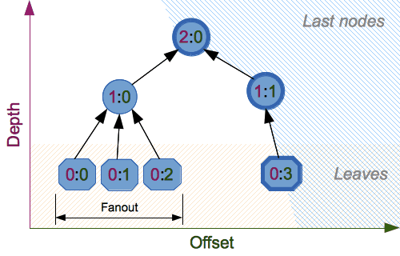

.. _hashlib-blake2:

:mod:`hashlib` --- BLAKE2 hash functions
========================================

.. module:: hashlib
   :synopsis: BLAKE2 hash function for Python
.. sectionauthor:: Dmitry Chestnykh

.. index::
   single: blake2b, blake2s

BLAKE2_ is a cryptographic hash function defined in RFC-7693_ that comes in two
flavors:

* **BLAKE2b**, optimized for 64-bit platforms and produces digests of any size
  between 1 and 64 bytes,

* **BLAKE2s**, optimized for 8- to 32-bit platforms and produces digests of any
  size between 1 and 32 bytes.

BLAKE2 supports **keyed mode** (a faster and simpler replacement for HMAC_),
**salted hashing**, **personalization**, and **tree hashing**.

Hash objects from this module follow the API of standard library's
:mod:`hashlib` objects.

Module
======

Creating hash objects
---------------------

New hash objects are created by calling constructor functions:

.. function:: blake2b(data=b'', digest_size=64, key=b'', salt=b'', \
                person=b'', fanout=1, depth=1, leaf_size=0, node_offset=0,  \
                node_depth=0, inner_size=0, last_node=False)

.. function:: blake2s(data=b'', digest_size=32, key=b'', salt=b'', \
                person=b'', fanout=1, depth=1, leaf_size=0, node_offset=0,  \
                node_depth=0, inner_size=0, last_node=False)

These functions return the corresponding hash objects for calculating
BLAKE2b or BLAKE2s. They optionally take these general parameters:

* *data*: initial chunk of data to hash, which must be interpretable as buffer
  of bytes.

* *digest_size*: size of output digest in bytes.

* *key*: key for keyed hashing (up to 64 bytes for BLAKE2b, up to 32 bytes for
  BLAKE2s).

* *salt*: salt for randomized hashing (up to 16 bytes for BLAKE2b, up to 8
  bytes for BLAKE2s).

* *person*: personalization string (up to 16 bytes for BLAKE2b, up to 8 bytes
  for BLAKE2s).

The following table shows limits for general parameters (in bytes):

======= =========== ======== ========= ===========
Hash    digest_size len(key) len(salt) len(person)
======= =========== ======== ========= ===========
BLAKE2b     64         64       16        16
BLAKE2s     32         32       8         8
======= =========== ======== ========= ===========

.. note::

    BLAKE2 specification defines constant lengths for salt and personalization
    parameters, however, for convenience, this implementation accepts byte
    strings of any size up to the specified length. If the length of the
    parameter is less than specified, it is padded with zeros, thus, for
    example, ``b'salt'`` and ``b'salt\x00'`` is the same value. (This is not
    the case for *key*.)

These sizes are available as module `constants`_ described below.

Constructor functions also accept the following tree hashing parameters:

* *fanout*: fanout (0 to 255, 0 if unlimited, 1 in sequential mode).

* *depth*: maximal depth of tree (1 to 255, 255 if unlimited, 1 in
  sequential mode).

* *leaf_size*: maximal byte length of leaf (0 to 2**32-1, 0 if unlimited or in
  sequential mode).

* *node_offset*: node offset (0 to 2**64-1 for BLAKE2b, 0 to 2**48-1 for
  BLAKE2s, 0 for the first, leftmost, leaf, or in sequential mode).

* *node_depth*: node depth (0 to 255, 0 for leaves, or in sequential mode).

* *inner_size*: inner digest size (0 to 64 for BLAKE2b, 0 to 32 for
  BLAKE2s, 0 in sequential mode).

* *last_node*: boolean indicating whether the processed node is the last
  one (`False` for sequential mode).

See section 2.10 in `BLAKE2 specification
<https://blake2.net/blake2_20130129.pdf>`_ for comprehensive review of tree
hashing.

Constants
---------

.. data:: blake2b.SALT_SIZE
.. data:: blake2s.SALT_SIZE

Salt length (maximum length accepted by constructors).

.. data:: blake2b.PERSON_SIZE
.. data:: blake2s.PERSON_SIZE

Personalization string length (maximum length accepted by constructors).

.. data:: blake2b.MAX_KEY_SIZE
.. data:: blake2s.MAX_KEY_SIZE

Maximum key size.

.. data:: blake2b.MAX_DIGEST_SIZE
.. data:: blake2s.MAX_DIGEST_SIZE

Maximum digest size that the hash function can output.

Examples
========

Simple hashing
--------------

To calculate hash of some data, you should first construct a hash object by
calling the appropriate constructor function (:func:`blake2b` or
:func:`blake2s`), then update it with the data by calling :meth:`update` on the
object, and, finally, get the digest out of the object by calling
:meth:`digest` (or :meth:`hexdigest` for hex-encoded string).

    >>> from hashlib import blake2b
    >>> h = blake2b()
    >>> h.update(b'Hello world')
    >>> h.hexdigest()
    '6ff843ba685842aa82031d3f53c48b66326df7639a63d128974c5c14f31a0f33343a8c65551134ed1ae0f2b0dd2bb495dc81039e3eeb0aa1bb0388bbeac29183'

As a shortcut, you can pass the first chunk of data to update directly to the
constructor as the first argument (or as *data* keyword argument):

    >>> from hashlib import blake2b
    >>> blake2b(b'Hello world').hexdigest()
    '6ff843ba685842aa82031d3f53c48b66326df7639a63d128974c5c14f31a0f33343a8c65551134ed1ae0f2b0dd2bb495dc81039e3eeb0aa1bb0388bbeac29183'

You can call :meth:`hash.update` as many times as you need to iteratively
update the hash:

    >>> from hashlib import blake2b
    >>> items = [b'Hello', b' ', b'world']
    >>> h = blake2b()
    >>> for item in items:
    ...     h.update(item)
    >>> h.hexdigest()
    '6ff843ba685842aa82031d3f53c48b66326df7639a63d128974c5c14f31a0f33343a8c65551134ed1ae0f2b0dd2bb495dc81039e3eeb0aa1bb0388bbeac29183'

Using different digest sizes
----------------------------

BLAKE2 has configurable size of digests up to 64 bytes for BLAKE2b and up to 32
bytes for BLAKE2s. For example, to replace SHA-1 with BLAKE2b without changing
the size of output, we can tell BLAKE2b to produce 20-byte digests:

    >>> from hashlib import blake2b
    >>> h = blake2b(digest_size=20)
    >>> h.update(b'Replacing SHA1 with the more secure function')
    >>> h.hexdigest()
    'd24f26cf8de66472d58d4e1b1774b4c9158b1f4c'
    >>> h.digest_size
    20
    >>> len(h.digest())
    20

Hash objects with different digest sizes have completely different outputs
(shorter hashes are *not* prefixes of longer hashes); BLAKE2b and BLAKE2s
produce different outputs even if the output length is the same:

    >>> from hashlib import blake2b, blake2s
    >>> blake2b(digest_size=10).hexdigest()
    '6fa1d8fcfd719046d762'
    >>> blake2b(digest_size=11).hexdigest()
    'eb6ec15daf9546254f0809'
    >>> blake2s(digest_size=10).hexdigest()
    '1bf21a98c78a1c376ae9'
    >>> blake2s(digest_size=11).hexdigest()
    '567004bf96e4a25773ebf4'

Keyed hashing
-------------

Keyed hashing can be used for authentication as a faster and simpler
replacement for `Hash-based message authentication code
<http://en.wikipedia.org/wiki/Hash-based_message_authentication_code>`_ (HMAC).
BLAKE2 can be securely used in prefix-MAC mode thanks to the
indifferentiability property inherited from BLAKE.

This example shows how to get a (hex-encoded) 128-bit authentication code for
message ``b'message data'`` with key ``b'pseudorandom key'``::

    >>> from hashlib import blake2b
    >>> h = blake2b(key=b'pseudorandom key', digest_size=16)
    >>> h.update(b'message data')
    >>> h.hexdigest()
    '3d363ff7401e02026f4a4687d4863ced'

As a practical example, a web application can symmetrically sign cookies sent
to users and later verify them to make sure they weren't tampered with::

    >>> from hashlib import blake2b
    >>> from hmac import compare_digest
    >>>
    >>> SECRET_KEY = b'pseudorandomly generated server secret key'
    >>> AUTH_SIZE = 16
    >>>
    >>> def sign(cookie):
    ...     h = blake2b(data=cookie, digest_size=AUTH_SIZE, key=SECRET_KEY)
    ...     return h.hexdigest()
    >>>
    >>> cookie = b'user:vatrogasac'
    >>> sig = sign(cookie)
    >>> print("{0},{1}".format(cookie.decode('utf-8'), sig))
    user:vatrogasac,349cf904533767ed2d755279a8df84d0
    >>> compare_digest(cookie, sig)
    True
    >>> compare_digest(b'user:policajac', sig)
    False
    >>> compare_digesty(cookie, '0102030405060708090a0b0c0d0e0f00')
    False

Even though there's a native keyed hashing mode, BLAKE2 can, of course, be used
in HMAC construction with :mod:`hmac` module::

    >>> import hmac, hashlib
    >>> m = hmac.new(b'secret key', digestmod=hashlib.blake2s)
    >>> m.update(b'message')
    >>> m.hexdigest()
    'e3c8102868d28b5ff85fc35dda07329970d1a01e273c37481326fe0c861c8142'

Randomized hashing
------------------

By setting *salt* parameter users can introduce randomization to the hash
function. Randomized hashing is useful for protecting against collision attacks
on the hash function used in digital signatures.

    Randomized hashing is designed for situations where one party, the message
    preparer, generates all or part of a message to be signed by a second
    party, the message signer. If the message preparer is able to find
    cryptographic hash function collisions (i.e., two messages producing the
    same hash value), then she might prepare meaningful versions of the message
    that would produce the same hash value and digital signature, but with
    different results (e.g., transferring $1,000,000 to an account, rather than
    $10). Cryptographic hash functions have been designed with collision
    resistance as a major goal, but the current concentration on attacking
    cryptographic hash functions may result in a given cryptographic hash
    function providing less collision resistance than expected. Randomized
    hashing offers the signer additional protection by reducing the likelihood
    that a preparer can generate two or more messages that ultimately yield the
    same hash value during the digital signature generation process --- even if
    it is practical to find collisions for the hash function. However, the use
    of randomized hashing may reduce the amount of security provided by a
    digital signature when all portions of the message are prepared
    by the signer.

    (`NIST SP-800-106 "Randomized Hashing for Digital Signatures"
    <http://csrc.nist.gov/publications/nistpubs/800-106/NIST-SP-800-106.pdf>`_)

In BLAKE2 the salt is processed as a one-time input to the hash function during
initialization, rather than as an input to each compression function.

.. warning::

    *Salted hashing* (or just hashing) with BLAKE2 or any other general-purpose
    cryptographic hash function, such as SHA-256, is not suitable for hashing
    passwords.  See `BLAKE2 FAQ <https://blake2.net/#qa>`_ for more
    information.
..

    >>> import os
    >>> from hashlib import blake2b
    >>> msg = b'some message'
    >>> # Calculate the first hash with a random salt.
    >>> salt1 = os.urandom(blake2b.SALT_SIZE)
    >>> h1 = blake2b(salt=salt1)
    >>> h1.update(msg)
    >>> # Calculate the second hash with a different random salt.
    >>> salt2 = os.urandom(blake2b.SALT_SIZE)
    >>> h2 = blake2b(salt=salt2)
    >>> h2.update(msg)
    >>> # The digests are different.
    >>> h1.digest() != h2.digest()
    True

Personalization
---------------

Sometimes it is useful to force hash function to produce different digests for
the same input for different purposes. Quoting the authors of the Skein hash
function:

    We recommend that all application designers seriously consider doing this;
    we have seen many protocols where a hash that is computed in one part of
    the protocol can be used in an entirely different part because two hash
    computations were done on similar or related data, and the attacker can
    force the application to make the hash inputs the same. Personalizing each
    hash function used in the protocol summarily stops this type of attack.

    (`The Skein Hash Function Family
    <http://www.skein-hash.info/sites/default/files/skein1.3.pdf>`_,
    p. 21)

BLAKE2 can be personalized by passing bytes to the *person* argument::

    >>> from hashlib import blake2b
    >>> FILES_HASH_PERSON = b'MyApp Files Hash'
    >>> BLOCK_HASH_PERSON = b'MyApp Block Hash'
    >>> h = blake2b(digest_size=32, person=FILES_HASH_PERSON)
    >>> h.update(b'the same content')
    >>> h.hexdigest()
    '20d9cd024d4fb086aae819a1432dd2466de12947831b75c5a30cf2676095d3b4'
    >>> h = blake2b(digest_size=32, person=BLOCK_HASH_PERSON)
    >>> h.update(b'the same content')
    >>> h.hexdigest()
    'cf68fb5761b9c44e7878bfb2c4c9aea52264a80b75005e65619778de59f383a3'

Personalization together with the keyed mode can also be used to derive different
keys from a single one.

    >>> from hashlib import blake2s
    >>> from base64 import b64decode, b64encode
    >>> orig_key = b64decode(b'Rm5EPJai72qcK3RGBpW3vPNfZy5OZothY+kHY6h21KM=')
    >>> enc_key = blake2s(key=orig_key, person=b'kEncrypt').digest()
    >>> mac_key = blake2s(key=orig_key, person=b'kMAC').digest()
    >>> print(b64encode(enc_key).decode('utf-8'))
    rbPb15S/Z9t+agffno5wuhB77VbRi6F9Iv2qIxU7WHw=
    >>> print(b64encode(mac_key).decode('utf-8'))
    G9GtHFE1YluXY1zWPlYk1e/nWfu0WSEb0KRcjhDeP/o=

Tree mode
---------

Here's an example of hashing a minimal tree with two leaf nodes::

       10
      /  \
     00  01

This example uses 64-byte internal digests, and returns the 32-byte final
digest::

    >>> from hashlib import blake2b
    >>>
    >>> FANOUT = 2
    >>> DEPTH = 2
    >>> LEAF_SIZE = 4096
    >>> INNER_SIZE = 64
    >>>
    >>> buf = bytearray(6000)
    >>>
    >>> # Left leaf
    ... h00 = blake2b(buf[0:LEAF_SIZE], fanout=FANOUT, depth=DEPTH,
    ...               leaf_size=LEAF_SIZE, inner_size=INNER_SIZE,
    ...               node_offset=0, node_depth=0, last_node=False)
    >>> # Right leaf
    ... h01 = blake2b(buf[LEAF_SIZE:], fanout=FANOUT, depth=DEPTH,
    ...               leaf_size=LEAF_SIZE, inner_size=INNER_SIZE,
    ...               node_offset=1, node_depth=0, last_node=True)
    >>> # Root node
    ... h10 = blake2b(digest_size=32, fanout=FANOUT, depth=DEPTH,
    ...               leaf_size=LEAF_SIZE, inner_size=INNER_SIZE,
    ...               node_offset=0, node_depth=1, last_node=True)
    >>> h10.update(h00.digest())
    >>> h10.update(h01.digest())
    >>> h10.hexdigest()
    '3ad2a9b37c6070e374c7a8c508fe20ca86b6ed54e286e93a0318e95e881db5aa'

Credits
=======

BLAKE2_ was designed by *Jean-Philippe Aumasson*, *Samuel Neves*, *Zooko
Wilcox-O'Hearn*, and *Christian Winnerlein* based on SHA-3_ finalist BLAKE_
created by *Jean-Philippe Aumasson*, *Luca Henzen*, *Willi Meier*, and
*Raphael C.-W. Phan*.

It uses core algorithm from ChaCha_ cipher designed by *Daniel J.  Bernstein*.

The stdlib implementation is based on pyblake2_ module. It was written by
*Dmitry Chestnykh* based on C implementation written by *Samuel Neves*. The
documentation was copied from pyblake2_ and written by *Dmitry Chestnykh*.

The C code was partly rewritten for Python by *Christian Heimes*.

The following public domain dedication applies for both C hash function
implementation, extension code, and this documentation:

   To the extent possible under law, the author(s) have dedicated all copyright
   and related and neighboring rights to this software to the public domain
   worldwide. This software is distributed without any warranty.

   You should have received a copy of the CC0 Public Domain Dedication along
   with this software. If not, see
   http://creativecommons.org/publicdomain/zero/1.0/.

The following people have helped with development or contributed their changes
to the project and the public domain according to the Creative Commons Public
Domain Dedication 1.0 Universal:

* *Alexandr Sokolovskiy*

.. seealso:: Official BLAKE2 website: https://blake2.net

.. _RFC-7693: https://tools.ietf.org/html/rfc7693
.. _BLAKE2: https://blake2.net
.. _HMAC: https://en.wikipedia.org/wiki/Hash-based_message_authentication_code
.. _BLAKE: https://131002.net/blake/
.. _SHA-3: https://en.wikipedia.org/wiki/NIST_hash_function_competition
.. _ChaCha: https://cr.yp.to/chacha.html
.. _pyblake2: https://pythonhosted.org/pyblake2/

