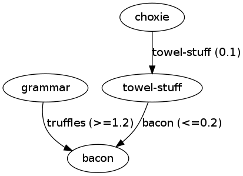

:mod:`packaging.depgraph` --- Dependency graph builder
======================================================

.. module:: packaging.depgraph
   :synopsis: Graph builder for dependencies between releases.

This module provides the means to analyse the dependencies between various
distributions and to create a graph representing these dependency relationships.
In this document, "distribution" refers to an instance of
:class:`packaging.database.Distribution` or
:class:`packaging.database.EggInfoDistribution`.

.. XXX terminology problem with dist vs. release: dists are installed, but deps
   use releases

.. XXX explain how to use it with dists not installed: Distribution can only be
   instantiated with a path, but this module is useful for remote dist too

.. XXX functions should accept and return iterators, not lists

The :class:`DependencyGraph` class
----------------------------------

.. class:: DependencyGraph

   Represent a dependency graph between releases.  The nodes are distribution
   instances; the edge model dependencies.  An edge from ``a`` to ``b`` means
   that ``a`` depends on ``b``.

   .. method:: add_distribution(distribution)

      Add *distribution* to the graph.

   .. method:: add_edge(x, y, label=None)

      Add an edge from distribution *x* to distribution *y* with the given
      *label* (string).

   .. method:: add_missing(distribution, requirement)

      Add a missing *requirement* (string) for the given *distribution*.

   .. method:: repr_node(dist, level=1)

      Print a subgraph starting from *dist*.  *level* gives the depth of the
      subgraph.

   Direct access to the graph nodes and edges is provided through these
   attributes:

   .. attribute:: adjacency_list

      Dictionary mapping distributions to a list of ``(other, label)`` tuples
      where  ``other`` is a distribution and the edge is labeled with ``label``
      (i.e. the version specifier, if such was provided).

   .. attribute:: reverse_list

      Dictionary mapping distributions to a list of predecessors.  This allows
      efficient traversal.

   .. attribute:: missing

      Dictionary mapping distributions to a list of requirements that were not
      provided by any distribution.

Auxiliary functions
-------------------

.. function:: dependent_dists(dists, dist)

   Recursively generate a list of distributions from *dists* that are dependent
   on *dist*.

   .. XXX what does member mean here: "dist is a member of *dists* for which we
      are interested"

.. function:: generate_graph(dists)

   Generate a :class:`DependencyGraph` from the given list of distributions.

   .. XXX make this alternate constructor a DepGraph classmethod or rename;
      'generate' can suggest it creates a file or an image, use 'make'

.. function:: graph_to_dot(graph, f, skip_disconnected=True)

   Write a DOT output for the graph to the file-like object *f*.

   If *skip_disconnected* is true, all distributions that are not dependent on
   any other distribution are skipped.

   .. XXX why is this not a DepGraph method?

Example Usage
-------------

Depict all dependenciess in the system
^^^^^^^^^^^^^^^^^^^^^^^^^^^^^^^^^^^^^^

First, we shall generate a graph of all the distributions on the system
and then create an image out of it using the tools provided by
`Graphviz <http://www.graphviz.org/>`_::

   from packaging.database import get_distributions
   from packaging.depgraph import generate_graph

   dists = list(get_distributions())
   graph = generate_graph(dists)

It would be interesting to print out the missing requirements.  This can be done
as follows::

   for dist, reqs in graph.missing.items():
       if reqs:
           reqs = ' ,'.join(repr(req) for req in reqs)
           print('Missing dependencies for %r: %s' % (dist.name, reqs))

Example output is:

.. code-block:: none

   Missing dependencies for 'TurboCheetah': 'Cheetah'
   Missing dependencies for 'TurboGears': 'ConfigObj', 'DecoratorTools', 'RuleDispatch'
   Missing dependencies for 'jockey': 'PyKDE4.kdecore', 'PyKDE4.kdeui', 'PyQt4.QtCore', 'PyQt4.QtGui'
   Missing dependencies for 'TurboKid': 'kid'
   Missing dependencies for 'TurboJson: 'DecoratorTools', 'RuleDispatch'

Now, we proceed with generating a graphical representation of the graph. First
we write it to a file, and then we generate a PNG image using the
:program:`dot` command-line tool::

   from packaging.depgraph import graph_to_dot
   with open('output.dot', 'w') as f:
      # only show the interesting distributions, skipping the disconnected ones
      graph_to_dot(graph, f, skip_disconnected=True)

We can create the final picture using:

.. code-block:: sh

   $ dot -Tpng output.dot > output.png

An example result is:

If you want to include egg distributions as well, then the code requires only
one change, namely the line::

   dists = list(packaging.database.get_distributions())

has to be replaced with::

   dists = list(packaging.database.get_distributions(use_egg_info=True))

On many platforms, a richer graph is obtained because at the moment most
distributions are provided in the egg rather than the new standard
``.dist-info`` format.

.. XXX missing image

   An example of a more involved graph for illustrative reasons can be seen
   here:

   .. image:: depgraph_big.png

List all dependent distributions
^^^^^^^^^^^^^^^^^^^^^^^^^^^^^^^^

We will list all distributions that are dependent on some given distibution.
This time, egg distributions will be considered as well::

   import sys
   from packaging.database import get_distribution, get_distributions
   from packaging.depgraph import dependent_dists

   dists = list(get_distributions(use_egg_info=True))
   dist = get_distribution('bacon', use_egg_info=True)
   if dist is None:
       sys.exit('No such distribution in the system')

   deps = dependent_dists(dists, dist)
   deps = ', '.join(repr(x.name) for x in deps)
   print('Distributions depending on %r: %s' % (dist.name, deps))

And this is example output:

.. with the dependency relationships as in the previous section
   (depgraph_big)

.. code-block:: none

   Distributions depending on 'bacon': 'towel-stuff', 'choxie', 'grammar'
