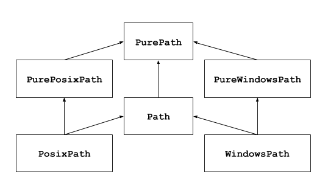

:mod:`!pathlib` --- Object-oriented filesystem paths
====================================================

.. module:: pathlib
   :synopsis: Object-oriented filesystem paths

.. versionadded:: 3.4

**Source code:** :source:`Lib/pathlib.py`

.. index:: single: path; operations

--------------

This module offers classes representing filesystem paths with semantics
appropriate for different operating systems.  Path classes are divided
between :ref:`pure paths <pure-paths>`, which provide purely computational
operations without I/O, and :ref:`concrete paths <concrete-paths>`, which
inherit from pure paths but also provide I/O operations.

If you've never used this module before or just aren't sure which class is
right for your task, :class:`Path` is most likely what you need. It instantiates
a :ref:`concrete path <concrete-paths>` for the platform the code is running on.

Pure paths are useful in some special cases; for example:

#. If you want to manipulate Windows paths on a Unix machine (or vice versa).
   You cannot instantiate a :class:`WindowsPath` when running on Unix, but you
   can instantiate :class:`PureWindowsPath`.
#. You want to make sure that your code only manipulates paths without actually
   accessing the OS. In this case, instantiating one of the pure classes may be
   useful since those simply don't have any OS-accessing operations.

.. seealso::
   :pep:`428`: The pathlib module -- object-oriented filesystem paths.

.. seealso::
   For low-level path manipulation on strings, you can also use the
   :mod:`os.path` module.

Basic use
---------

Importing the main class::

   >>> from pathlib import Path

Listing subdirectories::

   >>> p = Path('.')
   >>> [x for x in p.iterdir() if x.is_dir()]
   [PosixPath('.hg'), PosixPath('docs'), PosixPath('dist'),
    PosixPath('__pycache__'), PosixPath('build')]

Listing Python source files in this directory tree::

   >>> list(p.glob('**/*.py'))
   [PosixPath('test_pathlib.py'), PosixPath('setup.py'),
    PosixPath('pathlib.py'), PosixPath('docs/conf.py'),
    PosixPath('build/lib/pathlib.py')]

Navigating inside a directory tree::

   >>> p = Path('/etc')
   >>> q = p / 'init.d' / 'reboot'
   >>> q
   PosixPath('/etc/init.d/reboot')
   >>> q.resolve()
   PosixPath('/etc/rc.d/init.d/halt')

Querying path properties::

   >>> q.exists()
   True
   >>> q.is_dir()
   False

Opening a file::

   >>> with q.open() as f: f.readline()
   ...
   '#!/bin/bash\n'

.. _pure-paths:

Pure paths
----------

Pure path objects provide path-handling operations which don't actually
access a filesystem.  There are three ways to access these classes, which
we also call *flavours*:

.. class:: PurePath(*pathsegments)

   A generic class that represents the system's path flavour (instantiating
   it creates either a :class:`PurePosixPath` or a :class:`PureWindowsPath`)::

      >>> PurePath('setup.py')      # Running on a Unix machine
      PurePosixPath('setup.py')

   Each element of *pathsegments* can be either a string representing a
   path segment, or an object implementing the :class:`os.PathLike` interface
   where the :meth:`~os.PathLike.__fspath__` method returns a string,
   such as another path object::

      >>> PurePath('foo', 'some/path', 'bar')
      PurePosixPath('foo/some/path/bar')
      >>> PurePath(Path('foo'), Path('bar'))
      PurePosixPath('foo/bar')

   When *pathsegments* is empty, the current directory is assumed::

      >>> PurePath()
      PurePosixPath('.')

   If a segment is an absolute path, all previous segments are ignored
   (like :func:`os.path.join`)::

      >>> PurePath('/etc', '/usr', 'lib64')
      PurePosixPath('/usr/lib64')
      >>> PureWindowsPath('c:/Windows', 'd:bar')
      PureWindowsPath('d:bar')

   On Windows, the drive is not reset when a rooted relative path
   segment (e.g., ``r'\foo'``) is encountered::

      >>> PureWindowsPath('c:/Windows', '/Program Files')
      PureWindowsPath('c:/Program Files')

   Spurious slashes and single dots are collapsed, but double dots (``'..'``)
   and leading double slashes (``'//'``) are not, since this would change the
   meaning of a path for various reasons (e.g. symbolic links, UNC paths)::

      >>> PurePath('foo//bar')
      PurePosixPath('foo/bar')
      >>> PurePath('//foo/bar')
      PurePosixPath('//foo/bar')
      >>> PurePath('foo/./bar')
      PurePosixPath('foo/bar')
      >>> PurePath('foo/../bar')
      PurePosixPath('foo/../bar')

   (a naïve approach would make ``PurePosixPath('foo/../bar')`` equivalent
   to ``PurePosixPath('bar')``, which is wrong if ``foo`` is a symbolic link
   to another directory)

   Pure path objects implement the :class:`os.PathLike` interface, allowing them
   to be used anywhere the interface is accepted.

   .. versionchanged:: 3.6
      Added support for the :class:`os.PathLike` interface.

.. class:: PurePosixPath(*pathsegments)

   A subclass of :class:`PurePath`, this path flavour represents non-Windows
   filesystem paths::

      >>> PurePosixPath('/etc')
      PurePosixPath('/etc')

   *pathsegments* is specified similarly to :class:`PurePath`.

.. class:: PureWindowsPath(*pathsegments)

   A subclass of :class:`PurePath`, this path flavour represents Windows
   filesystem paths, including `UNC paths`_::

      >>> PureWindowsPath('c:/Program Files/')
      PureWindowsPath('c:/Program Files')
      >>> PureWindowsPath('//server/share/file')
      PureWindowsPath('//server/share/file')

   *pathsegments* is specified similarly to :class:`PurePath`.

   .. _unc paths: https://en.wikipedia.org/wiki/Path_(computing)#UNC

Regardless of the system you're running on, you can instantiate all of
these classes, since they don't provide any operation that does system calls.

General properties
^^^^^^^^^^^^^^^^^^

Paths are immutable and :term:`hashable`.  Paths of a same flavour are comparable
and orderable.  These properties respect the flavour's case-folding
semantics::

   >>> PurePosixPath('foo') == PurePosixPath('FOO')
   False
   >>> PureWindowsPath('foo') == PureWindowsPath('FOO')
   True
   >>> PureWindowsPath('FOO') in { PureWindowsPath('foo') }
   True
   >>> PureWindowsPath('C:') < PureWindowsPath('d:')
   True

Paths of a different flavour compare unequal and cannot be ordered::

   >>> PureWindowsPath('foo') == PurePosixPath('foo')
   False
   >>> PureWindowsPath('foo') < PurePosixPath('foo')
   Traceback (most recent call last):
     File "<stdin>", line 1, in <module>
   TypeError: '<' not supported between instances of 'PureWindowsPath' and 'PurePosixPath'

Operators
^^^^^^^^^

The slash operator helps create child paths, like :func:`os.path.join`.
If the argument is an absolute path, the previous path is ignored.
On Windows, the drive is not reset when the argument is a rooted
relative path (e.g., ``r'\foo'``)::

   >>> p = PurePath('/etc')
   >>> p
   PurePosixPath('/etc')
   >>> p / 'init.d' / 'apache2'
   PurePosixPath('/etc/init.d/apache2')
   >>> q = PurePath('bin')
   >>> '/usr' / q
   PurePosixPath('/usr/bin')
   >>> p / '/an_absolute_path'
   PurePosixPath('/an_absolute_path')
   >>> PureWindowsPath('c:/Windows', '/Program Files')
   PureWindowsPath('c:/Program Files')

A path object can be used anywhere an object implementing :class:`os.PathLike`
is accepted::

   >>> import os
   >>> p = PurePath('/etc')
   >>> os.fspath(p)
   '/etc'

The string representation of a path is the raw filesystem path itself
(in native form, e.g. with backslashes under Windows), which you can
pass to any function taking a file path as a string::

   >>> p = PurePath('/etc')
   >>> str(p)
   '/etc'
   >>> p = PureWindowsPath('c:/Program Files')
   >>> str(p)
   'c:\\Program Files'

Similarly, calling :class:`bytes` on a path gives the raw filesystem path as a
bytes object, as encoded by :func:`os.fsencode`::

   >>> bytes(p)
   b'/etc'

.. note::
   Calling :class:`bytes` is only recommended under Unix.  Under Windows,
   the unicode form is the canonical representation of filesystem paths.

Accessing individual parts
^^^^^^^^^^^^^^^^^^^^^^^^^^

To access the individual "parts" (components) of a path, use the following
property:

.. attribute:: PurePath.parts

   A tuple giving access to the path's various components::

      >>> p = PurePath('/usr/bin/python3')
      >>> p.parts
      ('/', 'usr', 'bin', 'python3')

      >>> p = PureWindowsPath('c:/Program Files/PSF')
      >>> p.parts
      ('c:\\', 'Program Files', 'PSF')

   (note how the drive and local root are regrouped in a single part)

Methods and properties
^^^^^^^^^^^^^^^^^^^^^^

.. testsetup::

   from pathlib import PurePath, PurePosixPath, PureWindowsPath

Pure paths provide the following methods and properties:

.. attribute:: PurePath.drive

   A string representing the drive letter or name, if any::

      >>> PureWindowsPath('c:/Program Files/').drive
      'c:'
      >>> PureWindowsPath('/Program Files/').drive
      ''
      >>> PurePosixPath('/etc').drive
      ''

   UNC shares are also considered drives::

      >>> PureWindowsPath('//host/share/foo.txt').drive
      '\\\\host\\share'

.. attribute:: PurePath.root

   A string representing the (local or global) root, if any::

      >>> PureWindowsPath('c:/Program Files/').root
      '\\'
      >>> PureWindowsPath('c:Program Files/').root
      ''
      >>> PurePosixPath('/etc').root
      '/'

   UNC shares always have a root::

      >>> PureWindowsPath('//host/share').root
      '\\'

   If the path starts with more than two successive slashes,
   :class:`~pathlib.PurePosixPath` collapses them::

      >>> PurePosixPath('//etc').root
      '//'
      >>> PurePosixPath('///etc').root
      '/'
      >>> PurePosixPath('////etc').root
      '/'

   .. note::

      This behavior conforms to *The Open Group Base Specifications Issue 6*,
      paragraph `4.11 Pathname Resolution
      <https://pubs.opengroup.org/onlinepubs/009695399/basedefs/xbd_chap04.html#tag_04_11>`_:

      *"A pathname that begins with two successive slashes may be interpreted in
      an implementation-defined manner, although more than two leading slashes
      shall be treated as a single slash."*

.. attribute:: PurePath.anchor

   The concatenation of the drive and root::

      >>> PureWindowsPath('c:/Program Files/').anchor
      'c:\\'
      >>> PureWindowsPath('c:Program Files/').anchor
      'c:'
      >>> PurePosixPath('/etc').anchor
      '/'
      >>> PureWindowsPath('//host/share').anchor
      '\\\\host\\share\\'

.. attribute:: PurePath.parents

   An immutable sequence providing access to the logical ancestors of
   the path::

      >>> p = PureWindowsPath('c:/foo/bar/setup.py')
      >>> p.parents[0]
      PureWindowsPath('c:/foo/bar')
      >>> p.parents[1]
      PureWindowsPath('c:/foo')
      >>> p.parents[2]
      PureWindowsPath('c:/')

   .. versionchanged:: 3.10
      The parents sequence now supports :term:`slices <slice>` and negative index values.

.. attribute:: PurePath.parent

   The logical parent of the path::

      >>> p = PurePosixPath('/a/b/c/d')
      >>> p.parent
      PurePosixPath('/a/b/c')

   You cannot go past an anchor, or empty path::

      >>> p = PurePosixPath('/')
      >>> p.parent
      PurePosixPath('/')
      >>> p = PurePosixPath('.')
      >>> p.parent
      PurePosixPath('.')

   .. note::
      This is a purely lexical operation, hence the following behaviour::

         >>> p = PurePosixPath('foo/..')
         >>> p.parent
         PurePosixPath('foo')

      If you want to walk an arbitrary filesystem path upwards, it is
      recommended to first call :meth:`Path.resolve` so as to resolve
      symlinks and eliminate ``".."`` components.

.. attribute:: PurePath.name

   A string representing the final path component, excluding the drive and
   root, if any::

      >>> PurePosixPath('my/library/setup.py').name
      'setup.py'

   UNC drive names are not considered::

      >>> PureWindowsPath('//some/share/setup.py').name
      'setup.py'
      >>> PureWindowsPath('//some/share').name
      ''

.. attribute:: PurePath.suffix

   The file extension of the final component, if any::

      >>> PurePosixPath('my/library/setup.py').suffix
      '.py'
      >>> PurePosixPath('my/library.tar.gz').suffix
      '.gz'
      >>> PurePosixPath('my/library').suffix
      ''

.. attribute:: PurePath.suffixes

   A list of the path's file extensions::

      >>> PurePosixPath('my/library.tar.gar').suffixes
      ['.tar', '.gar']
      >>> PurePosixPath('my/library.tar.gz').suffixes
      ['.tar', '.gz']
      >>> PurePosixPath('my/library').suffixes
      []

.. attribute:: PurePath.stem

   The final path component, without its suffix::

      >>> PurePosixPath('my/library.tar.gz').stem
      'library.tar'
      >>> PurePosixPath('my/library.tar').stem
      'library'
      >>> PurePosixPath('my/library').stem
      'library'

.. method:: PurePath.as_posix()

   Return a string representation of the path with forward slashes (``/``)::

      >>> p = PureWindowsPath('c:\\windows')
      >>> str(p)
      'c:\\windows'
      >>> p.as_posix()
      'c:/windows'

.. method:: PurePath.as_uri()

   Represent the path as a ``file`` URI.  :exc:`ValueError` is raised if
   the path isn't absolute.

      >>> p = PurePosixPath('/etc/passwd')
      >>> p.as_uri()
      'file:///etc/passwd'
      >>> p = PureWindowsPath('c:/Windows')
      >>> p.as_uri()
      'file:///c:/Windows'

.. method:: PurePath.is_absolute()

   Return whether the path is absolute or not.  A path is considered absolute
   if it has both a root and (if the flavour allows) a drive::

      >>> PurePosixPath('/a/b').is_absolute()
      True
      >>> PurePosixPath('a/b').is_absolute()
      False

      >>> PureWindowsPath('c:/a/b').is_absolute()
      True
      >>> PureWindowsPath('/a/b').is_absolute()
      False
      >>> PureWindowsPath('c:').is_absolute()
      False
      >>> PureWindowsPath('//some/share').is_absolute()
      True

.. method:: PurePath.is_relative_to(other)

   Return whether or not this path is relative to the *other* path.

      >>> p = PurePath('/etc/passwd')
      >>> p.is_relative_to('/etc')
      True
      >>> p.is_relative_to('/usr')
      False

   This method is string-based; it neither accesses the filesystem nor treats
   "``..``" segments specially. The following code is equivalent:

      >>> u = PurePath('/usr')
      >>> u == p or u in p.parents
      False

   .. versionadded:: 3.9

   .. deprecated-removed:: 3.12 3.14

      Passing additional arguments is deprecated; if supplied, they are joined
      with *other*.

.. method:: PurePath.is_reserved()

   With :class:`PureWindowsPath`, return ``True`` if the path is considered
   reserved under Windows, ``False`` otherwise.  With :class:`PurePosixPath`,
   ``False`` is always returned.

      >>> PureWindowsPath('nul').is_reserved()
      True
      >>> PurePosixPath('nul').is_reserved()
      False

   File system calls on reserved paths can fail mysteriously or have
   unintended effects.

.. method:: PurePath.joinpath(*pathsegments)

   Calling this method is equivalent to combining the path with each of
   the given *pathsegments* in turn::

      >>> PurePosixPath('/etc').joinpath('passwd')
      PurePosixPath('/etc/passwd')
      >>> PurePosixPath('/etc').joinpath(PurePosixPath('passwd'))
      PurePosixPath('/etc/passwd')
      >>> PurePosixPath('/etc').joinpath('init.d', 'apache2')
      PurePosixPath('/etc/init.d/apache2')
      >>> PureWindowsPath('c:').joinpath('/Program Files')
      PureWindowsPath('c:/Program Files')

.. method:: PurePath.match(pattern, *, case_sensitive=None)

   Match this path against the provided glob-style pattern.  Return ``True``
   if matching is successful, ``False`` otherwise.

   If *pattern* is relative, the path can be either relative or absolute,
   and matching is done from the right::

      >>> PurePath('a/b.py').match('*.py')
      True
      >>> PurePath('/a/b/c.py').match('b/*.py')
      True
      >>> PurePath('/a/b/c.py').match('a/*.py')
      False

   If *pattern* is absolute, the path must be absolute, and the whole path
   must match::

      >>> PurePath('/a.py').match('/*.py')
      True
      >>> PurePath('a/b.py').match('/*.py')
      False

   The *pattern* may be another path object; this speeds up matching the same
   pattern against multiple files::

      >>> pattern = PurePath('*.py')
      >>> PurePath('a/b.py').match(pattern)
      True

   .. note::
      The recursive wildcard "``**``" isn't supported by this method (it acts
      like non-recursive "``*``".)

   .. versionchanged:: 3.12
      Accepts an object implementing the :class:`os.PathLike` interface.

   As with other methods, case-sensitivity follows platform defaults::

      >>> PurePosixPath('b.py').match('*.PY')
      False
      >>> PureWindowsPath('b.py').match('*.PY')
      True

   Set *case_sensitive* to ``True`` or ``False`` to override this behaviour.

   .. versionchanged:: 3.12
      The *case_sensitive* parameter was added.

.. method:: PurePath.relative_to(other, walk_up=False)

   Compute a version of this path relative to the path represented by
   *other*.  If it's impossible, :exc:`ValueError` is raised::

      >>> p = PurePosixPath('/etc/passwd')
      >>> p.relative_to('/')
      PurePosixPath('etc/passwd')
      >>> p.relative_to('/etc')
      PurePosixPath('passwd')
      >>> p.relative_to('/usr')
      Traceback (most recent call last):
        File "<stdin>", line 1, in <module>
        File "pathlib.py", line 941, in relative_to
          raise ValueError(error_message.format(str(self), str(formatted)))
      ValueError: '/etc/passwd' is not in the subpath of '/usr' OR one path is relative and the other is absolute.

   When *walk_up* is false (the default), the path must start with *other*.
   When the argument is true, ``..`` entries may be added to form the
   relative path. In all other cases, such as the paths referencing
   different drives, :exc:`ValueError` is raised.::

      >>> p.relative_to('/usr', walk_up=True)
      PurePosixPath('../etc/passwd')
      >>> p.relative_to('foo', walk_up=True)
      Traceback (most recent call last):
        File "<stdin>", line 1, in <module>
        File "pathlib.py", line 941, in relative_to
          raise ValueError(error_message.format(str(self), str(formatted)))
      ValueError: '/etc/passwd' is not on the same drive as 'foo' OR one path is relative and the other is absolute.

   .. warning::
      This function is part of :class:`PurePath` and works with strings.
      It does not check or access the underlying file structure.
      This can impact the *walk_up* option as it assumes that no symlinks
      are present in the path; call :meth:`~Path.resolve` first if
      necessary to resolve symlinks.

   .. versionchanged:: 3.12
      The *walk_up* parameter was added (old behavior is the same as ``walk_up=False``).

   .. deprecated-removed:: 3.12 3.14

      Passing additional positional arguments is deprecated; if supplied,
      they are joined with *other*.

.. method:: PurePath.with_name(name)

   Return a new path with the :attr:`name` changed.  If the original path
   doesn't have a name, ValueError is raised::

      >>> p = PureWindowsPath('c:/Downloads/pathlib.tar.gz')
      >>> p.with_name('setup.py')
      PureWindowsPath('c:/Downloads/setup.py')
      >>> p = PureWindowsPath('c:/')
      >>> p.with_name('setup.py')
      Traceback (most recent call last):
        File "<stdin>", line 1, in <module>
        File "/home/antoine/cpython/default/Lib/pathlib.py", line 751, in with_name
          raise ValueError("%r has an empty name" % (self,))
      ValueError: PureWindowsPath('c:/') has an empty name

.. method:: PurePath.with_stem(stem)

   Return a new path with the :attr:`stem` changed.  If the original path
   doesn't have a name, ValueError is raised::

      >>> p = PureWindowsPath('c:/Downloads/draft.txt')
      >>> p.with_stem('final')
      PureWindowsPath('c:/Downloads/final.txt')
      >>> p = PureWindowsPath('c:/Downloads/pathlib.tar.gz')
      >>> p.with_stem('lib')
      PureWindowsPath('c:/Downloads/lib.gz')
      >>> p = PureWindowsPath('c:/')
      >>> p.with_stem('')
      Traceback (most recent call last):
        File "<stdin>", line 1, in <module>
        File "/home/antoine/cpython/default/Lib/pathlib.py", line 861, in with_stem
          return self.with_name(stem + self.suffix)
        File "/home/antoine/cpython/default/Lib/pathlib.py", line 851, in with_name
          raise ValueError("%r has an empty name" % (self,))
      ValueError: PureWindowsPath('c:/') has an empty name

   .. versionadded:: 3.9

.. method:: PurePath.with_suffix(suffix)

   Return a new path with the :attr:`suffix` changed.  If the original path
   doesn't have a suffix, the new *suffix* is appended instead.  If the
   *suffix* is an empty string, the original suffix is removed::

      >>> p = PureWindowsPath('c:/Downloads/pathlib.tar.gz')
      >>> p.with_suffix('.bz2')
      PureWindowsPath('c:/Downloads/pathlib.tar.bz2')
      >>> p = PureWindowsPath('README')
      >>> p.with_suffix('.txt')
      PureWindowsPath('README.txt')
      >>> p = PureWindowsPath('README.txt')
      >>> p.with_suffix('')
      PureWindowsPath('README')

.. method:: PurePath.with_segments(*pathsegments)

   Create a new path object of the same type by combining the given
   *pathsegments*. This method is called whenever a derivative path is created,
   such as from :attr:`parent` and :meth:`relative_to`. Subclasses may
   override this method to pass information to derivative paths, for example::

      from pathlib import PurePosixPath

      class MyPath(PurePosixPath):
          def __init__(self, *pathsegments, session_id):
              super().__init__(*pathsegments)
              self.session_id = session_id

          def with_segments(self, *pathsegments):
              return type(self)(*pathsegments, session_id=self.session_id)

      etc = MyPath('/etc', session_id=42)
      hosts = etc / 'hosts'
      print(hosts.session_id)  # 42

   .. versionadded:: 3.12

.. _concrete-paths:

Concrete paths
--------------

Concrete paths are subclasses of the pure path classes.  In addition to
operations provided by the latter, they also provide methods to do system
calls on path objects.  There are three ways to instantiate concrete paths:

.. class:: Path(*pathsegments)

   A subclass of :class:`PurePath`, this class represents concrete paths of
   the system's path flavour (instantiating it creates either a
   :class:`PosixPath` or a :class:`WindowsPath`)::

      >>> Path('setup.py')
      PosixPath('setup.py')

   *pathsegments* is specified similarly to :class:`PurePath`.

.. class:: PosixPath(*pathsegments)

   A subclass of :class:`Path` and :class:`PurePosixPath`, this class
   represents concrete non-Windows filesystem paths::

      >>> PosixPath('/etc')
      PosixPath('/etc')

   *pathsegments* is specified similarly to :class:`PurePath`.

.. class:: WindowsPath(*pathsegments)

   A subclass of :class:`Path` and :class:`PureWindowsPath`, this class
   represents concrete Windows filesystem paths::

      >>> WindowsPath('c:/Program Files/')
      WindowsPath('c:/Program Files')

   *pathsegments* is specified similarly to :class:`PurePath`.

You can only instantiate the class flavour that corresponds to your system
(allowing system calls on non-compatible path flavours could lead to
bugs or failures in your application)::

   >>> import os
   >>> os.name
   'posix'
   >>> Path('setup.py')
   PosixPath('setup.py')
   >>> PosixPath('setup.py')
   PosixPath('setup.py')
   >>> WindowsPath('setup.py')
   Traceback (most recent call last):
     File "<stdin>", line 1, in <module>
     File "pathlib.py", line 798, in __new__
       % (cls.__name__,))
   NotImplementedError: cannot instantiate 'WindowsPath' on your system

Querying file type and status
^^^^^^^^^^^^^^^^^^^^^^^^^^^^^

.. versionchanged:: 3.8

   :meth:`~Path.exists()`, :meth:`~Path.is_dir()`, :meth:`~Path.is_file()`,
   :meth:`~Path.is_mount()`, :meth:`~Path.is_symlink()`,
   :meth:`~Path.is_block_device()`, :meth:`~Path.is_char_device()`,
   :meth:`~Path.is_fifo()`, :meth:`~Path.is_socket()` now return ``False``
   instead of raising an exception for paths that contain characters
   unrepresentable at the OS level.

.. method:: Path.stat(*, follow_symlinks=True)

   Return a :class:`os.stat_result` object containing information about this path, like :func:`os.stat`.
   The result is looked up at each call to this method.

   This method normally follows symlinks; to stat a symlink add the argument
   ``follow_symlinks=False``, or use :meth:`~Path.lstat`.

   ::

      >>> p = Path('setup.py')
      >>> p.stat().st_size
      956
      >>> p.stat().st_mtime
      1327883547.852554

   .. versionchanged:: 3.10
      The *follow_symlinks* parameter was added.

.. method:: Path.lstat()

   Like :meth:`Path.stat` but, if the path points to a symbolic link, return
   the symbolic link's information rather than its target's.

.. method:: Path.exists(*, follow_symlinks=True)

   Return ``True`` if the path points to an existing file or directory.

   This method normally follows symlinks; to check if a symlink exists, add
   the argument ``follow_symlinks=False``.

   ::

      >>> Path('.').exists()
      True
      >>> Path('setup.py').exists()
      True
      >>> Path('/etc').exists()
      True
      >>> Path('nonexistentfile').exists()
      False

   .. versionchanged:: 3.12
      The *follow_symlinks* parameter was added.

.. method:: Path.is_file()

   Return ``True`` if the path points to a regular file (or a symbolic link
   pointing to a regular file), ``False`` if it points to another kind of file.

   ``False`` is also returned if the path doesn't exist or is a broken symlink;
   other errors (such as permission errors) are propagated.

.. method:: Path.is_dir()

   Return ``True`` if the path points to a directory (or a symbolic link
   pointing to a directory), ``False`` if it points to another kind of file.

   ``False`` is also returned if the path doesn't exist or is a broken symlink;
   other errors (such as permission errors) are propagated.

.. method:: Path.is_symlink()

   Return ``True`` if the path points to a symbolic link, ``False`` otherwise.

   ``False`` is also returned if the path doesn't exist; other errors (such
   as permission errors) are propagated.

.. method:: Path.is_junction()

   Return ``True`` if the path points to a junction, and ``False`` for any other
   type of file. Currently only Windows supports junctions.

   .. versionadded:: 3.12

.. method:: Path.is_mount()

   Return ``True`` if the path is a :dfn:`mount point`: a point in a
   file system where a different file system has been mounted.  On POSIX, the
   function checks whether *path*'s parent, :file:`path/..`, is on a different
   device than *path*, or whether :file:`path/..` and *path* point to the same
   i-node on the same device --- this should detect mount points for all Unix
   and POSIX variants.  On Windows, a mount point is considered to be a drive
   letter root (e.g. ``c:\``), a UNC share (e.g. ``\\server\share``), or a
   mounted filesystem directory.

   .. versionadded:: 3.7

   .. versionchanged:: 3.12
      Windows support was added.

.. method:: Path.is_socket()

   Return ``True`` if the path points to a Unix socket (or a symbolic link
   pointing to a Unix socket), ``False`` if it points to another kind of file.

   ``False`` is also returned if the path doesn't exist or is a broken symlink;
   other errors (such as permission errors) are propagated.

.. method:: Path.is_fifo()

   Return ``True`` if the path points to a FIFO (or a symbolic link
   pointing to a FIFO), ``False`` if it points to another kind of file.

   ``False`` is also returned if the path doesn't exist or is a broken symlink;
   other errors (such as permission errors) are propagated.

.. method:: Path.is_block_device()

   Return ``True`` if the path points to a block device (or a symbolic link
   pointing to a block device), ``False`` if it points to another kind of file.

   ``False`` is also returned if the path doesn't exist or is a broken symlink;
   other errors (such as permission errors) are propagated.

.. method:: Path.is_char_device()

   Return ``True`` if the path points to a character device (or a symbolic link
   pointing to a character device), ``False`` if it points to another kind of file.

   ``False`` is also returned if the path doesn't exist or is a broken symlink;
   other errors (such as permission errors) are propagated.

.. method:: Path.samefile(other_path)

   Return whether this path points to the same file as *other_path*, which
   can be either a Path object, or a string.  The semantics are similar
   to :func:`os.path.samefile` and :func:`os.path.samestat`.

   An :exc:`OSError` can be raised if either file cannot be accessed for some
   reason.

   ::

      >>> p = Path('spam')
      >>> q = Path('eggs')
      >>> p.samefile(q)
      False
      >>> p.samefile('spam')
      True

   .. versionadded:: 3.5

Reading and writing files
^^^^^^^^^^^^^^^^^^^^^^^^^

.. method:: Path.open(mode='r', buffering=-1, encoding=None, errors=None, newline=None)

   Open the file pointed to by the path, like the built-in :func:`open`
   function does::

      >>> p = Path('setup.py')
      >>> with p.open() as f:
      ...     f.readline()
      ...
      '#!/usr/bin/env python3\n'

.. method:: Path.read_text(encoding=None, errors=None)

   Return the decoded contents of the pointed-to file as a string::

      >>> p = Path('my_text_file')
      >>> p.write_text('Text file contents')
      18
      >>> p.read_text()
      'Text file contents'

   The file is opened and then closed. The optional parameters have the same
   meaning as in :func:`open`.

   .. versionadded:: 3.5

.. method:: Path.read_bytes()

   Return the binary contents of the pointed-to file as a bytes object::

      >>> p = Path('my_binary_file')
      >>> p.write_bytes(b'Binary file contents')
      20
      >>> p.read_bytes()
      b'Binary file contents'

   .. versionadded:: 3.5

.. method:: Path.write_text(data, encoding=None, errors=None, newline=None)

   Open the file pointed to in text mode, write *data* to it, and close the
   file::

      >>> p = Path('my_text_file')
      >>> p.write_text('Text file contents')
      18
      >>> p.read_text()
      'Text file contents'

   An existing file of the same name is overwritten. The optional parameters
   have the same meaning as in :func:`open`.

   .. versionadded:: 3.5

   .. versionchanged:: 3.10
      The *newline* parameter was added.

.. method:: Path.write_bytes(data)

   Open the file pointed to in bytes mode, write *data* to it, and close the
   file::

      >>> p = Path('my_binary_file')
      >>> p.write_bytes(b'Binary file contents')
      20
      >>> p.read_bytes()
      b'Binary file contents'

   An existing file of the same name is overwritten.

   .. versionadded:: 3.5

Other methods
^^^^^^^^^^^^^

Many of these methods can raise an :exc:`OSError` if a system call fails (for
example because the path doesn't exist).

.. classmethod:: Path.cwd()

   Return a new path object representing the current directory (as returned
   by :func:`os.getcwd`)::

      >>> Path.cwd()
      PosixPath('/home/antoine/pathlib')

.. classmethod:: Path.home()

   Return a new path object representing the user's home directory (as
   returned by :func:`os.path.expanduser` with ``~`` construct). If the home
   directory can't be resolved, :exc:`RuntimeError` is raised.

   ::

      >>> Path.home()
      PosixPath('/home/antoine')

   .. versionadded:: 3.5

.. method:: Path.chmod(mode, *, follow_symlinks=True)

   Change the file mode and permissions, like :func:`os.chmod`.

   This method normally follows symlinks. Some Unix flavours support changing
   permissions on the symlink itself; on these platforms you may add the
   argument ``follow_symlinks=False``, or use :meth:`~Path.lchmod`.

   ::

      >>> p = Path('setup.py')
      >>> p.stat().st_mode
      33277
      >>> p.chmod(0o444)
      >>> p.stat().st_mode
      33060

   .. versionchanged:: 3.10
      The *follow_symlinks* parameter was added.

.. method:: Path.expanduser()

   Return a new path with expanded ``~`` and ``~user`` constructs,
   as returned by :meth:`os.path.expanduser`. If a home directory can't be
   resolved, :exc:`RuntimeError` is raised.

   ::

      >>> p = PosixPath('~/films/Monty Python')
      >>> p.expanduser()
      PosixPath('/home/eric/films/Monty Python')

   .. versionadded:: 3.5

.. method:: Path.glob(pattern, *, case_sensitive=None)

   Glob the given relative *pattern* in the directory represented by this path,
   yielding all matching files (of any kind)::

      >>> sorted(Path('.').glob('*.py'))
      [PosixPath('pathlib.py'), PosixPath('setup.py'), PosixPath('test_pathlib.py')]
      >>> sorted(Path('.').glob('*/*.py'))
      [PosixPath('docs/conf.py')]

   Patterns are the same as for :mod:`fnmatch`, with the addition of "``**``"
   which means "this directory and all subdirectories, recursively".  In other
   words, it enables recursive globbing::

      >>> sorted(Path('.').glob('**/*.py'))
      [PosixPath('build/lib/pathlib.py'),
       PosixPath('docs/conf.py'),
       PosixPath('pathlib.py'),
       PosixPath('setup.py'),
       PosixPath('test_pathlib.py')]

   This method calls :meth:`Path.is_dir` on the top-level directory and
   propagates any :exc:`OSError` exception that is raised. Subsequent
   :exc:`OSError` exceptions from scanning directories are suppressed.

   By default, or when the *case_sensitive* keyword-only argument is set to
   ``None``, this method matches paths using platform-specific casing rules:
   typically, case-sensitive on POSIX, and case-insensitive on Windows.
   Set *case_sensitive* to ``True`` or ``False`` to override this behaviour.

   .. note::
      Using the "``**``" pattern in large directory trees may consume
      an inordinate amount of time.

   .. audit-event:: pathlib.Path.glob self,pattern pathlib.Path.glob

   .. versionchanged:: 3.11
      Return only directories if *pattern* ends with a pathname components
      separator (:data:`~os.sep` or :data:`~os.altsep`).

   .. versionchanged:: 3.12
      The *case_sensitive* parameter was added.

.. method:: Path.group()

   Return the name of the group owning the file.  :exc:`KeyError` is raised
   if the file's gid isn't found in the system database.

.. method:: Path.iterdir()

   When the path points to a directory, yield path objects of the directory
   contents::

      >>> p = Path('docs')
      >>> for child in p.iterdir(): child
      ...
      PosixPath('docs/conf.py')
      PosixPath('docs/_templates')
      PosixPath('docs/make.bat')
      PosixPath('docs/index.rst')
      PosixPath('docs/_build')
      PosixPath('docs/_static')
      PosixPath('docs/Makefile')

   The children are yielded in arbitrary order, and the special entries
   ``'.'`` and ``'..'`` are not included.  If a file is removed from or added
   to the directory after creating the iterator, whether a path object for
   that file be included is unspecified.

.. method:: Path.walk(top_down=True, on_error=None, follow_symlinks=False)

   Generate the file names in a directory tree by walking the tree
   either top-down or bottom-up.

   For each directory in the directory tree rooted at *self* (including
   *self* but excluding '.' and '..'), the method yields a 3-tuple of
   ``(dirpath, dirnames, filenames)``.

   *dirpath* is a :class:`Path` to the directory currently being walked,
   *dirnames* is a list of strings for the names of subdirectories in *dirpath*
   (excluding ``'.'`` and ``'..'``), and *filenames* is a list of strings for
   the names of the non-directory files in *dirpath*. To get a full path
   (which begins with *self*) to a file or directory in *dirpath*, do
   ``dirpath / name``. Whether or not the lists are sorted is file
   system-dependent.

   If the optional argument *top_down* is true (which is the default), the triple for a
   directory is generated before the triples for any of its subdirectories
   (directories are walked top-down).  If *top_down* is false, the triple
   for a directory is generated after the triples for all of its subdirectories
   (directories are walked bottom-up). No matter the value of *top_down*, the
   list of subdirectories is retrieved before the triples for the directory and
   its subdirectories are walked.

   When *top_down* is true, the caller can modify the *dirnames* list in-place
   (for example, using :keyword:`del` or slice assignment), and :meth:`Path.walk`
   will only recurse into the subdirectories whose names remain in *dirnames*.
   This can be used to prune the search, or to impose a specific order of visiting,
   or even to inform :meth:`Path.walk` about directories the caller creates or
   renames before it resumes :meth:`Path.walk` again. Modifying *dirnames* when
   *top_down* is false has no effect on the behavior of :meth:`Path.walk()` since the
   directories in *dirnames* have already been generated by the time *dirnames*
   is yielded to the caller.

   By default, errors from :func:`os.scandir` are ignored.  If the optional
   argument *on_error* is specified, it should be a callable; it will be
   called with one argument, an :exc:`OSError` instance. The callable can handle the
   error to continue the walk or re-raise it to stop the walk. Note that the
   filename is available as the ``filename`` attribute of the exception object.

   By default, :meth:`Path.walk` does not follow symbolic links, and instead adds them
   to the *filenames* list. Set *follow_symlinks* to true to resolve symlinks
   and place them in *dirnames* and *filenames* as appropriate for their targets, and
   consequently visit directories pointed to by symlinks (where supported).

   .. note::

      Be aware that setting *follow_symlinks* to true can lead to infinite
      recursion if a link points to a parent directory of itself. :meth:`Path.walk`
      does not keep track of the directories it has already visited.

   .. note::
      :meth:`Path.walk` assumes the directories it walks are not modified during
      execution. For example, if a directory from *dirnames* has been replaced
      with a symlink and *follow_symlinks* is false, :meth:`Path.walk` will
      still try to descend into it. To prevent such behavior, remove directories
      from *dirnames* as appropriate.

   .. note::

      Unlike :func:`os.walk`, :meth:`Path.walk` lists symlinks to directories in
      *filenames* if *follow_symlinks* is false.

   This example displays the number of bytes used by all files in each directory,
   while ignoring ``__pycache__`` directories::

      from pathlib import Path
      for root, dirs, files in Path("cpython/Lib/concurrent").walk(on_error=print):
        print(
            root,
            "consumes",
            sum((root / file).stat().st_size for file in files),
            "bytes in",
            len(files),
            "non-directory files"
        )
        if '__pycache__' in dirs:
              dirs.remove('__pycache__')

   This next example is a simple implementation of :func:`shutil.rmtree`.
   Walking the tree bottom-up is essential as :func:`rmdir` doesn't allow
   deleting a directory before it is empty::

      # Delete everything reachable from the directory "top".
      # CAUTION:  This is dangerous! For example, if top == Path('/'),
      # it could delete all of your files.
      for root, dirs, files in top.walk(top_down=False):
          for name in files:
              (root / name).unlink()
          for name in dirs:
              (root / name).rmdir()

   .. versionadded:: 3.12

.. method:: Path.lchmod(mode)

   Like :meth:`Path.chmod` but, if the path points to a symbolic link, the
   symbolic link's mode is changed rather than its target's.

.. method:: Path.mkdir(mode=0o777, parents=False, exist_ok=False)

   Create a new directory at this given path.  If *mode* is given, it is
   combined with the process' ``umask`` value to determine the file mode
   and access flags.  If the path already exists, :exc:`FileExistsError`
   is raised.

   If *parents* is true, any missing parents of this path are created
   as needed; they are created with the default permissions without taking
   *mode* into account (mimicking the POSIX ``mkdir -p`` command).

   If *parents* is false (the default), a missing parent raises
   :exc:`FileNotFoundError`.

   If *exist_ok* is false (the default), :exc:`FileExistsError` is
   raised if the target directory already exists.

   If *exist_ok* is true, :exc:`FileExistsError` will not be raised unless the given
   path already exists in the file system and is not a directory (same
   behavior as the POSIX ``mkdir -p`` command).

   .. versionchanged:: 3.5
      The *exist_ok* parameter was added.

.. method:: Path.owner()

   Return the name of the user owning the file.  :exc:`KeyError` is raised
   if the file's uid isn't found in the system database.

.. method:: Path.readlink()

   Return the path to which the symbolic link points (as returned by
   :func:`os.readlink`)::

      >>> p = Path('mylink')
      >>> p.symlink_to('setup.py')
      >>> p.readlink()
      PosixPath('setup.py')

   .. versionadded:: 3.9

.. method:: Path.rename(target)

   Rename this file or directory to the given *target*, and return a new Path
   instance pointing to *target*.  On Unix, if *target* exists and is a file,
   it will be replaced silently if the user has permission.
   On Windows, if *target* exists, :exc:`FileExistsError` will be raised.
   *target* can be either a string or another path object::

      >>> p = Path('foo')
      >>> p.open('w').write('some text')
      9
      >>> target = Path('bar')
      >>> p.rename(target)
      PosixPath('bar')
      >>> target.open().read()
      'some text'

   The target path may be absolute or relative. Relative paths are interpreted
   relative to the current working directory, *not* the directory of the Path
   object.

   It is implemented in terms of :func:`os.rename` and gives the same guarantees.

   .. versionchanged:: 3.8
      Added return value, return the new Path instance.

.. method:: Path.replace(target)

   Rename this file or directory to the given *target*, and return a new Path
   instance pointing to *target*.  If *target* points to an existing file or
   empty directory, it will be unconditionally replaced.

   The target path may be absolute or relative. Relative paths are interpreted
   relative to the current working directory, *not* the directory of the Path
   object.

   .. versionchanged:: 3.8
      Added return value, return the new Path instance.

.. method:: Path.absolute()

   Make the path absolute, without normalization or resolving symlinks.
   Returns a new path object::

      >>> p = Path('tests')
      >>> p
      PosixPath('tests')
      >>> p.absolute()
      PosixPath('/home/antoine/pathlib/tests')

.. method:: Path.resolve(strict=False)

   Make the path absolute, resolving any symlinks.  A new path object is
   returned::

      >>> p = Path()
      >>> p
      PosixPath('.')
      >>> p.resolve()
      PosixPath('/home/antoine/pathlib')

   "``..``" components are also eliminated (this is the only method to do so)::

      >>> p = Path('docs/../setup.py')
      >>> p.resolve()
      PosixPath('/home/antoine/pathlib/setup.py')

   If the path doesn't exist and *strict* is ``True``, :exc:`FileNotFoundError`
   is raised.  If *strict* is ``False``, the path is resolved as far as possible
   and any remainder is appended without checking whether it exists.  If an
   infinite loop is encountered along the resolution path, :exc:`RuntimeError`
   is raised.

   .. versionchanged:: 3.6
      The *strict* parameter was added (pre-3.6 behavior is strict).

.. method:: Path.rglob(pattern, *, case_sensitive=None)

   Glob the given relative *pattern* recursively.  This is like calling
   :func:`Path.glob` with "``**/``" added in front of the *pattern*, where
   *patterns* are the same as for :mod:`fnmatch`::

      >>> sorted(Path().rglob("*.py"))
      [PosixPath('build/lib/pathlib.py'),
       PosixPath('docs/conf.py'),
       PosixPath('pathlib.py'),
       PosixPath('setup.py'),
       PosixPath('test_pathlib.py')]

   By default, or when the *case_sensitive* keyword-only argument is set to
   ``None``, this method matches paths using platform-specific casing rules:
   typically, case-sensitive on POSIX, and case-insensitive on Windows.
   Set *case_sensitive* to ``True`` or ``False`` to override this behaviour.

   .. audit-event:: pathlib.Path.rglob self,pattern pathlib.Path.rglob

   .. versionchanged:: 3.11
      Return only directories if *pattern* ends with a pathname components
      separator (:data:`~os.sep` or :data:`~os.altsep`).

   .. versionchanged:: 3.12
      The *case_sensitive* parameter was added.

.. method:: Path.rmdir()

   Remove this directory.  The directory must be empty.

.. method:: Path.symlink_to(target, target_is_directory=False)

   Make this path a symbolic link pointing to *target*.

   On Windows, a symlink represents either a file or a directory, and does not
   morph to the target dynamically.  If the target is present, the type of the
   symlink will be created to match. Otherwise, the symlink will be created
   as a directory if *target_is_directory* is ``True`` or a file symlink (the
   default) otherwise.  On non-Windows platforms, *target_is_directory* is ignored.

   ::

      >>> p = Path('mylink')
      >>> p.symlink_to('setup.py')
      >>> p.resolve()
      PosixPath('/home/antoine/pathlib/setup.py')
      >>> p.stat().st_size
      956
      >>> p.lstat().st_size
      8

   .. note::
      The order of arguments (link, target) is the reverse
      of :func:`os.symlink`'s.

.. method:: Path.hardlink_to(target)

   Make this path a hard link to the same file as *target*.

   .. note::
      The order of arguments (link, target) is the reverse
      of :func:`os.link`'s.

   .. versionadded:: 3.10

.. method:: Path.touch(mode=0o666, exist_ok=True)

   Create a file at this given path.  If *mode* is given, it is combined
   with the process' ``umask`` value to determine the file mode and access
   flags.  If the file already exists, the function succeeds if *exist_ok*
   is true (and its modification time is updated to the current time),
   otherwise :exc:`FileExistsError` is raised.

.. method:: Path.unlink(missing_ok=False)

   Remove this file or symbolic link.  If the path points to a directory,
   use :func:`Path.rmdir` instead.

   If *missing_ok* is false (the default), :exc:`FileNotFoundError` is
   raised if the path does not exist.

   If *missing_ok* is true, :exc:`FileNotFoundError` exceptions will be
   ignored (same behavior as the POSIX ``rm -f`` command).

   .. versionchanged:: 3.8
      The *missing_ok* parameter was added.

Correspondence to tools in the :mod:`os` module
-----------------------------------------------

Below is a table mapping various :mod:`os` functions to their corresponding
:class:`PurePath`/:class:`Path` equivalent.

.. note::

   Not all pairs of functions/methods below are equivalent. Some of them,
   despite having some overlapping use-cases, have different semantics. They
   include :func:`os.path.abspath` and :meth:`Path.absolute`,
   :func:`os.path.relpath` and :meth:`PurePath.relative_to`.

====================================   ==============================
:mod:`os` and :mod:`os.path`           :mod:`pathlib`
====================================   ==============================
:func:`os.path.abspath`                :meth:`Path.absolute` [#]_
:func:`os.path.realpath`               :meth:`Path.resolve`
:func:`os.chmod`                       :meth:`Path.chmod`
:func:`os.mkdir`                       :meth:`Path.mkdir`
:func:`os.makedirs`                    :meth:`Path.mkdir`
:func:`os.rename`                      :meth:`Path.rename`
:func:`os.replace`                     :meth:`Path.replace`
:func:`os.rmdir`                       :meth:`Path.rmdir`
:func:`os.remove`, :func:`os.unlink`   :meth:`Path.unlink`
:func:`os.getcwd`                      :func:`Path.cwd`
:func:`os.path.exists`                 :meth:`Path.exists`
:func:`os.path.expanduser`             :meth:`Path.expanduser` and
                                       :meth:`Path.home`
:func:`os.listdir`                     :meth:`Path.iterdir`
:func:`os.walk`                        :meth:`Path.walk`
:func:`os.path.isdir`                  :meth:`Path.is_dir`
:func:`os.path.isfile`                 :meth:`Path.is_file`
:func:`os.path.islink`                 :meth:`Path.is_symlink`
:func:`os.link`                        :meth:`Path.hardlink_to`
:func:`os.symlink`                     :meth:`Path.symlink_to`
:func:`os.readlink`                    :meth:`Path.readlink`
:func:`os.path.relpath`                :meth:`PurePath.relative_to` [#]_
:func:`os.stat`                        :meth:`Path.stat`,
                                       :meth:`Path.owner`,
                                       :meth:`Path.group`
:func:`os.path.isabs`                  :meth:`PurePath.is_absolute`
:func:`os.path.join`                   :func:`PurePath.joinpath`
:func:`os.path.basename`               :attr:`PurePath.name`
:func:`os.path.dirname`                :attr:`PurePath.parent`
:func:`os.path.samefile`               :meth:`Path.samefile`
:func:`os.path.splitext`               :attr:`PurePath.stem` and
                                       :attr:`PurePath.suffix`
====================================   ==============================

.. rubric:: Footnotes

.. [#] :func:`os.path.abspath` normalizes the resulting path, which may change its meaning in the presence of symlinks, while :meth:`Path.absolute` does not.
.. [#] :meth:`PurePath.relative_to` requires ``self`` to be the subpath of the argument, but :func:`os.path.relpath` does not.
