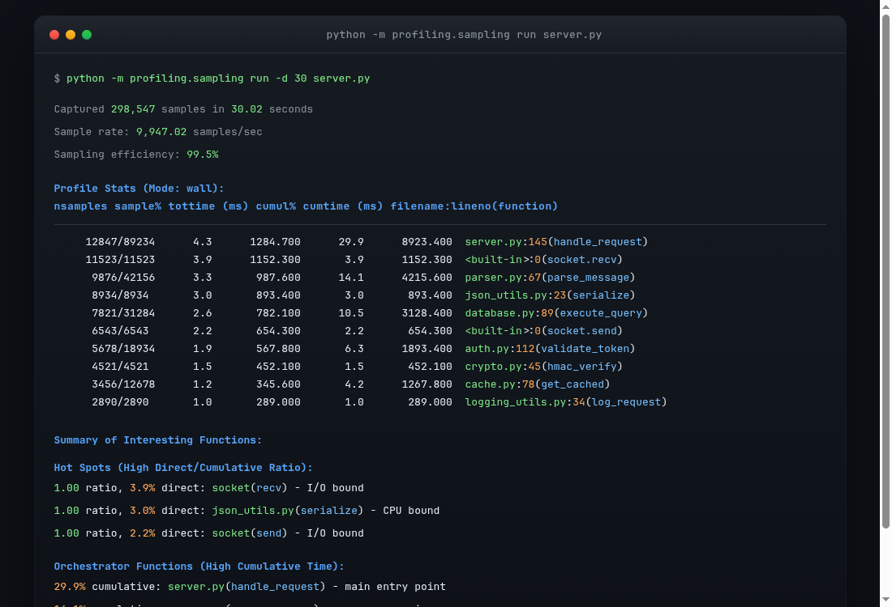
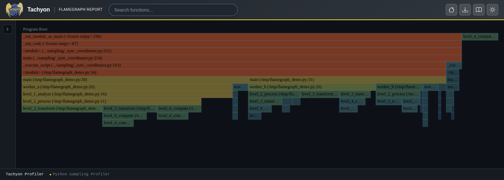
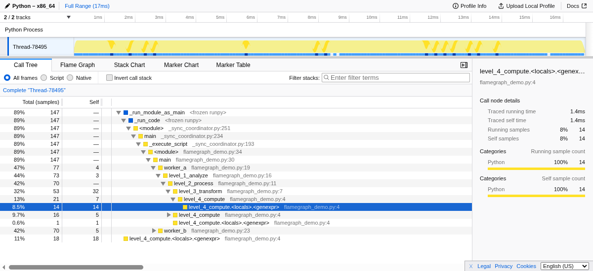
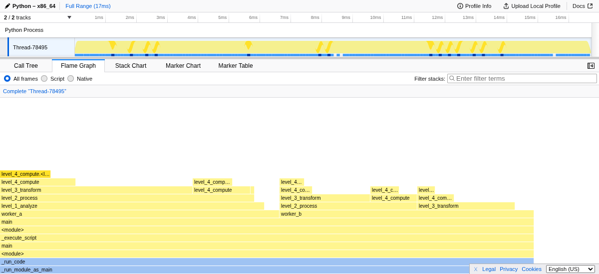
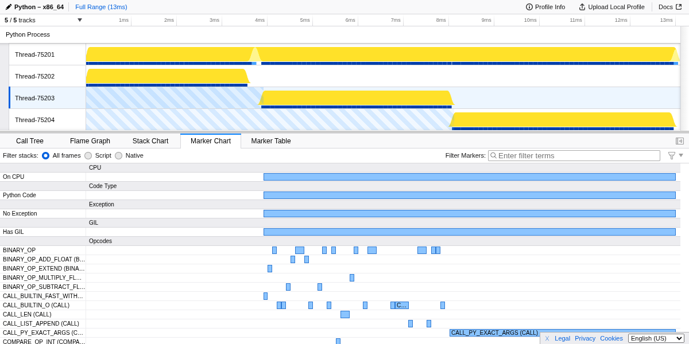
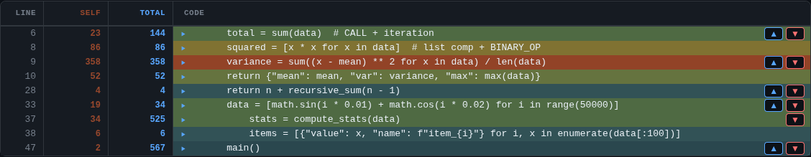
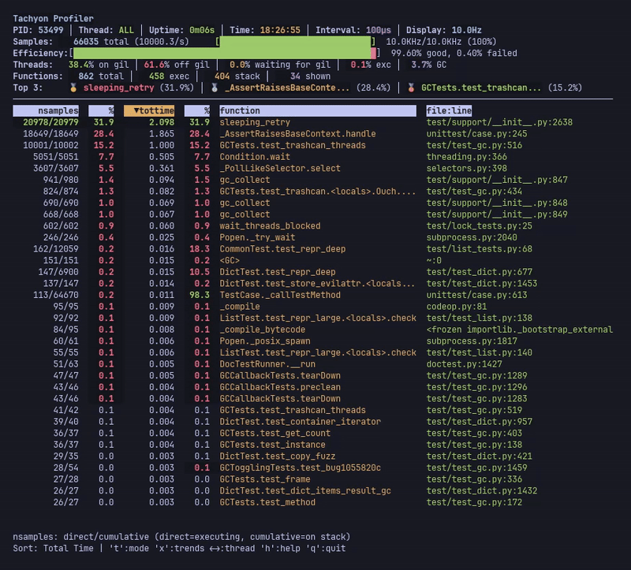

.. highlight:: shell-session

.. _profiling-sampling:

***************************************************
:mod:`profiling.sampling` --- Statistical profiler
***************************************************

.. module:: profiling.sampling
   :synopsis: Statistical sampling profiler for Python processes.

.. versionadded:: 3.15

**Source code:** :source:`Lib/profiling/sampling/`

.. program:: profiling.sampling

--------------

The :mod:`profiling.sampling` module, named **Tachyon**, provides statistical
profiling of Python programs through periodic stack sampling. Tachyon can
run scripts directly or attach to any running Python process without requiring
code changes or restarts. Because sampling occurs externally to the target
process, overhead is virtually zero, making Tachyon suitable for both
development and production environments.

What is statistical profiling?
==============================

Statistical profiling builds a picture of program behavior by periodically
capturing snapshots of the call stack. Rather than instrumenting every function
call and return as deterministic profilers do, Tachyon reads the call stack at
regular intervals to record what code is currently running.

This approach rests on a simple principle: functions that consume significant
CPU time will appear frequently in the collected samples. By gathering thousands
of samples over a profiling session, Tachyon constructs an accurate statistical
estimate of where time is spent. The more samples collected, the
more precise this estimate becomes.

How time is estimated
---------------------

The time values shown in Tachyon's output are **estimates derived from sample
counts**, not direct measurements. Tachyon counts how many times each function
appears in the collected samples, then multiplies by the sampling interval to
estimate time.

For example, with a 10 kHz sampling rate over a 10-second profile,
Tachyon collects approximately 100,000 samples. If a function appears in 5,000
samples (5% of total), Tachyon estimates it consumed 5% of the 10-second
duration, or about 500 milliseconds. This is a statistical estimate, not a
precise measurement.

The accuracy of these estimates depends on sample count. With 100,000 samples,
a function showing 5% has a margin of error of roughly ±0.5%. With only 1,000
samples, the same 5% measurement could actually represent anywhere from 3% to
7% of real time.

This is why longer profiling durations and shorter sampling intervals produce
more reliable results---they collect more samples. For most performance
analysis, the default settings provide sufficient accuracy to identify
bottlenecks and guide optimization efforts.

Because sampling is statistical, results will vary slightly between runs. A
function showing 12% in one run might show 11% or 13% in the next. This is
normal and expected. Focus on the overall pattern rather than exact percentages,
and don't worry about small variations between runs.

When to use a different approach
--------------------------------

Statistical sampling is not ideal for every situation.

For very short scripts that complete in under one second, the profiler may not
collect enough samples for reliable results. Use :mod:`profiling.tracing`
instead, or run the script in a loop to extend profiling time.

When you need exact call counts, sampling cannot provide them. Sampling
estimates frequency from snapshots, so if you need to know precisely how many
times a function was called, use :mod:`profiling.tracing`.

When comparing two implementations where the difference might be only 1-2%,
sampling noise can obscure real differences. Use :mod:`timeit` for
micro-benchmarks or :mod:`profiling.tracing` for precise measurements.

The key difference from :mod:`profiling.tracing` is how measurement happens.
A tracing profiler instruments your code, recording every function call and
return. This provides exact call counts and precise timing but adds overhead
to every function call. A sampling profiler, by contrast, observes the program
from outside at fixed intervals without modifying its execution. Think of the
difference like this: tracing is like having someone follow you and write down
every step you take, while sampling is like taking photographs every second
and inferring your path from those snapshots.

This external observation model is what makes sampling profiling practical for
production use. The profiled program runs at full speed because there is no
instrumentation code running inside it, and the target process is never stopped
or paused during sampling---Tachyon reads the call stack directly from the
process's memory while it continues to run. You can attach to a live server,
collect data, and detach without the application ever knowing it was observed.
The trade-off is that very short-lived functions may be missed if they happen
to complete between samples.

Statistical profiling excels at answering the question, "Where is my program
spending time?" It reveals hotspots and bottlenecks in production code where
deterministic profiling overhead would be unacceptable. For exact call counts
and complete call graphs, use :mod:`profiling.tracing` instead.

Quick examples
==============

Profile a script and see the results immediately::

   python -m profiling.sampling run script.py

Profile a module with arguments::

   python -m profiling.sampling run -m mypackage.module arg1 arg2

Generate an interactive flame graph::

   python -m profiling.sampling run --flamegraph -o profile.html script.py

Attach to a running process by PID::

   python -m profiling.sampling attach 12345

Use live mode for real-time monitoring (press ``q`` to quit)::

   python -m profiling.sampling run --live script.py

Profile for 60 seconds with a faster sampling rate::

   python -m profiling.sampling run -d 60 -r 20khz script.py

Generate a line-by-line heatmap::

   python -m profiling.sampling run --heatmap script.py

Enable opcode-level profiling to see which bytecode instructions are executing::

   python -m profiling.sampling run --opcodes --flamegraph script.py

Commands
========

Tachyon operates through two subcommands that determine how to obtain the
target process.

The ``run`` command
-------------------

The ``run`` command launches a Python script or module and profiles it from
startup::

   python -m profiling.sampling run script.py
   python -m profiling.sampling run -m mypackage.module

When profiling a script, the profiler starts the target in a subprocess, waits
for it to initialize, then begins collecting samples. The ``-m`` flag
indicates that the target should be run as a module (equivalent to
``python -m``). Arguments after the target are passed through to the
profiled program::

   python -m profiling.sampling run script.py --config settings.yaml

The ``attach`` command
----------------------

The ``attach`` command connects to an already-running Python process by its
process ID::

   python -m profiling.sampling attach 12345

This command is particularly valuable for investigating performance issues in
production systems. The target process requires no modification and need not
be restarted. The profiler attaches, collects samples for the specified
duration, then detaches and produces output.

::

   python -m profiling.sampling attach --live 12345
   python -m profiling.sampling attach --flamegraph -d 30 -o profile.html 12345

On most systems, attaching to another process requires appropriate permissions.
See :ref:`profiling-permissions` for platform-specific requirements.

.. _replay-command:

The ``replay`` command
----------------------

The ``replay`` command converts binary profile files to other output formats::

   python -m profiling.sampling replay profile.bin
   python -m profiling.sampling replay --flamegraph -o profile.html profile.bin

This command is useful when you have captured profiling data in binary format
and want to analyze it later or convert it to a visualization format. Binary
profiles can be replayed multiple times to different formats without
re-profiling.

::

   # Convert binary to pstats (default, prints to stdout)
   python -m profiling.sampling replay profile.bin

   # Convert binary to flame graph
   python -m profiling.sampling replay --flamegraph -o output.html profile.bin

   # Convert binary to gecko format for Firefox Profiler
   python -m profiling.sampling replay --gecko -o profile.json profile.bin

   # Convert binary to heatmap
   python -m profiling.sampling replay --heatmap -o my_heatmap profile.bin

Profiling in production
-----------------------

The sampling profiler is designed for production use. It imposes no measurable
overhead on the target process because it reads memory externally rather than
instrumenting code. The target application continues running at full speed and
is unaware it is being profiled.

When profiling production systems, keep these guidelines in mind:

Start with shorter durations (10-30 seconds) to get quick results, then extend
if you need more statistical accuracy. By default, profiling runs until the
target process completes, which is usually sufficient to identify major hotspots.

If possible, profile during representative load rather than peak traffic.
Profiles collected during normal operation are easier to interpret than those
collected during unusual spikes.

The profiler itself consumes some CPU on the machine where it runs (not on the
target process). On the same machine, this is typically negligible. When
profiling remote processes, network latency does not affect the target.

Results from production may differ from development due to different data
sizes, concurrent load, or caching effects. This is expected and is often
exactly what you want to capture.

.. _profiling-permissions:

Platform requirements
---------------------

The profiler reads the target process's memory to capture stack traces. This
requires elevated permissions on most operating systems.

**Linux**

On Linux, the profiler uses ``ptrace`` or ``process_vm_readv`` to read the
target process's memory. This typically requires one of:

- Running as root
- Having the ``CAP_SYS_PTRACE`` capability
- Adjusting the Yama ptrace scope: ``/proc/sys/kernel/yama/ptrace_scope``

The default ptrace_scope of 1 restricts ptrace to parent processes only. To
allow attaching to any process owned by the same user, set it to 0::

   echo 0 | sudo tee /proc/sys/kernel/yama/ptrace_scope

**macOS**

On macOS, the profiler uses ``task_for_pid()`` to access the target process.
This requires one of:

- Running as root
- The profiler binary having the ``com.apple.security.cs.debugger`` entitlement
- System Integrity Protection (SIP) being disabled (not recommended)

**Windows**

On Windows, the profiler requires administrative privileges or the
``SeDebugPrivilege`` privilege to read another process's memory.

Version compatibility
---------------------

The profiler and target process must run the same Python minor version (for
example, both Python 3.15). Attaching from Python 3.14 to a Python 3.15 process
is not supported.

Additional restrictions apply to pre-release Python versions: if either the
profiler or target is running a pre-release (alpha, beta, or release candidate),
both must run the exact same version.

On free-threaded Python builds, the profiler cannot attach from a free-threaded
build to a standard build, or vice versa.

Sampling configuration
======================

Before exploring the various output formats and visualization options, it is
important to understand how to configure the sampling process itself. The
profiler offers several options that control how frequently samples are
collected, how long profiling runs, which threads are observed, and what
additional context is captured in each sample.

The default configuration works well for most use cases:

.. list-table::
   :header-rows: 1
   :widths: 25 75

   * - Option
     - Default
   * - Default for ``--sampling-rate`` / ``-r``
     - 1 kHz
   * - Default for ``--duration`` / ``-d``
     - Run to completion
   * - Default for ``--all-threads`` / ``-a``
     - Main thread only
   * - Default for ``--native``
     - No ``<native>`` frames (C code time attributed to caller)
   * - Default for ``--no-gc``
     - ``<GC>`` frames included when garbage collection is active
   * - Default for ``--mode``
     - Wall-clock mode (all samples recorded)
   * - Default for ``--realtime-stats``
     - Disabled
   * - Default for ``--subprocesses``
     - Disabled
   * - Default for ``--blocking``
     - Disabled (non-blocking sampling)

Sampling rate and duration
--------------------------

The two most fundamental parameters are the sampling rate and duration.
Together, these determine how many samples will be collected during a profiling
session.

The :option:`--sampling-rate` option (:option:`-r`) sets how frequently samples
are collected. The default is 1 kHz (10,000 samples per second)::

   python -m profiling.sampling run -r 20khz script.py

Higher rates capture more samples and provide finer-grained data at the
cost of slightly higher profiler CPU usage. Lower rates reduce profiler
overhead but may miss short-lived functions. For most applications, the
default rate provides a good balance between accuracy and overhead.

The :option:`--duration` option (:option:`-d`) sets how long to profile in seconds. By
default, profiling continues until the target process exits or is interrupted::

   python -m profiling.sampling run -d 60 script.py

Specifying a duration is useful when attaching to long-running processes or when
you want to limit profiling to a specific time window. When profiling a script,
the default behavior of running to completion is usually what you want.

Thread selection
----------------

Python programs often use multiple threads, whether explicitly through the
:mod:`threading` module or implicitly through libraries that manage thread
pools.

By default, the profiler samples only the main thread. The :option:`--all-threads`
option (:option:`-a`) enables sampling of all threads in the process::

   python -m profiling.sampling run -a script.py

Multi-thread profiling reveals how work is distributed across threads and can
identify threads that are blocked or starved. Each thread's samples are
combined in the output, with the ability to filter by thread in some formats.
This option is particularly useful when investigating concurrency issues or
when work is distributed across a thread pool.

.. _blocking-mode:

Blocking mode
-------------

By default, Tachyon reads the target process's memory without stopping it.
This non-blocking approach is ideal for most profiling scenarios because it
imposes virtually zero overhead on the target application: the profiled
program runs at full speed and is unaware it is being observed.

However, non-blocking sampling can occasionally produce incomplete or
inconsistent stack traces in applications with many generators or coroutines
that rapidly switch between yield points, or in programs with very fast-changing
call stacks where functions enter and exit between the start and end of a single
stack read, resulting in reconstructed stacks that mix frames from different
execution states or that never actually existed.

For these cases, the :option:`--blocking` option stops the target process during
each sample::

   python -m profiling.sampling run --blocking script.py
   python -m profiling.sampling attach --blocking 12345

When blocking mode is enabled, the profiler suspends the target process,
reads its stack, then resumes it. This guarantees that each captured stack
represents a real, consistent snapshot of what the process was doing at that
instant. The trade-off is that the target process runs slower because it is
repeatedly paused.

.. warning::

   Do not use very high sample rates (low ``--interval`` values) with blocking
   mode. Suspending and resuming a process takes time, and if the sampling
   interval is too short, the target will spend more time stopped than running.
   For blocking mode, intervals of 1000 microseconds (1 millisecond) or higher
   are recommended. The default 100 microsecond interval may cause noticeable
   slowdown in the target application.

Use blocking mode only when you observe inconsistent stacks in your profiles,
particularly with generator-heavy or coroutine-heavy code. For most
applications, the default non-blocking mode provides accurate results with
zero impact on the target process.

Special frames
--------------

The profiler can inject artificial frames into the captured stacks to provide
additional context about what the interpreter is doing at the moment each
sample is taken. These synthetic frames help distinguish different types of
execution that would otherwise be invisible.

The :option:`--native` option adds ``<native>`` frames to indicate when Python has
called into C code (extension modules, built-in functions, or the interpreter
itself)::

   python -m profiling.sampling run --native script.py

These frames help distinguish time spent in Python code versus time spent in
native libraries. Without this option, native code execution appears as time
in the Python function that made the call. This is useful when optimizing
code that makes heavy use of C extensions like NumPy or database drivers.

By default, the profiler includes ``<GC>`` frames when garbage collection is
active. The :option:`--no-gc` option suppresses these frames::

   python -m profiling.sampling run --no-gc script.py

GC frames help identify programs where garbage collection consumes significant
time, which may indicate memory allocation patterns worth optimizing. If you
see substantial time in ``<GC>`` frames, consider investigating object
allocation rates or using object pooling.

Opcode-aware profiling
----------------------

The :option:`--opcodes` option enables instruction-level profiling that captures
which Python bytecode instructions are executing at each sample::

   python -m profiling.sampling run --opcodes --flamegraph script.py

This feature provides visibility into Python's bytecode execution, including
adaptive specialization optimizations. When a generic instruction like
``LOAD_ATTR`` is specialized at runtime into a more efficient variant like
``LOAD_ATTR_INSTANCE_VALUE``, the profiler shows both the specialized name
and the base instruction.

Opcode information appears in several output formats:

- **Flame graphs**: Hovering over a frame displays a tooltip with a bytecode
  instruction breakdown, showing which opcodes consumed time in that function
- **Heatmap**: Expandable bytecode panels per source line show instruction
  breakdown with specialization percentages
- **Live mode**: An opcode panel shows instruction-level statistics for the
  selected function, accessible via keyboard navigation
- **Gecko format**: Opcode transitions are emitted as interval markers in the
  Firefox Profiler timeline

This level of detail is particularly useful for:

- Understanding the performance impact of Python's adaptive specialization
- Identifying hot bytecode instructions that might benefit from optimization
- Analyzing the effectiveness of different code patterns at the instruction level
- Debugging performance issues that occur at the bytecode level

The :option:`--opcodes` option is compatible with :option:`--live`, :option:`--flamegraph`,
:option:`--heatmap`, and :option:`--gecko` formats. It requires additional memory to store
opcode information and may slightly reduce sampling performance, but provides
unprecedented visibility into Python's execution model.

Real-time statistics
--------------------

The :option:`--realtime-stats` option displays sampling rate statistics during
profiling::

   python -m profiling.sampling run --realtime-stats script.py

This shows the actual achieved sampling rate, which may be lower than requested
if the profiler cannot keep up. The statistics help verify that profiling is
working correctly and that sufficient samples are being collected. See
:ref:`sampling-efficiency` for details on interpreting these metrics.

Subprocess profiling
--------------------

The :option:`--subprocesses` option enables automatic profiling of subprocesses
spawned by the target::

   python -m profiling.sampling run --subprocesses script.py
   python -m profiling.sampling attach --subprocesses 12345

When enabled, the profiler monitors the target process for child process
creation. When a new Python child process is detected, a separate profiler
instance is automatically spawned to profile it. This is useful for
applications that use :mod:`multiprocessing`, :mod:`subprocess`,
:mod:`concurrent.futures` with :class:`~concurrent.futures.ProcessPoolExecutor`,
or other process spawning mechanisms.

.. code-block:: python
   :caption: worker_pool.py

   from concurrent.futures import ProcessPoolExecutor
   import math

   def compute_factorial(n):
       total = 0
       for i in range(50):
           total += math.factorial(n)
       return total

   if __name__ == "__main__":
       numbers = [5000 + i * 100 for i in range(50)]
       with ProcessPoolExecutor(max_workers=4) as executor:
           results = list(executor.map(compute_factorial, numbers))
       print(f"Computed {len(results)} factorials")

::

   python -m profiling.sampling run --subprocesses --flamegraph worker_pool.py

This produces separate flame graphs for the main process and each worker
process: ``flamegraph_<main_pid>.html``, ``flamegraph_<worker1_pid>.html``,
and so on.

Each subprocess receives its own output file. The filename is derived from
the specified output path (or the default) with the subprocess's process ID
appended:

- If you specify ``-o profile.html``, subprocesses produce ``profile_12345.html``,
  ``profile_12346.html``, and so on
- With default output, subprocesses produce files like ``flamegraph_12345.html``
  or directories like ``heatmap_12345``
- For pstats format (which defaults to stdout), subprocesses produce files like
  ``profile_12345.pstats``

The subprocess profilers inherit most sampling options from the parent (sampling
rate, duration, thread selection, native frames, GC frames, async-aware mode,
and output format). All Python descendant processes are profiled recursively,
including grandchildren and further descendants.

Subprocess detection works by periodically scanning for new descendants of
the target process and checking whether each new process is a Python process
by probing the process memory for Python runtime structures. Non-Python
subprocesses (such as shell commands or external tools) are ignored.

There is a limit of 100 concurrent subprocess profilers to prevent resource
exhaustion in programs that spawn many processes. If this limit is reached,
additional subprocesses are not profiled and a warning is printed.

The :option:`--subprocesses` option is incompatible with :option:`--live` mode
because live mode uses an interactive terminal interface that cannot
accommodate multiple concurrent profiler displays.

.. _sampling-efficiency:

Sampling efficiency
-------------------

Sampling efficiency metrics help assess the quality of the collected data.
These metrics appear in the profiler's terminal output and in the flame graph
sidebar.

**Sampling efficiency** is the percentage of sample attempts that succeeded.
Each sample attempt reads the target process's call stack from memory. An
attempt can fail if the process is in an inconsistent state at the moment of
reading, such as during a context switch or while the interpreter is updating
its internal structures. A low efficiency may indicate that the profiler could
not keep up with the requested sampling rate, often due to system load or an
overly aggressive interval setting.

**Missed samples** is the percentage of expected samples that were not
collected. Based on the configured interval and duration, the profiler expects
to collect a certain number of samples. Some samples may be missed if the
profiler falls behind schedule, for example when the system is under heavy
load. A small percentage of missed samples is normal and does not significantly
affect the statistical accuracy of the profile.

Both metrics are informational. Even with some failed attempts or missed
samples, the profile remains statistically valid as long as enough samples
were collected. The profiler reports the actual number of samples captured,
which you can use to judge whether the data is sufficient for your analysis.

Profiling modes
===============

The sampling profiler supports four modes that control which samples are
recorded. The mode determines what the profile measures: total elapsed time,
CPU execution time, time spent holding the global interpreter lock, or
exception handling.

Wall-clock mode
---------------

Wall-clock mode (:option:`--mode`\ ``=wall``) captures all samples regardless of what the
thread is doing. This is the default mode and provides a complete picture of
where time passes during program execution::

   python -m profiling.sampling run --mode=wall script.py

In wall-clock mode, samples are recorded whether the thread is actively
executing Python code, waiting for I/O, blocked on a lock, or sleeping.
This makes wall-clock profiling ideal for understanding the overall time
distribution in your program, including time spent waiting.

If your program spends significant time in I/O operations, network calls, or
sleep, wall-clock mode will show these waits as time attributed to the calling
function. This is often exactly what you want when optimizing end-to-end
latency.

CPU mode
--------

CPU mode (:option:`--mode`\ ``=cpu``) records samples only when the thread is actually
executing on a CPU core::

   python -m profiling.sampling run --mode=cpu script.py

Samples taken while the thread is sleeping, blocked on I/O, or waiting for
a lock are discarded. The resulting profile shows where CPU cycles are consumed,
filtering out idle time.

CPU mode is useful when you want to focus on computational hotspots without
being distracted by I/O waits. If your program alternates between computation
and network calls, CPU mode reveals which computational sections are most
expensive.

Comparing wall-clock and CPU profiles
-------------------------------------

Running both wall-clock and CPU mode profiles can reveal whether a function's
time is spent computing or waiting.

If a function appears prominently in both profiles, it is a true computational
hotspot---actively using the CPU. Optimization should focus on algorithmic
improvements or more efficient code.

If a function is high in wall-clock mode but low or absent in CPU mode, it is
I/O-bound or waiting. The function spends most of its time waiting for network,
disk, locks, or sleep. CPU optimization won't help here; consider async I/O,
connection pooling, or reducing wait time instead.

.. code-block:: python

   import time

   def do_sleep():
       time.sleep(2)

   def do_compute():
       sum(i**2 for i in range(1000000))

   if __name__ == "__main__":
       do_sleep()
       do_compute()

::

   python -m profiling.sampling run --mode=wall script.py  # do_sleep ~98%, do_compute ~1%
   python -m profiling.sampling run --mode=cpu script.py   # do_sleep absent, do_compute dominates

GIL mode
--------

GIL mode (:option:`--mode`\ ``=gil``) records samples only when the thread holds Python's
global interpreter lock::

   python -m profiling.sampling run --mode=gil script.py

The GIL is held only while executing Python bytecode. When Python calls into
C extensions, performs I/O operations, or executes native code, the GIL is
typically released. This means GIL mode effectively measures time spent
running Python code specifically, filtering out time in native libraries.

In multi-threaded programs, GIL mode reveals which code is preventing other
threads from running Python bytecode. Since only one thread can hold the GIL
at a time, functions that appear frequently in GIL mode profiles are
monopolizing the interpreter.

GIL mode helps answer questions like "which functions are monopolizing the
GIL?" and "why are my other threads starving?" It can also be useful in
single-threaded programs to distinguish Python execution time from time spent
in C extensions or I/O.

.. code-block:: python

   import hashlib

   def hash_work():
       # C extension - releases GIL during computation
       for _ in range(200):
           hashlib.sha256(b"data" * 250000).hexdigest()

   def python_work():
       # Pure Python - holds GIL during computation
       for _ in range(3):
           sum(i**2 for i in range(1000000))

   if __name__ == "__main__":
       hash_work()
       python_work()

::

   python -m profiling.sampling run --mode=cpu script.py  # hash_work ~42%, python_work ~38%
   python -m profiling.sampling run --mode=gil script.py  # hash_work ~5%, python_work ~60%

Exception mode
--------------

Exception mode (``--mode=exception``) records samples only when a thread has
an active exception::

   python -m profiling.sampling run --mode=exception script.py

Samples are recorded in two situations: when an exception is being propagated
up the call stack (after ``raise`` but before being caught), or when code is
executing inside an ``except`` block where exception information is still
present in the thread state.

The following example illustrates which code regions are captured:

.. code-block:: python

   def example():
       try:
           raise ValueError("error")    # Captured: exception being raised
       except ValueError:
           process_error()              # Captured: inside except block
       finally:
           cleanup()                    # NOT captured: exception already handled

   def example_propagating():
       try:
           try:
               raise ValueError("error")
           finally:
               cleanup()                # Captured: exception propagating through
       except ValueError:
           pass

   def example_no_exception():
       try:
           do_work()
       finally:
           cleanup()                    # NOT captured: no exception involved

Note that ``finally`` blocks are only captured when an exception is actively
propagating through them. Once an ``except`` block finishes executing, Python
clears the exception information before running any subsequent ``finally``
block. Similarly, ``finally`` blocks that run during normal execution (when no
exception was raised) are not captured because no exception state is present.

This mode is useful for understanding where your program spends time handling
errors. Exception handling can be a significant source of overhead in code
that uses exceptions for flow control (such as ``StopIteration`` in iterators)
or in applications that process many error conditions (such as network servers
handling connection failures).

Exception mode helps answer questions like "how much time is spent handling
exceptions?" and "which exception handlers are the most expensive?" It can
reveal hidden performance costs in code that catches and processes many
exceptions, even when those exceptions are handled gracefully. For example,
if a parsing library uses exceptions internally to signal format errors, this
mode will capture time spent in those handlers even if the calling code never
sees the exceptions.

Output formats
==============

The profiler produces output in several formats, each suited to different
analysis workflows. The format is selected with a command-line flag, and
output goes to stdout, a file, or a directory depending on the format.

pstats format
-------------

The pstats format (:option:`--pstats`) produces a text table similar to what
deterministic profilers generate. This is the default output format::

   python -m profiling.sampling run script.py
   python -m profiling.sampling run --pstats script.py

   The pstats format displays profiling results in a color-coded table showing
   function hotspots, sample counts, and timing estimates.

Output appears on stdout by default::

   Profile Stats (Mode: wall):
        nsamples  sample%    tottime (ms)  cumul%   cumtime (ms)  filename:lineno(function)
          234/892    11.7%       234.00     44.6%       892.00    server.py:145(handle_request)
          156/156     7.8%       156.00      7.8%       156.00    <built-in>:0(socket.recv)
           98/421     4.9%        98.00     21.1%       421.00    parser.py:67(parse_message)

The columns show sampling counts and estimated times:

- **nsamples**: Displayed as ``direct/cumulative`` (for example, ``10/50``).
  Direct samples are when the function was at the top of the stack, actively
  executing. Cumulative samples are when the function appeared anywhere on the
  stack, including when it was waiting for functions it called. If a function
  shows ``10/50``, it was directly executing in 10 samples and was on the call
  stack in 50 samples total.

- **sample%** and **cumul%**: Percentages of total samples for direct and
  cumulative counts respectively.

- **tottime** and **cumtime**: Estimated wall-clock time based on sample counts
  and the profiling duration. Time units are selected automatically based on
  the magnitude: seconds for large values, milliseconds for moderate values,
  or microseconds for small values.

The output includes a legend explaining each column and a summary of
interesting functions that highlights:

- **Hot spots**: Functions with high direct/cumulative sample ratio (ratio
  close to 1.0). These functions spend most of their time executing their own
  code rather than waiting for callees. High ratios indicate where CPU time
  is actually consumed.

- **Indirect calls**: Functions with large differences between cumulative and
  direct samples. These are orchestration functions that delegate work to
  other functions. They appear frequently on the stack but rarely at the top.

- **Call magnification**: Functions where cumulative samples far exceed direct
  samples (high cumulative/direct multiplier). These are frequently-nested
  functions that appear deep in many call chains.

Use :option:`--no-summary` to suppress both the legend and summary sections.

To save pstats output to a binary file instead of stdout::

   python -m profiling.sampling run -o profile.pstats script.py

The pstats format supports several options for controlling the display.
The :option:`--sort` option determines the column used for ordering results::

   python -m profiling.sampling run --sort=tottime script.py
   python -m profiling.sampling run --sort=cumtime script.py
   python -m profiling.sampling run --sort=nsamples script.py

The :option:`--limit` option restricts output to the top N entries::

   python -m profiling.sampling run --limit=30 script.py

The :option:`--no-summary` option suppresses the header summary that precedes the
statistics table.

Collapsed stacks format
-----------------------

Collapsed stacks format (:option:`--collapsed`) produces one line per unique call
stack, with a count of how many times that stack was sampled::

   python -m profiling.sampling run --collapsed script.py

The output looks like:

.. code-block:: text

   main;process_data;parse_json;decode_utf8 42
   main;process_data;parse_json 156
   main;handle_request;send_response 89

Each line contains semicolon-separated function names representing the call
stack from bottom to top, followed by a space and the sample count. This
format is designed for compatibility with external flame graph tools,
particularly Brendan Gregg's ``flamegraph.pl`` script.

To generate a flame graph from collapsed stacks::

   python -m profiling.sampling run --collapsed script.py > stacks.txt
   flamegraph.pl stacks.txt > profile.svg

The resulting SVG can be viewed in any web browser and provides an interactive
visualization where you can click to zoom into specific call paths.

Flame graph format
------------------

Flame graph format (:option:`--flamegraph`) produces a self-contained HTML file with
an interactive flame graph visualization::

   python -m profiling.sampling run --flamegraph script.py
   python -m profiling.sampling run --flamegraph -o profile.html script.py

   The flame graph visualization shows call stacks as nested rectangles, with
   width proportional to time spent. The sidebar displays runtime statistics,
   GIL metrics, and hotspot functions.

.. only:: html

   `Try the interactive example <../_static/tachyon-example-flamegraph.html>`__!

If no output file is specified, the profiler generates a filename based on
the process ID (for example, ``flamegraph.12345.html``).

The generated HTML file requires no external dependencies and can be opened
directly in a web browser. The visualization displays call stacks as nested
rectangles, with width proportional to time spent. Hovering over a rectangle
shows details about that function including source code context, and clicking
zooms into that portion of the call tree.

The flame graph interface includes:

- A sidebar showing profile summary, thread statistics, sampling efficiency
  metrics (see :ref:`sampling-efficiency`), and top hotspot functions
- Search functionality supporting both function name matching and
  ``file.py:42`` line patterns
- Per-thread filtering via dropdown
- Dark/light theme toggle (preference saved across sessions)
- SVG export for saving the current view

The thread statistics section shows runtime behavior metrics:

- **GIL Held**: percentage of samples where a thread held the global interpreter
  lock (actively running Python code)
- **GIL Released**: percentage of samples where no thread held the GIL
- **Waiting GIL**: percentage of samples where a thread was waiting to acquire
  the GIL
- **GC**: percentage of samples during garbage collection

These statistics help identify GIL contention and understand how time is
distributed between Python execution, native code, and waiting.

Flame graphs are particularly effective for identifying deep call stacks and
understanding the hierarchical structure of time consumption. Wide rectangles
at the top indicate functions that consume significant time either directly
or through their callees.

Gecko format
------------

Gecko format (:option:`--gecko`) produces JSON output compatible with the Firefox
Profiler::

   python -m profiling.sampling run --gecko script.py
   python -m profiling.sampling run --gecko -o profile.json script.py

The `Firefox Profiler <https://profiler.firefox.com>`__ is a sophisticated
web-based tool originally built for profiling Firefox itself. It provides
features beyond basic flame graphs, including a timeline view, call tree
exploration, and marker visualization. See the
`Firefox Profiler documentation <https://profiler.firefox.com/docs/#/>`__ for
detailed usage instructions.

To use the output, open the Firefox Profiler in your browser and load the
JSON file. The profiler runs entirely client-side, so your profiling data
never leaves your machine.

Gecko format automatically collects additional metadata about GIL state and
CPU activity, enabling analysis features specific to Python's threading model.
The profiler emits interval markers that appear as colored bands in the
Firefox Profiler timeline:

- **GIL markers**: show when threads hold or release the global interpreter lock
- **CPU markers**: show when threads are executing on CPU versus idle
- **Code type markers**: distinguish Python code from native (C extension) code
- **GC markers**: indicate garbage collection activity

For this reason, the :option:`--mode` option is not available with Gecko format;
all relevant data is captured automatically.

   The Call Tree view shows the complete call hierarchy with sample counts
   and percentages. The sidebar displays detailed statistics for the
   selected function including running time and sample distribution.

   The Flame Graph visualization shows call stacks as nested rectangles.
   Functions names are visible in the call hierarchy.

   The Marker Chart displays interval markers including CPU state, GIL
   status, and opcodes. With ``--opcodes`` enabled, bytecode instructions
   like ``BINARY_OP_ADD_FLOAT``, ``CALL_PY_EXACT_ARGS``, and
   ``CALL_LIST_APPEND`` appear as markers showing execution over time.

Heatmap format
--------------

Heatmap format (:option:`--heatmap`) generates an interactive HTML visualization
showing sample counts at the source line level::

   python -m profiling.sampling run --heatmap script.py
   python -m profiling.sampling run --heatmap -o my_heatmap script.py

   The heatmap overlays sample counts directly on your source code. Lines are
   color-coded from cool (few samples) to hot (many samples). Navigation
   buttons (▲▼) let you jump between callers and callees.

Unlike other formats that produce a single file, heatmap output creates a
directory containing HTML files for each profiled source file. If no output
path is specified, the directory is named ``heatmap_PID``.

The heatmap visualization displays your source code with a color gradient
indicating how many samples were collected at each line. Hot lines (many
samples) appear in warm colors, while cold lines (few or no samples) appear
in cool colors. This view helps pinpoint exactly which lines of code are
responsible for time consumption.

The heatmap interface provides several interactive features:

- **Coloring modes**: toggle between "Self Time" (direct execution) and
  "Total Time" (cumulative, including time in called functions)
- **Cold code filtering**: show all lines or only lines with samples
- **Call graph navigation**: each line shows navigation buttons (▲ for callers,
  ▼ for callees) that let you trace execution paths through your code. When
  multiple functions called or were called from a line, a menu appears showing
  all options with their sample counts.
- **Scroll minimap**: a vertical overview showing the heat distribution across
  the entire file
- **Hierarchical index**: files organized by type (stdlib, site-packages,
  project) with aggregate sample counts per folder
- **Dark/light theme**: toggle with preference saved across sessions
- **Line linking**: click line numbers to create shareable URLs

When opcode-level profiling is enabled with :option:`--opcodes`, each hot line
can be expanded to show which bytecode instructions consumed time:

.. figure:: tachyon-heatmap-with-opcodes.png
   :alt: Heatmap with expanded bytecode panel
   :align: center
   :width: 100%

   Expanding a hot line reveals the bytecode instructions executed, including
   specialized variants. The panel shows sample counts per instruction and the
   overall specialization percentage for the line.

.. only:: html

   `Try the interactive example <../_static/tachyon-example-heatmap.html>`__!

Heatmaps are especially useful when you know which file contains a performance
issue but need to identify the specific lines. Many developers prefer this
format because it maps directly to their source code, making it easy to read
and navigate. For smaller scripts and focused analysis, heatmaps provide an
intuitive view that shows exactly where time is spent without requiring
interpretation of hierarchical visualizations.

Binary format
-------------

Binary format (:option:`--binary`) produces a compact binary file for efficient
storage of profiling data::

   python -m profiling.sampling run --binary -o profile.bin script.py
   python -m profiling.sampling attach --binary -o profile.bin 12345

The :option:`--compression` option controls data compression:

- ``auto`` (default): Use zstd compression if available, otherwise no
  compression
- ``zstd``: Force zstd compression (requires :mod:`compression.zstd` support)
- ``none``: Disable compression

::

   python -m profiling.sampling run --binary --compression=zstd -o profile.bin script.py

To analyze binary profiles, use the :ref:`replay-command` to convert them to
other formats like flame graphs or pstats output.

Record and replay workflow
==========================

The binary format combined with the replay command enables a record-and-replay
workflow that separates data capture from analysis. Rather than generating
visualizations during profiling, you capture raw data to a compact binary file
and convert it to different formats later.

This approach has three main benefits:

- Sampling runs faster because the work of building data structures for
  visualization is deferred until replay.
- A single binary capture can be converted to multiple output formats
  without re-profiling: pstats for a quick overview, flame graph for visual
  exploration, heatmap for line-level detail.
- Binary files are compact and easy to share with colleagues who can convert
  them to their preferred format.

A typical workflow::

   # Capture profile in production or during tests
   python -m profiling.sampling attach --binary -o profile.bin 12345

   # Later, analyze with different formats
   python -m profiling.sampling replay profile.bin
   python -m profiling.sampling replay --flamegraph -o profile.html profile.bin
   python -m profiling.sampling replay --heatmap -o heatmap profile.bin

Live mode
=========

Live mode (:option:`--live`) provides a terminal-based real-time view of profiling
data, similar to the ``top`` command for system processes::

   python -m profiling.sampling run --live script.py
   python -m profiling.sampling attach --live 12345

   Live mode displays real-time profiling statistics, showing combined
   data from multiple threads in a multi-threaded application.

The display updates continuously as new samples arrive, showing the current
hottest functions. This mode requires the :mod:`curses` module, which is
available on Unix-like systems but not on Windows. The terminal must be at
least 60 columns wide and 12 lines tall; larger terminals display more columns.

The header displays the top 3 hottest functions, sampling efficiency metrics,
and thread status statistics (GIL held percentage, CPU usage, GC time). The
main table shows function statistics with the currently sorted column indicated
by an arrow (▼).

When :option:`--opcodes` is enabled, an additional opcode panel appears below the
main table, showing instruction-level statistics for the currently selected
function. This panel displays which bytecode instructions are executing most
frequently, including specialized variants and their base opcodes.

.. figure:: tachyon-live-mode-1.gif
   :alt: Tachyon live mode with opcode panel
   :align: center
   :width: 100%

   Live mode with ``--opcodes`` enabled shows an opcode panel with a bytecode
   instruction breakdown for the selected function.

Keyboard commands
-----------------

Within live mode, keyboard commands control the display:

:kbd:`q`
   Quit the profiler and return to the shell.

:kbd:`s` / :kbd:`S`
   Cycle through sort orders forward/backward (sample count, percentage,
   total time, cumulative percentage, cumulative time).

:kbd:`p`
   Pause or resume display updates. Sampling continues in the background
   while the display is paused, so you can freeze the view to examine results
   without stopping data collection.

:kbd:`r`
   Reset all statistics and start fresh. This is disabled after profiling
   finishes to prevent accidental data loss.

:kbd:`/`
   Enter filter mode to search for functions by name. The filter uses
   case-insensitive substring matching against the filename and function name.
   Type a pattern and press Enter to apply, or Escape to cancel. Glob patterns
   and regular expressions are not supported.

:kbd:`c`
   Clear the current filter and show all functions again.

:kbd:`t`
   Toggle between viewing all threads combined or per-thread statistics.
   In per-thread mode, a thread counter (for example, ``1/4``) appears showing
   your position among the available threads.

:kbd:`←` :kbd:`→` or :kbd:`↑` :kbd:`↓`
   In per-thread view, navigate between threads. Navigation wraps around
   from the last thread to the first and vice versa.

:kbd:`+` / :kbd:`-`
   Increase or decrease the display refresh rate. The range is 0.05 seconds
   (20 Hz, very responsive) to 1.0 second (1 Hz, lower overhead). Faster refresh
   rates use more CPU. The default is 0.1 seconds (10 Hz).

:kbd:`x`
   Toggle trend indicators that show whether functions are becoming hotter
   or cooler over time. When enabled, increasing metrics appear in green and
   decreasing metrics appear in red, comparing each update to the previous one.

:kbd:`h` or :kbd:`?`
   Show the help screen with all available commands.

:kbd:`j` / :kbd:`k` (or :kbd:`Up` / :kbd:`Down`)
   Navigate through opcode entries in the opcode panel (when ``--opcodes`` is
   enabled). These keys scroll through the instruction-level statistics for the
   currently selected function.

When profiling finishes (duration expires or target process exits), the display
shows a "PROFILING COMPLETE" banner and freezes the final results. You can
still navigate, sort, and filter the results before pressing :kbd:`q` to exit.

Live mode is incompatible with output format options (:option:`--collapsed`,
:option:`--flamegraph`, and so on) because it uses an interactive terminal
interface rather than producing file output.

Async-aware profiling
=====================

For programs using :mod:`asyncio`, the profiler offers async-aware mode
(:option:`--async-aware`) that reconstructs call stacks based on the task structure
rather than the raw Python frames::

   python -m profiling.sampling run --async-aware async_script.py

Standard profiling of async code can be confusing because the physical call
stack often shows event loop internals rather than the logical flow of your
coroutines. Async-aware mode addresses this by tracking which task is running
and presenting stacks that reflect the ``await`` chain.

.. code-block:: python

   import asyncio

   async def fetch(url):
       await asyncio.sleep(0.1)
       return url

   async def main():
       for _ in range(50):
           await asyncio.gather(fetch("a"), fetch("b"), fetch("c"))

   if __name__ == "__main__":
       asyncio.run(main())

::

   python -m profiling.sampling run --async-aware --flamegraph -o out.html script.py

.. note::

   Async-aware profiling requires the target process to have the :mod:`asyncio`
   module loaded. If you profile a script before it imports asyncio, async-aware
   mode will not be able to capture task information.

Async modes
-----------

The :option:`--async-mode` option controls which tasks appear in the profile::

   python -m profiling.sampling run --async-aware --async-mode=running async_script.py
   python -m profiling.sampling run --async-aware --async-mode=all async_script.py

With :option:`--async-mode`\ ``=running`` (the default), only the task currently executing
on the CPU is profiled. This shows where your program is actively spending time
and is the typical choice for performance analysis.

With :option:`--async-mode`\ ``=all``, tasks that are suspended (awaiting I/O, locks, or
other tasks) are also included. This mode is useful for understanding what your
program is waiting on, but produces larger profiles since every suspended task
appears in each sample.

Task markers and stack reconstruction
-------------------------------------

In async-aware profiles, you will see ``<task>`` frames that mark boundaries
between asyncio tasks. These are synthetic frames inserted by the profiler to
show the task structure. The task name appears as the function name in these
frames.

When a task awaits another task, the profiler reconstructs the logical call
chain by following the ``await`` relationships. Only "leaf" tasks (tasks that
no other task is currently awaiting) generate their own stack entries. Tasks
being awaited by other tasks appear as part of their awaiter's stack instead.

If a task has multiple awaiters (a diamond pattern in the task graph), the
profiler deterministically selects one parent and annotates the task marker
with the number of parents, for example ``MyTask (2 parents)``. This indicates
that alternate execution paths exist but are not shown in this particular stack.

Option restrictions
-------------------

Async-aware mode uses a different stack reconstruction mechanism and is
incompatible with: :option:`--native`, :option:`--no-gc`, :option:`--all-threads`, and
:option:`--mode`\ ``=cpu`` or :option:`--mode`\ ``=gil``.

Command-line interface
======================

.. program:: profiling.sampling

The complete command-line interface for reference.

Global options
--------------

.. option:: run

   Run and profile a Python script or module.

.. option:: attach

   Attach to and profile a running process by PID.

.. option:: replay

   Convert a binary profile file to another output format.

Sampling options
----------------

.. option:: -r <rate>, --sampling-rate <rate>

   Sampling rate (for example, ``10000``, ``10khz``, ``10k``). Default: ``1khz``.

.. option:: -d <seconds>, --duration <seconds>

   Profiling duration in seconds. Default: run to completion.

.. option:: -a, --all-threads

   Sample all threads, not just the main thread.

.. option:: --realtime-stats

   Display sampling statistics during profiling.

.. option:: --native

   Include ``<native>`` frames for non-Python code.

.. option:: --no-gc

   Exclude ``<GC>`` frames for garbage collection.

.. option:: --async-aware

   Enable async-aware profiling for asyncio programs.

.. option:: --opcodes

   Gather bytecode opcode information for instruction-level profiling. Shows
   which bytecode instructions are executing, including specializations.
   Compatible with ``--live``, ``--flamegraph``, ``--heatmap``, and ``--gecko``
   formats only.

.. option:: --subprocesses

   Also profile subprocesses. Each subprocess gets its own profiler
   instance and output file. Incompatible with ``--live``.

.. option:: --blocking

   Pause the target process during each sample. This ensures consistent
   stack traces at the cost of slowing down the target. Use with longer
   intervals (1000 µs or higher) to minimize impact. See :ref:`blocking-mode`
   for details.

Mode options
------------

.. option:: --mode <mode>

   Sampling mode: ``wall`` (default), ``cpu``, ``gil``, or ``exception``.
   The ``cpu``, ``gil``, and ``exception`` modes are incompatible with
   ``--async-aware``.

.. option:: --async-mode <mode>

   Async profiling mode: ``running`` (default) or ``all``.
   Requires ``--async-aware``.

Output options
--------------

.. option:: --pstats

   Generate pstats statistics. This is the default.
   When written to stdout, the output is a text table; with :option:`-o`,
   it is a binary pstats file.

.. option:: --collapsed

   Generate collapsed stack format for external flame graph tools.

.. option:: --flamegraph

   Generate self-contained HTML flame graph.

.. option:: --gecko

   Generate Gecko JSON format for Firefox Profiler.

.. option:: --heatmap

   Generate HTML heatmap with line-level sample counts.

.. option:: --binary

   Generate high-performance binary format for later conversion with the
   ``replay`` command.

.. option:: --compression <type>

   Compression for binary format: ``auto`` (use zstd if available, default),
   ``zstd``, or ``none``.

.. option:: -o <path>, --output <path>

   Output file or directory path. Default behavior varies by format:
   :option:`--pstats` prints a text table to stdout, while ``-o`` writes a
   binary pstats file. Other formats generate a file named
   ``<format>_<PID>.<ext>`` (for example, ``flamegraph_12345.html``).
   :option:`--heatmap` creates a directory named ``heatmap_<PID>``.

.. option:: --browser

   Automatically open HTML output (:option:`--flamegraph` and
   :option:`--heatmap`) in your default web browser after generation.
   When profiling with :option:`--subprocesses`, only the main process
   opens the browser; subprocess outputs are never auto-opened.

pstats display options
----------------------

These options apply only to pstats format output.

.. option:: --sort <key>

   Sort order: ``nsamples``, ``tottime``, ``cumtime``, ``sample-pct``,
   ``cumul-pct``, ``nsamples-cumul``, or ``name``. Default: ``nsamples``.

.. option:: -l <count>, --limit <count>

   Maximum number of entries to display. Default: 15.

.. option:: --no-summary

   Omit the Legend and Summary of Interesting Functions sections from output.

Run command options
-------------------

.. option:: -m, --module

   Treat the target as a module name rather than a script path.

.. option:: --live

   Start interactive terminal interface instead of batch profiling.

.. seealso::

   :mod:`profiling`
      Overview of Python profiling tools and guidance on choosing a profiler.

   :mod:`profiling.tracing`
      Deterministic tracing profiler for exact call counts and timing.

   :mod:`pstats`
      Statistics analysis for profile data.

   `Firefox Profiler <https://profiler.firefox.com>`__
      Web-based profiler that accepts Gecko format output. See the
      `documentation <https://profiler.firefox.com/docs/#/>`__ for usage details.

   `FlameGraph <https://github.com/brendangregg/FlameGraph>`__
      Tools for generating flame graphs from collapsed stack format.
