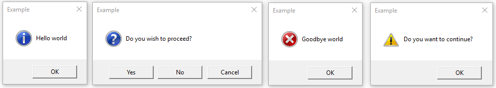

:mod:`tkinter.messagebox` --- Tkinter message prompts
=====================================================

.. module:: tkinter.messagebox
   :platform: Tk
   :synopsis: Various types of alert dialogs

**Source code:** :source:`Lib/tkinter/messagebox.py`

--------------

The :mod:`tkinter.messagebox` module provides a template base class as well as
a variety of convenience methods for commonly used configurations. The message
boxes are modal and will return a subset of (True, False, OK, None, Yes, No) based on
the user's selection. Common message box styles and layouts include but are not
limited to:

.. class:: Message(master=None, **options)

   Create a default information message box.

**Information message box**

.. method:: showinfo(title=None, message=None, **options)

**Warning message boxes**

.. method:: showwarning(title=None, message=None, **options)
            showerror(title=None, message=None, **options)

**Question message boxes**

.. method:: askquestion(title=None, message=None, **options)
            askokcancel(title=None, message=None, **options)
            askretrycancel(title=None, message=None, **options)
            askyesno(title=None, message=None, **options)
            askyesnocancel(title=None, message=None, **options)
