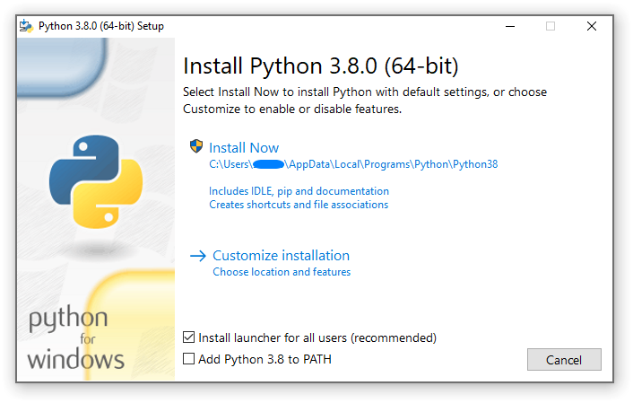
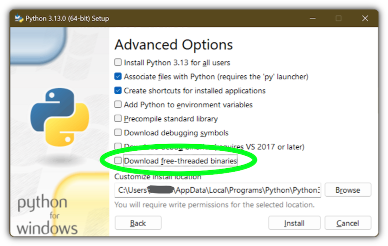

.. highlight:: none

.. _python.org/downloads: https://www.python.org/downloads/

.. _Microsoft Store app: https://apps.microsoft.com/detail/9NQ7512CXL7T

.. _legacy launcher: https://www.python.org/ftp/python/3.14.0/win32/launcher.msi

.. _using-on-windows:

*************************
 Using Python on Windows
*************************

.. sectionauthor:: Steve Dower <steve.dower@python.org>

This document aims to give an overview of Windows-specific behaviour you should
know about when using Python on Microsoft Windows.

Unlike most Unix systems and services, Windows does not include a system
supported installation of Python. Instead, Python can be obtained from a number
of distributors, including directly from the CPython team. Each Python
distribution will have its own benefits and drawbacks, however, consistency with
other tools you are using is generally a worthwhile benefit. Before committing
to the process described here, we recommend investigating your existing tools to
see if they can provide Python directly.

To obtain Python from the CPython team, use the Python Install Manager. This
is a standalone tool that makes Python available as global commands on your
Windows machine, integrates with the system, and supports updates over time. You
can download the Python Install Manager from `python.org/downloads`_ or through
the `Microsoft Store app`_.

Once you have installed the Python Install Manager, the global ``python``
command can be used from any terminal to launch your current latest version of
Python. This version may change over time as you add or remove different
versions, and the ``py list`` command will show which is current.

In general, we recommend that you create a :ref:`virtual environment <tut-venv>`
for each project and run ``<env>\Scripts\Activate`` in your terminal to use it.
This provides isolation between projects, consistency over time, and ensures
that additional commands added by packages are also available in your session.
Create a virtual environment using ``python -m venv <env path>``.

If the ``python`` or ``py`` commands do not seem to be working, please see the
:ref:`Troubleshooting <pymanager-troubleshoot>` section below. There are
sometimes additional manual steps required to configure your PC.

Apart from using the Python install manager, Python can also be obtained as
NuGet packages. See :ref:`windows-nuget` below for more information on these
packages.

The embeddable distros are minimal packages of Python suitable for embedding
into larger applications. They can be installed using the Python install
manager. See :ref:`windows-embeddable` below for more information on these
packages.

.. _pymanager:
.. _windows-store:
.. _setting-envvars:
.. _windows-path-mod:
.. _launcher:

Python install manager
======================

Installation
------------

The Python install manager can be installed from the `Microsoft Store app`_
or downloaded and installed from `python.org/downloads`_. The two versions are
identical.

To install through the Store, simply click "Install". After it has completed,
open a terminal and type ``python`` to get started.

To install the file downloaded from python.org, either double-click and select
"Install", or run ``Add-AppxPackage <path to MSIX>`` in Windows Powershell.

After installation, the ``python``, ``py``, and ``pymanager`` commands should be
available. If you have existing installations of Python, or you have modified
your :envvar:`PATH` variable, you may need to remove them or undo the
modifications. See :ref:`pymanager-troubleshoot` for more help with fixing
non-working commands.

When you first install a runtime, you will likely be prompted to add a directory
to your :envvar:`PATH`. This is optional, if you prefer to use the ``py``
command, but is offered for those who prefer the full range of aliases (such
as ``python3.14.exe``) to be available. The directory will be
:file:`%LocalAppData%\\Python\\bin` by default, but may be customized by an
administrator. Click Start and search for "Edit environment variables for your
account" for the system settings page to add the path.

Each Python runtime you install will have its own directory for scripts. These
also need to be added to :envvar:`PATH` if you want to use them.

The Python install manager will be automatically updated to new releases. This
does not affect any installs of Python runtimes. Uninstalling the Python install
manager does not uninstall any Python runtimes.

If you are not able to install an MSIX in your context, for example, you are
using automated deployment software that does not support it, or are targeting
Windows Server 2019, please see :ref:`pymanager-advancedinstall` below for more
information.

Basic use
---------

The recommended command for launching Python is ``python``, which will either
launch the version requested by the script being launched, an active virtual
environment, or the default installed version, which will be the latest stable
release unless configured otherwise. If no version is specifically requested and
no runtimes are installed at all, the current latest release will be installed
automatically.

For all scenarios involving multiple runtime versions, the recommended command
is ``py``. This may be used anywhere in place of ``python`` or the older
``py.exe`` launcher. By default, ``py`` matches the behaviour of ``python``, but
also allows command line options to select a specific version as well as
subcommands to manage installations. These are detailed below.

Because the ``py`` command may already be taken by the previous version, there
is also an unambiguous ``pymanager`` command. Scripted installs that are
intending to use Python install manager should consider using ``pymanager``, due
to the lower chance of encountering a conflict with existing installs. The only
difference between the two commands is when running without any arguments:
``py`` will install and launch your default interpreter, while ``pymanager``
will display help (``pymanager exec ...`` provides equivalent behaviour to
``py ...``).

Each of these commands also has a windowed version that avoids creating a
console window. These are ``pyw``, ``pythonw`` and ``pymanagerw``. A ``python3``
command is also included that mimics the ``python`` command. It is intended to
catch accidental uses of the typical POSIX command on Windows, but is not meant
to be widely used or recommended.

To launch your default runtime, run ``python`` or ``py`` with the arguments you
want to be passed to the runtime (such as script files or the module to launch):

.. code::

   $> py
   ...
   $> python my-script.py
   ...
   $> py -m this
   ...

The default runtime can be overridden with the :envvar:`PYTHON_MANAGER_DEFAULT`
environment variable, or a configuration file. See :ref:`pymanager-config` for
information about configuration settings.

To launch a specific runtime, the ``py`` command accepts a ``-V:<TAG>`` option.
This option must be specified before any others. The tag is part or all of the
identifier for the runtime; for those from the CPython team, it looks like the
version, potentially with the platform. For compatibility, the ``V:`` may be
omitted in cases where the tag refers to an official release and starts with
``3``.

.. code::

   $> py -V:3.14 ...
   $> py -V:3-arm64 ...

Runtimes from other distributors may require the *company* to be included as
well. This should be separated from the tag by a slash, and may be a prefix.
Specifying the company is optional when it is ``PythonCore``, and specifying the
tag is optional (but not the slash) when you want the latest release from a
specific company.

.. code::

   $> py -V:Distributor\1.0 ...
   $> py -V:distrib/ ...

If no version is specified, but a script file is passed, the script will be
inspected for a *shebang line*. This is a special format for the first line in
a file that allows overriding the command. See :ref:`pymanager-shebang` for more
information. When there is no shebang line, or it cannot be resolved, the script
will be launched with the default runtime.

If you are running in an active virtual environment, have not requested a
particular version, and there is no shebang line, the default runtime will be
that virtual environment. In this scenario, the ``python`` command was likely
already overridden and none of these checks occurred. However, this behaviour
ensures that the ``py`` command can be used interchangeably.

When you launch either ``python`` or ``py`` but do not have any runtimes
installed, and the requested version is the default, it will be installed
automatically and then launched. Otherwise, the requested version will be
installed if automatic installation is configured (most likely by setting
``PYTHON_MANAGER_AUTOMATIC_INSTALL`` to ``true``), or if the ``py exec`` or
``pymanager exec`` forms of the command were used.

Command help
------------

The ``py help`` command will display the full list of supported commands, along
with their options. Any command may be passed the ``-?`` option to display its
help, or its name passed to ``py help``.

.. code::

   $> py help
   $> py help install
   $> py install /?

All commands support some common options, which will be shown by ``py help``.
These options must be specified after any subcommand. Specifying ``-v`` or
``--verbose`` will increase the amount of output shown, and ``-vv`` will
increase it further for debugging purposes. Passing ``-q`` or ``--quiet`` will
reduce output, and ``-qq`` will reduce it further.

The ``--config=<PATH>`` option allows specifying a configuration file to
override multiple settings at once. See :ref:`pymanager-config` below for more
information about these files.

Listing runtimes
----------------

.. code::

   $> py list [-f=|--format=<FMT>] [-1|--one] [--online|-s=|--source=<URL>] [<TAG>...]

The list of installed runtimes can be seen using ``py list``. A filter may be
added in the form of one or more tags (with or without company specifier), and
each may include a ``<``, ``<=``, ``>=`` or ``>`` prefix to restrict to a range.

A range of formats are supported, and can be passed as the ``--format=<FMT>`` or
``-f <FMT>`` option. Formats include ``table`` (a user friendly table view),
``csv`` (comma-separated table), ``json`` (a single JSON blob), ``jsonl`` (one
JSON blob per result), ``exe`` (just the executable path), ``prefix`` (just the
prefix path).

The ``--one`` or ``-1`` option only displays a single result. If the default
runtime is included, it will be the one. Otherwise, the "best" result is shown
("best" is deliberately vaguely defined, but will usually be the most recent
version). The result shown by ``py list --one <TAG>`` will match the runtime
that would be launched by ``py -V:<TAG>``.

The ``--only-managed`` option excludes results that were not installed by the
Python install manager. This is useful when determining which runtimes may be
updated or uninstalled through the ``py`` command.

The ``--online`` option is short for passing ``--source=<URL>`` with the default
source. Passing either of these options will search the online index for
runtimes that can be installed. The result shown by ``py list --online --one
<TAG>`` will match the runtime that would be installed by ``py install <TAG>``.

.. code::

   $> py list --online 3.14

For compatibility with the old launcher, the ``--list``, ``--list-paths``,
``-0`` and ``-0p`` commands (e.g. ``py -0p``) are retained. They do not allow
additional options, and will produce legacy formatted output.

Installing runtimes
-------------------

.. code::

   $> py install [-s=|--source=<URL>] [-f|--force] [-u|--update] [--dry-run] [<TAG>...]

New runtime versions may be added using ``py install``. One or more tags may be
specified, and the special tag ``default`` may be used to select the default.
Ranges are not supported for installation.

The ``--source=<URL>`` option allows overriding the online index that is used to
obtain runtimes. This may be used with an offline index, as shown in
:ref:`pymanager-offline`.

Passing ``--force`` will ignore any cached files and remove any existing install
to replace it with the specified one.

Passing ``--update`` will replace existing installs if the new version is newer.
Otherwise, they will be left. If no tags are provided with ``--update``, all
installs managed by the Python install manager will be updated if newer versions
are available. Updates will remove any modifications made to the install,
including globally installed packages, but virtual environments will continue to
work.

Passing ``--dry-run`` will generate output and logs, but will not modify any
installs.

In addition to the above options, the ``--target`` option will extract the
runtime to the specified directory instead of doing a normal install.
This is useful for embedding runtimes into larger applications.
Unlike a normal install, ``py`` will not be aware of the extracted runtime,
and no Start menu or other shortcuts will be created.
To launch the runtime, directly execute the main executable (typically
``python.exe``) in the target directory.

.. code::

   $> py install ... [-t=|--target=<PATH>] <TAG>

.. _pymanager-offline:

Offline installs
----------------

To perform offline installs of Python, you will need to first create an offline
index on a machine that has network access.

.. code::

   $> py install --download=<PATH> ... <TAG>...

The ``--download=<PATH>`` option will download the packages for the listed tags
and create a directory containing them and an ``index.json`` file suitable for
later installation. This entire directory can be moved to the offline machine
and used to install one or more of the bundled runtimes:

.. code::

   $> py install --source="<PATH>\index.json" <TAG>...

The Python install manager can be installed by downloading its installer and
moving it to another machine before installing.

Alternatively, the ZIP files in an offline index directory can simply be
transferred to another machine and extracted. This will not register the install
in any way, and so it must be launched by directly referencing the executables
in the extracted directory, but it is sometimes a preferable approach in cases
where installing the Python install manager is not possible or convenient.

In this way, Python runtimes can be installed and managed on a machine without
access to the internet.

Uninstalling runtimes
---------------------

.. code::

   $> py uninstall [-y|--yes] <TAG>...

Runtimes may be removed using the ``py uninstall`` command. One or more tags
must be specified. Ranges are not supported here.

The ``--yes`` option bypasses the confirmation prompt before uninstalling.

Instead of passing tags individually, the ``--purge`` option may be specified.
This will remove all runtimes managed by the Python install manager, including
cleaning up the Start menu, registry, and any download caches. Runtimes that
were not installed by the Python install manager will not be impacted, and
neither will manually created configuration files.

.. code::

   $> py uninstall [-y|--yes] --purge

The Python install manager can be uninstalled through the Windows "Installed
apps" settings page. This does not remove any runtimes, and they will still be
usable, though the global ``python`` and ``py`` commands will be removed.
Reinstalling the Python install manager will allow you to manage these runtimes
again. To completely clean up all Python runtimes, run with ``--purge`` before
uninstalling the Python install manager.

.. _pymanager-config:

Configuration
-------------

Python install manager is configured with a hierarchy of configuration files,
environment variables, command-line options, and registry settings. In general,
configuration files have the ability to configure everything, including the
location of other configuration files, while registry settings are
administrator-only and will override configuration files. Command-line options
override all other settings, but not every option is available.

This section will describe the defaults, but be aware that modified or
overridden installs may resolve settings differently.

A global configuration file may be configured by an administrator, and would be
read first. The user configuration file is stored at
:file:`%AppData%\\Python\\pymanager.json`
(note that this location is under ``Roaming``, not ``Local``) and is read next,
overwriting any settings from earlier files. An additional configuration file
may be specified as the ``PYTHON_MANAGER_CONFIG`` environment variable or the
``--config`` command line option (but not both).
These locations may be modified by administrative customization options listed
later.

The following settings are those that are considered likely to be modified in
normal use. Later sections list those that are intended for administrative
customization.

.. Sphinx bug with text writer; remove widths & caption temporarily
.. :widths: 2, 2, 4

.. rubric:: Standard configuration options

.. list-table::
   :header-rows: 1

   * - Config Key
     - Environment Variable
     - Description

   * - ``default_tag``
     - .. envvar:: PYTHON_MANAGER_DEFAULT
     - The preferred default version to launch or install.
       By default, this is interpreted as the most recent non-prerelease version
       from the CPython team.

   * - ``default_platform``
     - ``PYTHON_MANAGER_DEFAULT_PLATFORM``
     - The preferred default platform to launch or install.
       This is treated as a suffix to the specified tag, such that ``py -V:3.14``
       would prefer an install for ``3.14-64`` if it exists
       (and ``default_platform`` is ``-64``),
       but will use ``3.14`` if no tagged install exists.

   * - ``logs_dir``
     - ``PYTHON_MANAGER_LOGS``
     - The location where log files are written.
       By default, :file:`%TEMP%`.

   * - ``automatic_install``
     - ``PYTHON_MANAGER_AUTOMATIC_INSTALL``
     - True to allow automatic installs when using ``py exec`` to launch.
       Other commands will not automatically install.
       By default, true.

   * - ``include_unmanaged``
     - ``PYTHON_MANAGER_INCLUDE_UNMANAGED``
     - True to allow listing and launching runtimes that were not installed
       by the Python install manager, or false to exclude them.
       By default, true.

   * - ``shebang_can_run_anything``
     - ``PYTHON_MANAGER_SHEBANG_CAN_RUN_ANYTHING``
     - True to allow shebangs in ``.py`` files to launch applications other than
       Python runtimes, or false to prevent it.
       By default, true.

   * - ``log_level``
     - ``PYMANAGER_VERBOSE``, ``PYMANAGER_DEBUG``
     - Set the default level of output (0-50).
       By default, 20.
       Lower values produce more output.
       The environment variables are boolean, and may produce additional
       output during startup that is later suppressed by other configuration.

   * - ``confirm``
     - ``PYTHON_MANAGER_CONFIRM``
     - True to confirm certain actions before taking them (such as uninstall),
       or false to skip the confirmation.
       By default, true.

   * - ``install.source``
     - ``PYTHON_MANAGER_SOURCE_URL``
     - Override the index feed to obtain new installs from.

   * - ``list.format``
     - ``PYTHON_MANAGER_LIST_FORMAT``
     - Specify the default format used by the ``py list`` command.
       By default, ``table``.

   * - ``install_dir``
     - (none)
     - Specify the root directory that runtimes will be installed into.
       If you change this setting, previously installed runtimes will not be
       usable unless you move them to the new location.

   * - ``global_dir``
     - (none)
     - Specify the directory where global commands (such as ``python3.14.exe``)
       are stored.
       This directory should be added to your :envvar:`PATH` to make the
       commands available from your terminal.

   * - ``download_dir``
     - (none)
     - Specify the directory where downloaded files are stored.
       This directory is a temporary cache, and can be cleaned up from time to
       time.

Dotted names should be nested inside JSON objects, for example, ``list.format``
would be specified as ``{"list": {"format": "table"}}``.

.. _pymanager-shebang:

Shebang lines
-------------

If the first line of a script file starts with ``#!``, it is known as a
"shebang" line.  Linux and other Unix like operating systems have native
support for such lines and they are commonly used on such systems to indicate
how a script should be executed. The ``python`` and ``py`` commands allow the
same facilities to be used with Python scripts on Windows.

To allow shebang lines in Python scripts to be portable between Unix and
Windows, a number of 'virtual' commands are supported to specify which
interpreter to use.  The supported virtual commands are:

* ``/usr/bin/env <ALIAS>``
* ``/usr/bin/env -S <ALIAS>``
* ``/usr/bin/<ALIAS>``
* ``/usr/local/bin/<ALIAS>``
* ``<ALIAS>``

For example, if the first line of your script starts with

.. code-block:: sh

  #! /usr/bin/python

The default Python or an active virtual environment will be located and used.
As many Python scripts written to work on Unix will already have this line,
you should find these scripts can be used by the launcher without modification.
If you are writing a new script on Windows which you hope will be useful on
Unix, you should use one of the shebang lines starting with ``/usr``.

Any of the above virtual commands can have ``<ALIAS>`` replaced by an alias from
an installed runtime. That is, any command generated in the global aliases
directory (which you may have added to your :envvar:`PATH` environment variable)
can be used in a shebang, even if it is not on your :envvar:`PATH`. This allows
the use of shebangs like ``/usr/bin/python3.12`` to select a particular runtime.

If no runtimes are installed, or if automatic installation is enabled, the
requested runtime will be installed if necessary. See :ref:`pymanager-config`
for information about configuration settings.

The ``/usr/bin/env`` form of shebang line will also search the :envvar:`PATH`
environment variable for unrecognized commands. This corresponds to the
behaviour of the Unix ``env`` program, which performs the same search, but
prefers launching known Python commands. A warning may be displayed when
searching for arbitrary executables, and this search may be disabled by the
``shebang_can_run_anything`` configuration option.

Shebang lines that do not match any of patterns are treated as *Windows*
executable paths that are absolute or relative to the directory containing the
script file. This is a convenience for Windows-only scripts, such as those
generated by an installer, since the behavior is not compatible with Unix-style
shells. These paths may be quoted, and may include multiple arguments, after
which the path to the script and any additional arguments will be appended.
This functionality may be disabled by the ``shebang_can_run_anything``
configuration option.

.. note::

   The behaviour of shebangs in the Python install manager is subtly different
   from the previous ``py.exe`` launcher, and the old configuration options no
   longer apply. If you are specifically reliant on the old behaviour or
   configuration, we recommend installing the `legacy launcher`_. The legacy
   launcher's ``py`` command will override PyManager's one by default, and you
   will need to use ``pymanager`` commands for installing and uninstalling.

.. _Add-AppxPackage: https://learn.microsoft.com/powershell/module/appx/add-appxpackage

.. _Remove-AppxPackage: https://learn.microsoft.com/powershell/module/appx/remove-appxpackage

.. _Add-AppxProvisionedPackage: https://learn.microsoft.com/powershell/module/dism/add-appxprovisionedpackage

.. _PackageManager: https://learn.microsoft.com/uwp/api/windows.management.deployment.packagemanager

.. _pymanager-advancedinstall:

Advanced installation
---------------------

For situations where an MSIX cannot be installed, such as some older
administrative distribution platforms, there is an MSI available from the
python.org downloads page. This MSI has no user interface, and can only perform
per-machine installs to its default location in Program Files. It will attempt
to modify the system :envvar:`PATH` environment variable to include this install
location, but be sure to validate this on your configuration.

.. note::

   Windows Server 2019 is the only version of Windows that CPython supports that
   does not support MSIX. For Windows Server 2019, you should use the MSI.

Be aware that the MSI package does not bundle any runtimes, and so is not
suitable for installs into offline environments without also creating an offline
install index. See :ref:`pymanager-offline` and :ref:`pymanager-admin-config`
for information on handling these scenarios.

Runtimes installed by the MSI are shared with those installed by the MSIX, and
are all per-user only. The Python install manager does not support installing
runtimes per-machine. To emulate a per-machine install, you can use ``py install
--target=<shared location>`` as administrator and add your own system-wide
modifications to :envvar:`PATH`, the registry, or the Start menu.

When the MSIX is installed, but commands are not available in the :envvar:`PATH`
environment variable, they can be found under
:file:`%LocalAppData%\\Microsoft\\WindowsApps\\PythonSoftwareFoundation.PythonManager_3847v3x7pw1km`
or
:file:`%LocalAppData%\\Microsoft\\WindowsApps\\PythonSoftwareFoundation.PythonManager_qbz5n2kfra8p0`,
depending on whether it was installed from python.org or through the Windows
Store. Attempting to run the executable directly from Program Files is not
recommended.

To programmatically install the Python install manager, it is easiest to use
WinGet, which is included with all supported versions of Windows:

.. code-block:: powershell

   $> winget install 9NQ7512CXL7T -e --accept-package-agreements --disable-interactivity

   # Optionally run the configuration checker and accept all changes
   $> py install --configure -y

To download the Python install manager and install on another machine, the
following WinGet command will download the required files from the Store to your
Downloads directory (add ``-d <location>`` to customize the output location).
This also generates a YAML file that appears to be unnecessary, as the
downloaded MSIX can be installed by launching or using the commands below.

.. code-block:: powershell

   $> winget download 9NQ7512CXL7T -e --skip-license --accept-package-agreements --accept-source-agreements

To programmatically install or uninstall an MSIX using only PowerShell, the
`Add-AppxPackage`_ and `Remove-AppxPackage`_ PowerShell cmdlets are recommended:

.. code-block:: powershell

   $> Add-AppxPackage C:\Downloads\python-manager-25.0.msix
   ...
   $> Get-AppxPackage PythonSoftwareFoundation.PythonManager | Remove-AppxPackage

The latest release can be downloaded and installed by Windows by passing the
AppInstaller file to the Add-AppxPackage command. This installs using the MSIX
on python.org, and is only recommended for cases where installing via the Store
(interactively or using WinGet) is not possible.

.. code-block:: powershell

   $> Add-AppxPackage -AppInstallerFile https://www.python.org/ftp/python/pymanager/pymanager.appinstaller

Other tools and APIs may also be used to provision an MSIX package for all users
on a machine, but Python does not consider this a supported scenario. We suggest
looking into the PowerShell `Add-AppxProvisionedPackage`_ cmdlet, the native
Windows `PackageManager`_ class, or the documentation and support for your
deployment tool.

Regardless of the install method, users will still need to install their own
copies of Python itself, as there is no way to trigger those installs without
being a logged in user. When using the MSIX, the latest version of Python will
be available for all users to install without network access.

Note that the MSIX downloadable from the Store and from the Python website are
subtly different and cannot be installed at the same time. Wherever possible,
we suggest using the above WinGet commands to download the package from the
Store to reduce the risk of setting up conflicting installs. There are no
licensing restrictions on the Python install manager that would prevent using
the Store package in this way.

.. _pymanager-admin-config:

Administrative configuration
----------------------------

There are a number of options that may be useful for administrators to override
configuration of the Python install manager. These can be used to provide local
caching, disable certain shortcut types, override bundled content. All of the
above configuration options may be set, as well as those below.

Configuration options may be overridden in the registry by setting values under
:file:`HKEY_LOCAL_MACHINE\\Software\\Policies\\Python\\PyManager`, where the
value name matches the configuration key and the value type is ``REG_SZ``. Note
that this key can itself be customized, but only by modifying the core config
file distributed with the Python install manager. We recommend, however, that
registry values are used only to set ``base_config`` to a JSON file containing
the full set of overrides. Registry key overrides will replace any other
configured setting, while ``base_config`` allows users to further modify
settings they may need.

Note that most settings with environment variables support those variables
because their default setting specifies the variable. If you override them, the
environment variable will no longer work, unless you override it with another
one. For example, the default value of ``confirm`` is literally
``%PYTHON_MANAGER_CONFIRM%``, which will resolve the variable at load time. If
you override the value to ``yes``, then the environment variable will no longer
be used. If you override the value to ``%CONFIRM%``, then that environment
variable will be used instead.

Configuration settings that are paths are interpreted as relative to the
directory containing the configuration file that specified them.

.. Sphinx bug with text writer; remove widths & caption temporarily
.. :widths: 1, 4

.. rubric:: Administrative configuration options

.. list-table::
   :header-rows: 1

   * - Config Key
     - Description

   * - ``base_config``
     - The highest priority configuration file to read.
       Note that only the built-in configuration file and the registry can
       modify this setting.

   * - ``user_config``
     - The second configuration file to read.

   * - ``additional_config``
     - The third configuration file to read.

   * - ``registry_override_key``
     - Registry location to check for overrides.
       Note that only the built-in configuration file can modify this setting.

   * - ``bundled_dir``
     - Read-only directory containing locally cached files.

   * - ``install.fallback_source``
     - Path or URL to an index to consult when the main index cannot be accessed.

   * - ``install.enable_shortcut_kinds``
     - Comma-separated list of shortcut kinds to allow (e.g. ``"pep514,start"``).
       Enabled shortcuts may still be disabled by ``disable_shortcut_kinds``.

   * - ``install.disable_shortcut_kinds``
     - Comma-separated list of shortcut kinds to exclude
       (e.g. ``"pep514,start"``).
       Disabled shortcuts are not reactivated by ``enable_shortcut_kinds``.

   * - ``pep514_root``
     - Registry location to read and write PEP 514 entries into.
       By default, :file:`HKEY_CURRENT_USER\\Software\\Python`.

   * - ``start_folder``
     - Start menu folder to write shortcuts into.
       By default, ``Python``.
       This path is relative to the user's Programs folder.

   * - ``virtual_env``
     - Path to the active virtual environment.
       By default, this is ``%VIRTUAL_ENV%``, but may be set empty
       to disable venv detection.

   * - ``shebang_can_run_anything_silently``
     - True to suppress visible warnings when a shebang launches an application
       other than a Python runtime.

.. _install-freethreaded-windows:

Installing free-threaded binaries
---------------------------------

.. versionadded:: 3.13

Pre-built distributions of the free-threaded build are available
by installing tags with the ``t`` suffix.

.. code::

   $> py install 3.14t
   $> py install 3.14t-arm64
   $> py install 3.14t-32

This will install and register as normal. If you have no other runtimes
installed, then ``python`` will launch this one. Otherwise, you will need to use
``py -V:3.14t ...`` or, if you have added the global aliases directory to your
:envvar:`PATH` environment variable, the ``python3.14t.exe`` commands.

.. _pymanager-troubleshoot:

Troubleshooting
---------------

If your Python install manager does not seem to be working correctly, please
work through these tests and fixes to see if it helps. If not, please report an
issue at `our bug tracker <https://github.com/python/cpython/issues>`_,
including any relevant log files (written to your :file:`%TEMP%` directory by
default).

.. Sphinx bug with text writer; remove widths & caption temporarily
.. :widths: 1, 1

.. rubric:: Troubleshooting

.. list-table::
   :header-rows: 1

   * - Symptom
     - Things to try

   * - ``python`` gives me a "command not found" error or opens the Store app
       when I type it in my terminal.
     - Did you :ref:`install the Python install manager <pymanager>`?

   * -
     - Click Start, open "Manage app execution aliases", and check that the
       aliases for "Python (default)" are enabled.
       If they already are, try disabling and re-enabling to refresh the command.
       The "Python (default windowed)" and "Python install manager" commands
       may also need refreshing.

   * -
     - Check that the ``py`` and ``pymanager`` commands work.

   * -
     - Ensure your :envvar:`PATH` variable contains the entry for
       ``%UserProfile%\AppData\Local\Microsoft\WindowsApps``.
       The operating system includes this entry once by default, after other
       user paths. If removed, shortcuts will not be found.

   * - ``py`` gives me a "command not found" error when I type it in my terminal.
     - Did you :ref:`install the Python install manager <pymanager>`?

   * -
     - Click Start, open "Manage app execution aliases", and check that the
       aliases for "Python (default)" are enabled.
       If they already are, try disabling and re-enabling to refresh the command.
       The "Python (default windowed)" and "Python install manager" commands
       may also need refreshing.

   * -
     - Ensure your :envvar:`PATH` variable contains the entry for
       ``%UserProfile%\AppData\Local\Microsoft\WindowsApps``.
       The operating system includes this entry once by default, after other
       user paths. If removed, shortcuts will not be found.

   * - ``py`` gives me a "can't open file" error when I type commands in my
       terminal.
     - This usually means you have the legacy launcher installed and
       it has priority over the Python install manager.
       To remove, click Start, open "Installed apps",
       search for "Python launcher" and uninstall it.

   * - ``python`` doesn't launch the same runtime as ``py``
     - Click Start, open "Installed apps", look for any existing Python runtimes,
       and either remove them or Modify and disable the :envvar:`PATH` options.

   * -
     - Click Start, open "Manage app execution aliases", and check that your
       ``python.exe`` alias is set to "Python (default)"

   * - ``python`` and ``py`` don't launch the runtime I expect
     - Check your :envvar:`PYTHON_MANAGER_DEFAULT` environment variable
       or ``default_tag`` configuration.
       The ``py list`` command will show your default based on these settings.

   * -
     - Installs that are managed by the Python install manager will be chosen
       ahead of unmanaged installs.
       Use ``py install`` to install the runtime you expect,
       or configure your default tag.

   * -
     - Prerelease and experimental installs that are not managed by the Python
       install manager may be chosen ahead of stable releases.
       Configure your default tag or uninstall the prerelease runtime
       and reinstall it using ``py install``.

   * - ``pythonw`` or ``pyw`` don't launch the same runtime as ``python`` or ``py``
     - Click Start, open "Manage app execution aliases", and check that your
       ``pythonw.exe`` and ``pyw.exe`` aliases are consistent with your others.

   * - ``pip`` gives me a "command not found" error when I type it in my terminal.
     - Have you activated a virtual environment?
       Run the ``.venv\Scripts\activate`` script in your terminal to activate.

   * -
     - The package may be available but missing the generated executable.
       We recommend using the ``python -m pip`` command instead,
       or alternatively the ``python -m pip install --force pip`` command
       will recreate the executables and show you the path to
       add to :envvar:`PATH`.
       These scripts are separated for each runtime, and so you may need to
       add multiple paths.

   * - Typing ``script-name.py`` in the terminal opens in a new window.
     - This is a known limitation of the operating system. Either specify ``py``
       before the script name, create a batch file containing ``@py "%~dpn0.py" %*``
       with the same name as the script, or install the `legacy launcher`_
       and select it as the association for scripts.

   * - Drag-dropping files onto a script doesn't work
     - This is a known limitation of the operating system. It is supported with
       the `legacy launcher`_, or with the Python install manager when installed
       from the MSI.

   * - I have installed the Python install manager multiple times.
     - It is possible to install from the Store or WinGet, from the MSIX on
       the Python website, and from the MSI, all at once.
       They are all compatible and will share configuration and runtimes.

   * -
     - See the earlier :ref:`pymanager-advancedinstall` section for ways to
       uninstall the install manager other than the typical Installed Apps
       (Add and Remove Programs) settings page.

   * - My old ``py.ini`` settings no longer work.
     - The new Python install manager no longer supports this configuration file
       or its settings, and so it will be ignored.
       See :ref:`pymanager-config` for information about configuration settings.

.. _windows-embeddable:

The embeddable package
======================

.. versionadded:: 3.5

The embedded distribution is a ZIP file containing a minimal Python environment.
It is intended for acting as part of another application, rather than being
directly accessed by end-users.

To install an embedded distribution, we recommend using ``py install`` with the
``--target`` option:

.. code::

   $> py install 3.14-embed --target=<directory>

When extracted, the embedded distribution is (almost) fully isolated from the
user's system, including environment variables, system registry settings, and
installed packages. The standard library is included as pre-compiled and
optimized ``.pyc`` files in a ZIP, and ``python3.dll``, ``python313.dll``,
``python.exe`` and ``pythonw.exe`` are all provided. Tcl/tk (including all
dependents, such as Idle), pip and the Python documentation are not included.

A default ``._pth`` file is included, which further restricts the default search
paths (as described below in :ref:`windows_finding_modules`). This file is
intended for embedders to modify as necessary.

Third-party packages should be installed by the application installer alongside
the embedded distribution. Using pip to manage dependencies as for a regular
Python installation is not supported with this distribution, though with some
care it may be possible to include and use pip for automatic updates. In
general, third-party packages should be treated as part of the application
("vendoring") so that the developer can ensure compatibility with newer
versions before providing updates to users.

The two recommended use cases for this distribution are described below.

Python application
------------------

An application written in Python does not necessarily require users to be aware
of that fact. The embedded distribution may be used in this case to include a
private version of Python in an install package. Depending on how transparent it
should be (or conversely, how professional it should appear), there are two
options.

Using a specialized executable as a launcher requires some coding, but provides
the most transparent experience for users. With a customized launcher, there are
no obvious indications that the program is running on Python: icons can be
customized, company and version information can be specified, and file
associations behave properly. In most cases, a custom launcher should simply be
able to call ``Py_Main`` with a hard-coded command line.

The simpler approach is to provide a batch file or generated shortcut that
directly calls the ``python.exe`` or ``pythonw.exe`` with the required
command-line arguments. In this case, the application will appear to be Python
and not its actual name, and users may have trouble distinguishing it from other
running Python processes or file associations.

With the latter approach, packages should be installed as directories alongside
the Python executable to ensure they are available on the path. With the
specialized launcher, packages can be located in other locations as there is an
opportunity to specify the search path before launching the application.

Embedding Python
----------------

Applications written in native code often require some form of scripting
language, and the embedded Python distribution can be used for this purpose. In
general, the majority of the application is in native code, and some part will
either invoke ``python.exe`` or directly use ``python3.dll``. For either case,
extracting the embedded distribution to a subdirectory of the application
installation is sufficient to provide a loadable Python interpreter.

As with the application use, packages can be installed to any location as there
is an opportunity to specify search paths before initializing the interpreter.
Otherwise, there is no fundamental differences between using the embedded
distribution and a regular installation.

.. _windows-nuget:

The nuget.org packages
======================

.. versionadded:: 3.5.2

The nuget.org package is a reduced size Python environment intended for use on
continuous integration and build systems that do not have a system-wide
install of Python. While nuget is "the package manager for .NET", it also works
perfectly fine for packages containing build-time tools.

Visit `nuget.org <https://www.nuget.org/>`_ for the most up-to-date information
on using nuget. What follows is a summary that is sufficient for Python
developers.

The ``nuget.exe`` command line tool may be downloaded directly from
``https://aka.ms/nugetclidl``, for example, using curl or PowerShell. With the
tool, the latest version of Python for 64-bit or 32-bit machines is installed
using::

   nuget.exe install python -ExcludeVersion -OutputDirectory .
   nuget.exe install pythonx86 -ExcludeVersion -OutputDirectory .

To select a particular version, add a ``-Version 3.x.y``. The output directory
may be changed from ``.``, and the package will be installed into a
subdirectory. By default, the subdirectory is named the same as the package,
and without the ``-ExcludeVersion`` option this name will include the specific
version installed. Inside the subdirectory is a ``tools`` directory that
contains the Python installation:

.. code-block:: doscon

   # Without -ExcludeVersion
   > .\python.3.5.2\tools\python.exe -V
   Python 3.5.2

   # With -ExcludeVersion
   > .\python\tools\python.exe -V
   Python 3.5.2

In general, nuget packages are not upgradeable, and newer versions should be
installed side-by-side and referenced using the full path. Alternatively,
delete the package directory manually and install it again. Many CI systems
will do this automatically if they do not preserve files between builds.

Alongside the ``tools`` directory is a ``build\native`` directory. This
contains a MSBuild properties file ``python.props`` that can be used in a
C++ project to reference the Python install. Including the settings will
automatically use the headers and import libraries in your build.

The package information pages on nuget.org are
`www.nuget.org/packages/python <https://www.nuget.org/packages/python>`_
for the 64-bit version, `www.nuget.org/packages/pythonx86
<https://www.nuget.org/packages/pythonx86>`_ for the 32-bit version, and
`www.nuget.org/packages/pythonarm64
<https://www.nuget.org/packages/pythonarm64>`_ for the ARM64 version

Free-threaded packages
----------------------

.. versionadded:: 3.13

Packages containing free-threaded binaries are named
`python-freethreaded <https://www.nuget.org/packages/python-freethreaded>`_
for the 64-bit version, `pythonx86-freethreaded
<https://www.nuget.org/packages/pythonx86-freethreaded>`_ for the 32-bit
version, and `pythonarm64-freethreaded
<https://www.nuget.org/packages/pythonarm64-freethreaded>`_ for the ARM64
version. These packages contain both the ``python3.13t.exe`` and
``python.exe`` entry points, both of which run free threaded.

Alternative bundles
===================

Besides the standard CPython distribution, there are modified packages including
additional functionality.  The following is a list of popular versions and their
key features:

`ActivePython <https://www.activestate.com/products/python/>`_
    Installer with multi-platform compatibility, documentation, PyWin32

`Anaconda <https://www.anaconda.com/download/>`_
    Popular scientific modules (such as numpy, scipy and pandas) and the
    ``conda`` package manager.

`Enthought Deployment Manager <https://assets.enthought.com/downloads/edm/>`_
    "The Next Generation Python Environment and Package Manager".

    Previously Enthought provided Canopy, but it `reached end of life in 2016
    <https://support.enthought.com/hc/en-us/articles/360038600051-Canopy-GUI-end-of-life-transition-to-the-Enthought-Deployment-Manager-EDM-and-Visual-Studio-Code>`_.

`WinPython <https://winpython.github.io/>`_
    Windows-specific distribution with prebuilt scientific packages and
    tools for building packages.

Note that these packages may not include the latest versions of Python or
other libraries, and are not maintained or supported by the core Python team.

Supported Windows versions
==========================

As specified in :pep:`11`, a Python release only supports a Windows platform
while Microsoft considers the platform under extended support. This means that
Python |version| supports Windows 10 and newer. If you require Windows 7
support, please install Python 3.8. If you require Windows 8.1 support,
please install Python 3.12.

.. _max-path:

Removing the MAX_PATH limitation
================================

Windows historically has limited path lengths to 260 characters. This meant that
paths longer than this would not resolve and errors would result.

In the latest versions of Windows, this limitation can be expanded to over
32,000 characters. Your administrator will need to activate the "Enable Win32
long paths" group policy, or set ``LongPathsEnabled`` to ``1`` in the registry
key ``HKEY_LOCAL_MACHINE\SYSTEM\CurrentControlSet\Control\FileSystem``.

This allows the :func:`open` function, the :mod:`os` module and most other
path functionality to accept and return paths longer than 260 characters.

After changing the above option and rebooting, no further configuration is
required.

.. _win-utf8-mode:

UTF-8 mode
==========

.. versionadded:: 3.7
.. versionchanged:: 3.15

   Python UTF-8 mode is now enabled by default (:pep:`686`).

Windows still uses legacy encodings for the system encoding (the ANSI Code
Page).  Python uses it for the default encoding of text files (e.g.
:func:`locale.getencoding`).

This may cause issues because UTF-8 is widely used on the internet
and most Unix systems, including WSL (Windows Subsystem for Linux).

The :ref:`Python UTF-8 Mode <utf8-mode>`, enabled by default, can help by
changing the default text encoding to UTF-8.
When the :ref:`UTF-8 mode <utf8-mode>` is enabled, you can still use the
system encoding (the ANSI Code Page) via the "mbcs" codec.

You can disable the :ref:`Python UTF-8 Mode <utf8-mode>` via
the ``-X utf8=0`` command line option, or the ``PYTHONUTF8=0`` environment
variable.  See :envvar:`PYTHONUTF8` for disabling UTF-8 mode, and
:ref:`setting-envvars` for how to modify environment variables.

.. hint::
   Adding ``PYTHONUTF8={0,1}`` to the default environment variables
   will affect all Python 3.7+ applications on your system.
   If you have any Python 3.7+ applications which rely on the legacy
   system encoding, it is recommended to set the environment variable
   temporarily or use the ``-X utf8`` command line option.

.. note::
   Even when UTF-8 mode is disabled, Python uses UTF-8 by default
   on Windows for:

   * Console I/O including standard I/O (see :pep:`528` for details).
   * The :term:`filesystem encoding <filesystem encoding and error handler>`
     (see :pep:`529` for details).

.. _windows_finding_modules:

Finding modules
===============

These notes supplement the description at :ref:`sys-path-init` with
detailed Windows notes.

When no ``._pth`` file is found, this is how :data:`sys.path` is populated on
Windows:

* An empty entry is added at the start, which corresponds to the current
  directory.

* If the environment variable :envvar:`PYTHONPATH` exists, as described in
  :ref:`using-on-envvars`, its entries are added next.  Note that on Windows,
  paths in this variable must be separated by semicolons, to distinguish them
  from the colon used in drive identifiers (``C:\`` etc.).

* Additional "application paths" can be added in the registry as subkeys of
  :samp:`\\SOFTWARE\\Python\\PythonCore\\{version}\\PythonPath` under both the
  ``HKEY_CURRENT_USER`` and ``HKEY_LOCAL_MACHINE`` hives.  Subkeys which have
  semicolon-delimited path strings as their default value will cause each path
  to be added to :data:`sys.path`.  (Note that all known installers only use
  HKLM, so HKCU is typically empty.)

* If the environment variable :envvar:`PYTHONHOME` is set, it is assumed as
  "Python Home".  Otherwise, the path of the main Python executable is used to
  locate a "landmark file" (either ``Lib\os.py`` or ``pythonXY.zip``) to deduce
  the "Python Home".  If a Python home is found, the relevant sub-directories
  added to :data:`sys.path` (``Lib``, ``plat-win``, etc) are based on that
  folder.  Otherwise, the core Python path is constructed from the PythonPath
  stored in the registry.

* If the Python Home cannot be located, no :envvar:`PYTHONPATH` is specified in
  the environment, and no registry entries can be found, a default path with
  relative entries is used (e.g. ``.\Lib;.\plat-win``, etc).

If a ``pyvenv.cfg`` file is found alongside the main executable or in the
directory one level above the executable, the following variations apply:

* If ``home`` is an absolute path and :envvar:`PYTHONHOME` is not set, this
  path is used instead of the path to the main executable when deducing the
  home location.

The end result of all this is:

* When running :file:`python.exe`, or any other .exe in the main Python
  directory (either an installed version, or directly from the PCbuild
  directory), the core path is deduced, and the core paths in the registry are
  ignored.  Other "application paths" in the registry are always read.

* When Python is hosted in another .exe (different directory, embedded via COM,
  etc), the "Python Home" will not be deduced, so the core path from the
  registry is used.  Other "application paths" in the registry are always read.

* If Python can't find its home and there are no registry value (frozen .exe,
  some very strange installation setup) you get a path with some default, but
  relative, paths.

For those who want to bundle Python into their application or distribution, the
following advice will prevent conflicts with other installations:

* Include a ``._pth`` file alongside your executable containing the
  directories to include. This will ignore paths listed in the registry and
  environment variables, and also ignore :mod:`site` unless ``import site`` is
  listed.

* If you are loading :file:`python3.dll` or :file:`python37.dll` in your own
  executable, explicitly set :c:member:`PyConfig.module_search_paths` before
  :c:func:`Py_InitializeFromConfig`.

* Clear and/or overwrite :envvar:`PYTHONPATH` and set :envvar:`PYTHONHOME`
  before launching :file:`python.exe` from your application.

* If you cannot use the previous suggestions (for example, you are a
  distribution that allows people to run :file:`python.exe` directly), ensure
  that the landmark file (:file:`Lib\\os.py`) exists in your install directory.
  (Note that it will not be detected inside a ZIP file, but a correctly named
  ZIP file will be detected instead.)

These will ensure that the files in a system-wide installation will not take
precedence over the copy of the standard library bundled with your application.
Otherwise, your users may experience problems using your application. Note that
the first suggestion is the best, as the others may still be susceptible to
non-standard paths in the registry and user site-packages.

.. versionchanged:: 3.6

   Add ``._pth`` file support and removes ``applocal`` option from
   ``pyvenv.cfg``.

.. versionchanged:: 3.6

   Add :file:`python{XX}.zip` as a potential landmark when directly adjacent
   to the executable.

.. deprecated:: 3.6

   Modules specified in the registry under ``Modules`` (not ``PythonPath``)
   may be imported by :class:`importlib.machinery.WindowsRegistryFinder`.
   This finder is enabled on Windows in 3.6.0 and earlier, but may need to
   be explicitly added to :data:`sys.meta_path` in the future.

Additional modules
==================

Even though Python aims to be portable among all platforms, there are features
that are unique to Windows.  A couple of modules, both in the standard library
and external, and snippets exist to use these features.

The Windows-specific standard modules are documented in
:ref:`mswin-specific-services`.

PyWin32
-------

The :pypi:`PyWin32` module by Mark Hammond
is a collection of modules for advanced Windows-specific support.  This includes
utilities for:

* `Component Object Model
  <https://learn.microsoft.com/windows/win32/com/component-object-model--com--portal>`_
  (COM)
* Win32 API calls
* Registry
* Event log
* `Microsoft Foundation Classes
  <https://learn.microsoft.com/cpp/mfc/mfc-desktop-applications>`_
  (MFC) user interfaces

`PythonWin <https://web.archive.org/web/20060524042422/
https://www.python.org/windows/pythonwin/>`_ is a sample MFC application
shipped with PyWin32.  It is an embeddable IDE with a built-in debugger.

.. seealso::

   `Win32 How Do I...? <https://timgolden.me.uk/python/win32_how_do_i.html>`_
      by Tim Golden

   `Python and COM <https://www.boddie.org.uk/python/COM.html>`_
      by David and Paul Boddie

cx_Freeze
---------

`cx_Freeze <https://cx-freeze.readthedocs.io/en/latest/>`_
wraps Python scripts into executable Windows programs
(:file:`{*}.exe` files).  When you have done this, you can distribute your
application without requiring your users to install Python.

Compiling Python on Windows
===========================

If you want to compile CPython yourself, first thing you should do is get the
`source <https://www.python.org/downloads/source/>`_. You can download either the
latest release's source or just grab a fresh `checkout
<https://devguide.python.org/setup/#get-the-source-code>`_.

The source tree contains a build solution and project files for Microsoft
Visual Studio, which is the compiler used to build the official Python
releases. These files are in the :file:`PCbuild` directory.

Check :file:`PCbuild/readme.txt` for general information on the build process.

For extension modules, consult :ref:`building-on-windows`.

.. _windows-full:

The full installer (deprecated)
===============================

.. deprecated:: 3.14

   This installer is deprecated since 3.14 and will not be produced for Python
   3.16 or later. See :ref:`pymanager` for the modern installer.

Installation steps
------------------

Four Python |version| installers are available for download - two each for the
32-bit and 64-bit versions of the interpreter. The *web installer* is a small
initial download, and it will automatically download the required components as
necessary. The *offline installer* includes the components necessary for a
default installation and only requires an internet connection for optional
features. See :ref:`install-layout-option` for other ways to avoid downloading
during installation.

After starting the installer, one of two options may be selected:

If you select "Install Now":

* You will *not* need to be an administrator (unless a system update for the
  C Runtime Library is required or you install the :ref:`launcher` for all
  users)
* Python will be installed into your user directory
* The :ref:`launcher` will be installed according to the option at the bottom
  of the first page
* The standard library, test suite, launcher and pip will be installed
* If selected, the install directory will be added to your :envvar:`PATH`
* Shortcuts will only be visible for the current user

Selecting "Customize installation" will allow you to select the features to
install, the installation location and other options or post-install actions.
To install debugging symbols or binaries, you will need to use this option.

To perform an all-users installation, you should select "Customize
installation". In this case:

* You may be required to provide administrative credentials or approval
* Python will be installed into the Program Files directory
* The :ref:`launcher` will be installed into the Windows directory
* Optional features may be selected during installation
* The standard library can be pre-compiled to bytecode
* If selected, the install directory will be added to the system :envvar:`PATH`
* Shortcuts are available for all users

Removing the MAX_PATH limitation
--------------------------------

Windows historically has limited path lengths to 260 characters. This meant that
paths longer than this would not resolve and errors would result.

In the latest versions of Windows, this limitation can be expanded to
approximately 32,000 characters. Your administrator will need to activate the
"Enable Win32 long paths" group policy, or set ``LongPathsEnabled`` to ``1``
in the registry key
``HKEY_LOCAL_MACHINE\SYSTEM\CurrentControlSet\Control\FileSystem``.

This allows the :func:`open` function, the :mod:`os` module and most other
path functionality to accept and return paths longer than 260 characters.

After changing the above option, no further configuration is required.

.. versionchanged:: 3.6

   Support for long paths was enabled in Python.

.. _install-quiet-option:

Installing without UI
---------------------

All of the options available in the installer UI can also be specified from the
command line, allowing scripted installers to replicate an installation on many
machines without user interaction.  These options may also be set without
suppressing the UI in order to change some of the defaults.

The following options (found by executing the installer with ``/?``) can be
passed into the installer:

+---------------------+--------------------------------------------------------+
| Name                | Description                                            |
+=====================+========================================================+
| /passive            | to display progress without requiring user interaction |
+---------------------+--------------------------------------------------------+
| /quiet              | to install/uninstall without displaying any UI         |
+---------------------+--------------------------------------------------------+
| /simple             | to prevent user customization                          |
+---------------------+--------------------------------------------------------+
| /uninstall          | to remove Python (without confirmation)                |
+---------------------+--------------------------------------------------------+
| /layout [directory] | to pre-download all components                         |
+---------------------+--------------------------------------------------------+
| /log [filename]     | to specify log files location                          |
+---------------------+--------------------------------------------------------+

All other options are passed as ``name=value``, where the value is usually
``0`` to disable a feature, ``1`` to enable a feature, or a path. The full list
of available options is shown below.

+---------------------------+--------------------------------------+--------------------------+
| Name                      | Description                          | Default                  |
+===========================+======================================+==========================+
| InstallAllUsers           | Perform a system-wide installation.  | 0                        |
+---------------------------+--------------------------------------+--------------------------+
| TargetDir                 | The installation directory           | Selected based on        |
|                           |                                      | InstallAllUsers          |
+---------------------------+--------------------------------------+--------------------------+
| DefaultAllUsersTargetDir  | The default installation directory   | :file:`%ProgramFiles%\\\ |
|                           | for all-user installs                | Python X.Y` or :file:`\  |
|                           |                                      | %ProgramFiles(x86)%\\\   |
|                           |                                      | Python X.Y`              |
+---------------------------+--------------------------------------+--------------------------+
| DefaultJustForMeTargetDir | The default install directory for    | :file:`%LocalAppData%\\\ |
|                           | just-for-me installs                 | Programs\\Python\\\      |
|                           |                                      | PythonXY` or             |
|                           |                                      | :file:`%LocalAppData%\\\ |
|                           |                                      | Programs\\Python\\\      |
|                           |                                      | PythonXY-32` or          |
|                           |                                      | :file:`%LocalAppData%\\\ |
|                           |                                      | Programs\\Python\\\      |
|                           |                                      | PythonXY-64`             |
+---------------------------+--------------------------------------+--------------------------+
| DefaultCustomTargetDir    | The default custom install directory | (empty)                  |
|                           | displayed in the UI                  |                          |
+---------------------------+--------------------------------------+--------------------------+
| AssociateFiles            | Create file associations if the      | 1                        |
|                           | launcher is also installed.          |                          |
+---------------------------+--------------------------------------+--------------------------+
| CompileAll                | Compile all ``.py`` files to         | 0                        |
|                           | ``.pyc``.                            |                          |
+---------------------------+--------------------------------------+--------------------------+
| PrependPath               | Prepend install and Scripts          | 0                        |
|                           | directories  to :envvar:`PATH` and   |                          |
|                           | add ``.PY`` to :envvar:`PATHEXT`     |                          |
+---------------------------+--------------------------------------+--------------------------+
| AppendPath                | Append install and Scripts           | 0                        |
|                           | directories  to :envvar:`PATH` and   |                          |
|                           | add ``.PY`` to :envvar:`PATHEXT`     |                          |
+---------------------------+--------------------------------------+--------------------------+
| Shortcuts                 | Create shortcuts for the interpreter,| 1                        |
|                           | documentation and IDLE if installed. |                          |
+---------------------------+--------------------------------------+--------------------------+
| Include_doc               | Install Python manual                | 1                        |
+---------------------------+--------------------------------------+--------------------------+
| Include_debug             | Install debug binaries               | 0                        |
+---------------------------+--------------------------------------+--------------------------+
| Include_dev               | Install developer headers and        | 1                        |
|                           | libraries. Omitting this may lead to |                          |
|                           | an unusable installation.            |                          |
+---------------------------+--------------------------------------+--------------------------+
| Include_exe               | Install :file:`python.exe` and       | 1                        |
|                           | related files. Omitting this may     |                          |
|                           | lead to an unusable installation.    |                          |
+---------------------------+--------------------------------------+--------------------------+
| Include_launcher          | Install :ref:`launcher`.             | 1                        |
+---------------------------+--------------------------------------+--------------------------+
| InstallLauncherAllUsers   | Installs the launcher for all        | 1                        |
|                           | users. Also requires                 |                          |
|                           | ``Include_launcher`` to be set to 1  |                          |
+---------------------------+--------------------------------------+--------------------------+
| Include_lib               | Install standard library and         | 1                        |
|                           | extension modules. Omitting this may |                          |
|                           | lead to an unusable installation.    |                          |
+---------------------------+--------------------------------------+--------------------------+
| Include_pip               | Install bundled pip and setuptools   | 1                        |
+---------------------------+--------------------------------------+--------------------------+
| Include_symbols           | Install debugging symbols (``*.pdb``)| 0                        |
+---------------------------+--------------------------------------+--------------------------+
| Include_tcltk             | Install Tcl/Tk support and IDLE      | 1                        |
+---------------------------+--------------------------------------+--------------------------+
| Include_test              | Install standard library test suite  | 1                        |
+---------------------------+--------------------------------------+--------------------------+
| Include_tools             | Install utility scripts              | 1                        |
+---------------------------+--------------------------------------+--------------------------+
| LauncherOnly              | Only installs the launcher. This     | 0                        |
|                           | will override most other options.    |                          |
+---------------------------+--------------------------------------+--------------------------+
| SimpleInstall             | Disable most install UI              | 0                        |
+---------------------------+--------------------------------------+--------------------------+
| SimpleInstallDescription  | A custom message to display when the | (empty)                  |
|                           | simplified install UI is used.       |                          |
+---------------------------+--------------------------------------+--------------------------+

For example, to silently install a default, system-wide Python installation,
you could use the following command (from an elevated command prompt)::

    python-3.9.0.exe /quiet InstallAllUsers=1 PrependPath=1 Include_test=0

To allow users to easily install a personal copy of Python without the test
suite, you could provide a shortcut with the following command. This will
display a simplified initial page and disallow customization::

    python-3.9.0.exe InstallAllUsers=0 Include_launcher=0 Include_test=0
        SimpleInstall=1 SimpleInstallDescription="Just for me, no test suite."

(Note that omitting the launcher also omits file associations, and is only
recommended for per-user installs when there is also a system-wide installation
that included the launcher.)

The options listed above can also be provided in a file named ``unattend.xml``
alongside the executable. This file specifies a list of options and values.
When a value is provided as an attribute, it will be converted to a number if
possible. Values provided as element text are always left as strings. This
example file sets the same options as the previous example:

.. code-block:: xml

    <Options>
        <Option Name="InstallAllUsers" Value="no" />
        <Option Name="Include_launcher" Value="0" />
        <Option Name="Include_test" Value="no" />
        <Option Name="SimpleInstall" Value="yes" />
        <Option Name="SimpleInstallDescription">Just for me, no test suite</Option>
    </Options>

.. _install-layout-option:

Installing without downloading
------------------------------

As some features of Python are not included in the initial installer download,
selecting those features may require an internet connection.  To avoid this
need, all possible components may be downloaded on-demand to create a complete
*layout* that will no longer require an internet connection regardless of the
selected features. Note that this download may be bigger than required, but
where a large number of installations are going to be performed it is very
useful to have a locally cached copy.

Execute the following command from Command Prompt to download all possible
required files.  Remember to substitute ``python-3.9.0.exe`` for the actual
name of your installer, and to create layouts in their own directories to
avoid collisions between files with the same name.

::

    python-3.9.0.exe /layout [optional target directory]

You may also specify the ``/quiet`` option to hide the progress display.

Modifying an install
--------------------

Once Python has been installed, you can add or remove features through the
Programs and Features tool that is part of Windows. Select the Python entry and
choose "Uninstall/Change" to open the installer in maintenance mode.

"Modify" allows you to add or remove features by modifying the checkboxes -
unchanged checkboxes will not install or remove anything. Some options cannot be
changed in this mode, such as the install directory; to modify these, you will
need to remove and then reinstall Python completely.

"Repair" will verify all the files that should be installed using the current
settings and replace any that have been removed or modified.

"Uninstall" will remove Python entirely, with the exception of the
:ref:`launcher`, which has its own entry in Programs and Features.

Installing free-threaded binaries
---------------------------------

.. versionadded:: 3.13

To install pre-built binaries with free-threading enabled (see :pep:`703`), you
should select "Customize installation". The second page of options includes the
"Download free-threaded binaries" checkbox.

Selecting this option will download and install additional binaries to the same
location as the main Python install. The main executable is called
``python3.13t.exe``, and other binaries either receive a ``t`` suffix or a full
ABI suffix. Python source files and bundled third-party dependencies are shared
with the main install.

The free-threaded version is registered as a regular Python install with the
tag ``3.13t`` (with a ``-32`` or ``-arm64`` suffix as normal for those
platforms). This allows tools to discover it, and for the :ref:`launcher` to
support ``py.exe -3.13t``. Note that the launcher will interpret ``py.exe -3``
(or a ``python3`` shebang) as "the latest 3.x install", which will prefer the
free-threaded binaries over the regular ones, while ``py.exe -3.13`` will not.
If you use the short style of option, you may prefer to not install the
free-threaded binaries at this time.

To specify the install option at the command line, use
``Include_freethreaded=1``. See :ref:`install-layout-option` for instructions on
pre-emptively downloading the additional binaries for offline install. The
options to include debug symbols and binaries also apply to the free-threaded
builds.

Free-threaded binaries are also available :ref:`on nuget.org <windows-nuget>`.

Python launcher for Windows (deprecated)
========================================

.. deprecated:: 3.14

   The launcher and this documentation have been superseded by the Python
   Install Manager described above. This is preserved temporarily for historical
   interest.

.. versionadded:: 3.3

The Python launcher for Windows is a utility which aids in locating and
executing of different Python versions.  It allows scripts (or the
command-line) to indicate a preference for a specific Python version, and
will locate and execute that version.

Unlike the :envvar:`PATH` variable, the launcher will correctly select the most
appropriate version of Python. It will prefer per-user installations over
system-wide ones, and orders by language version rather than using the most
recently installed version.

The launcher was originally specified in :pep:`397`.

Getting started
---------------

From the command-line
^^^^^^^^^^^^^^^^^^^^^

.. versionchanged:: 3.6

System-wide installations of Python 3.3 and later will put the launcher on your
:envvar:`PATH`. The launcher is compatible with all available versions of
Python, so it does not matter which version is installed. To check that the
launcher is available, execute the following command in Command Prompt::

  py

You should find that the latest version of Python you have installed is
started - it can be exited as normal, and any additional command-line
arguments specified will be sent directly to Python.

If you have multiple versions of Python installed (e.g., 3.7 and |version|) you
will have noticed that Python |version| was started - to launch Python 3.7, try
the command::

  py -3.7

If you want the latest version of Python 2 you have installed, try the
command::

  py -2

If you see the following error, you do not have the launcher installed::

  'py' is not recognized as an internal or external command,
  operable program or batch file.

The command::

  py --list

displays the currently installed version(s) of Python.

The ``-x.y`` argument is the short form of the ``-V:Company/Tag`` argument,
which allows selecting a specific Python runtime, including those that may have
come from somewhere other than python.org. Any runtime registered by following
:pep:`514` will be discoverable. The ``--list`` command lists all available
runtimes using the ``-V:`` format.

When using the ``-V:`` argument, specifying the Company will limit selection to
runtimes from that provider, while specifying only the Tag will select from all
providers. Note that omitting the slash implies a tag::

  # Select any '3.*' tagged runtime
  py -V:3

  # Select any 'PythonCore' released runtime
  py -V:PythonCore/

  # Select PythonCore's latest Python 3 runtime
  py -V:PythonCore/3

The short form of the argument (``-3``) only ever selects from core Python
releases, and not other distributions. However, the longer form (``-V:3``) will
select from any.

The Company is matched on the full string, case-insensitive. The Tag is matched
on either the full string, or a prefix, provided the next character is a dot or a
hyphen. This allows ``-V:3.1`` to match ``3.1-32``, but not ``3.10``. Tags are
sorted using numerical ordering (``3.10`` is newer than ``3.1``), but are
compared using text (``-V:3.01`` does not match ``3.1``).

Virtual environments
^^^^^^^^^^^^^^^^^^^^

.. versionadded:: 3.5

If the launcher is run with no explicit Python version specification, and a
virtual environment (created with the standard library :mod:`venv` module or
the external ``virtualenv`` tool) active, the launcher will run the virtual
environment's interpreter rather than the global one.  To run the global
interpreter, either deactivate the virtual environment, or explicitly specify
the global Python version.

From a script
^^^^^^^^^^^^^

Let's create a test Python script - create a file called ``hello.py`` with the
following contents

.. code-block:: python

    #! python
    import sys
    sys.stdout.write("hello from Python %s\n" % (sys.version,))

From the directory in which hello.py lives, execute the command::

   py hello.py

You should notice the version number of your latest Python 2.x installation
is printed.  Now try changing the first line to be:

.. code-block:: python

    #! python3

Re-executing the command should now print the latest Python 3.x information.
As with the above command-line examples, you can specify a more explicit
version qualifier.  Assuming you have Python 3.7 installed, try changing
the first line to ``#! python3.7`` and you should find the 3.7
version information printed.

Note that unlike interactive use, a bare "python" will use the latest
version of Python 2.x that you have installed.  This is for backward
compatibility and for compatibility with Unix, where the command ``python``
typically refers to Python 2.

From file associations
^^^^^^^^^^^^^^^^^^^^^^

The launcher should have been associated with Python files (i.e. ``.py``,
``.pyw``, ``.pyc`` files) when it was installed.  This means that
when you double-click on one of these files from Windows explorer the launcher
will be used, and therefore you can use the same facilities described above to
have the script specify the version which should be used.

The key benefit of this is that a single launcher can support multiple Python
versions at the same time depending on the contents of the first line.

Shebang lines
-------------

If the first line of a script file starts with ``#!``, it is known as a
"shebang" line.  Linux and other Unix like operating systems have native
support for such lines and they are commonly used on such systems to indicate
how a script should be executed.  This launcher allows the same facilities to
be used with Python scripts on Windows and the examples above demonstrate their
use.

To allow shebang lines in Python scripts to be portable between Unix and
Windows, this launcher supports a number of 'virtual' commands to specify
which interpreter to use.  The supported virtual commands are:

* ``/usr/bin/env``
* ``/usr/bin/python``
* ``/usr/local/bin/python``
* ``python``

For example, if the first line of your script starts with

.. code-block:: sh

  #! /usr/bin/python

The default Python or an active virtual environment will be located and used.
As many Python scripts written to work on Unix will already have this line,
you should find these scripts can be used by the launcher without modification.
If you are writing a new script on Windows which you hope will be useful on
Unix, you should use one of the shebang lines starting with ``/usr``.

Any of the above virtual commands can be suffixed with an explicit version
(either just the major version, or the major and minor version).
Furthermore the 32-bit version can be requested by adding "-32" after the
minor version. I.e. ``/usr/bin/python3.7-32`` will request usage of the
32-bit Python 3.7. If a virtual environment is active, the version will be
ignored and the environment will be used.

.. versionadded:: 3.7

   Beginning with python launcher 3.7 it is possible to request 64-bit version
   by the "-64" suffix. Furthermore it is possible to specify a major and
   architecture without minor (i.e. ``/usr/bin/python3-64``).

.. versionchanged:: 3.11

   The "-64" suffix is deprecated, and now implies "any architecture that is
   not provably i386/32-bit". To request a specific environment, use the new
   :samp:`-V:{TAG}` argument with the complete tag.

.. versionchanged:: 3.13

   Virtual commands referencing ``python`` now prefer an active virtual
   environment rather than searching :envvar:`PATH`. This handles cases where
   the shebang specifies ``/usr/bin/env python3`` but :file:`python3.exe` is
   not present in the active environment.

The ``/usr/bin/env`` form of shebang line has one further special property.
Before looking for installed Python interpreters, this form will search the
executable :envvar:`PATH` for a Python executable matching the name provided
as the first argument. This corresponds to the behaviour of the Unix ``env``
program, which performs a :envvar:`PATH` search.
If an executable matching the first argument after the ``env`` command cannot
be found, but the argument starts with ``python``, it will be handled as
described for the other virtual commands.
The environment variable :envvar:`!PYLAUNCHER_NO_SEARCH_PATH` may be set
(to any value) to skip this search of :envvar:`PATH`.

Shebang lines that do not match any of these patterns are looked up in the
``[commands]`` section of the launcher's :ref:`.INI file <launcher-ini>`.
This may be used to handle certain commands in a way that makes sense for your
system. The name of the command must be a single argument (no spaces in the
shebang executable), and the value substituted is the full path to the
executable (additional arguments specified in the .INI will be quoted as part
of the filename).

.. code-block:: ini

   [commands]
   /bin/xpython=C:\Program Files\XPython\python.exe

Any commands not found in the .INI file are treated as **Windows** executable
paths that are absolute or relative to the directory containing the script file.
This is a convenience for Windows-only scripts, such as those generated by an
installer, since the behavior is not compatible with Unix-style shells.
These paths may be quoted, and may include multiple arguments, after which the
path to the script and any additional arguments will be appended.

Arguments in shebang lines
--------------------------

The shebang lines can also specify additional options to be passed to the
Python interpreter.  For example, if you have a shebang line:

.. code-block:: sh

  #! /usr/bin/python -v

Then Python will be started with the ``-v`` option

Customization
-------------

.. _launcher-ini:

Customization via INI files
^^^^^^^^^^^^^^^^^^^^^^^^^^^

Two .ini files will be searched by the launcher - ``py.ini`` in the current
user's application data directory (``%LOCALAPPDATA%`` or ``$env:LocalAppData``)
and ``py.ini`` in the same directory as the launcher. The same .ini files are
used for both the 'console' version of the launcher (i.e. py.exe) and for the
'windows' version (i.e. pyw.exe).

Customization specified in the "application directory" will have precedence over
the one next to the executable, so a user, who may not have write access to the
.ini file next to the launcher, can override commands in that global .ini file.

Customizing default Python versions
^^^^^^^^^^^^^^^^^^^^^^^^^^^^^^^^^^^

In some cases, a version qualifier can be included in a command to dictate
which version of Python will be used by the command. A version qualifier
starts with a major version number and can optionally be followed by a period
('.') and a minor version specifier. Furthermore it is possible to specify
if a 32 or 64 bit implementation shall be requested by adding "-32" or "-64".

For example, a shebang line of ``#!python`` has no version qualifier, while
``#!python3`` has a version qualifier which specifies only a major version.

If no version qualifiers are found in a command, the environment
variable :envvar:`!PY_PYTHON` can be set to specify the default version
qualifier. If it is not set, the default is "3". The variable can
specify any value that may be passed on the command line, such as "3",
"3.7", "3.7-32" or "3.7-64". (Note that the "-64" option is only
available with the launcher included with Python 3.7 or newer.)

If no minor version qualifiers are found, the environment variable
``PY_PYTHON{major}`` (where ``{major}`` is the current major version qualifier
as determined above) can be set to specify the full version. If no such option
is found, the launcher will enumerate the installed Python versions and use
the latest minor release found for the major version, which is likely,
although not guaranteed, to be the most recently installed version in that
family.

On 64-bit Windows with both 32-bit and 64-bit implementations of the same
(major.minor) Python version installed, the 64-bit version will always be
preferred. This will be true for both 32-bit and 64-bit implementations of the
launcher - a 32-bit launcher will prefer to execute a 64-bit Python installation
of the specified version if available. This is so the behavior of the launcher
can be predicted knowing only what versions are installed on the PC and
without regard to the order in which they were installed (i.e., without knowing
whether a 32 or 64-bit version of Python and corresponding launcher was
installed last). As noted above, an optional "-32" or "-64" suffix can be
used on a version specifier to change this behaviour.

Examples:

* If no relevant options are set, the commands ``python`` and
  ``python2`` will use the latest Python 2.x version installed and
  the command ``python3`` will use the latest Python 3.x installed.

* The command ``python3.7`` will not consult any
  options at all as the versions are fully specified.

* If ``PY_PYTHON=3``, the commands ``python`` and ``python3`` will both use
  the latest installed Python 3 version.

* If ``PY_PYTHON=3.7-32``, the command ``python`` will use the 32-bit
  implementation of 3.7 whereas the command ``python3`` will use the latest
  installed Python (PY_PYTHON was not considered at all as a major
  version was specified.)

* If ``PY_PYTHON=3`` and ``PY_PYTHON3=3.7``, the commands
  ``python`` and ``python3`` will both use specifically 3.7

In addition to environment variables, the same settings can be configured
in the .INI file used by the launcher.  The section in the INI file is
called ``[defaults]`` and the key name will be the same as the
environment variables without the leading ``PY_`` prefix (and note that
the key names in the INI file are case insensitive.)  The contents of
an environment variable will override things specified in the INI file.

For example:

* Setting ``PY_PYTHON=3.7`` is equivalent to the INI file containing:

.. code-block:: ini

  [defaults]
  python=3.7

* Setting ``PY_PYTHON=3`` and ``PY_PYTHON3=3.7`` is equivalent to the INI file
  containing:

.. code-block:: ini

  [defaults]
  python=3
  python3=3.7

Diagnostics
-----------

If an environment variable :envvar:`!PYLAUNCHER_DEBUG` is set (to any value), the
launcher will print diagnostic information to stderr (i.e. to the console).
While this information manages to be simultaneously verbose *and* terse, it
should allow you to see what versions of Python were located, why a
particular version was chosen and the exact command-line used to execute the
target Python. It is primarily intended for testing and debugging.

Dry run
-------

If an environment variable :envvar:`!PYLAUNCHER_DRYRUN` is set (to any value),
the launcher will output the command it would have run, but will not actually
launch Python. This may be useful for tools that want to use the launcher to
detect and then launch Python directly. Note that the command written to
standard output is always encoded using UTF-8, and may not render correctly in
the console.

Install on demand
-----------------

If an environment variable :envvar:`!PYLAUNCHER_ALLOW_INSTALL` is set (to any
value), and the requested Python version is not installed but is available on
the Microsoft Store, the launcher will attempt to install it. This may require
user interaction to complete, and you may need to run the command again.

An additional :envvar:`!PYLAUNCHER_ALWAYS_INSTALL` variable causes the launcher
to always try to install Python, even if it is detected. This is mainly intended
for testing (and should be used with :envvar:`!PYLAUNCHER_DRYRUN`).

Return codes
------------

The following exit codes may be returned by the Python launcher. Unfortunately,
there is no way to distinguish these from the exit code of Python itself.

The names of codes are as used in the sources, and are only for reference. There
is no way to access or resolve them apart from reading this page. Entries are
listed in alphabetical order of names.

+-------------------+-------+-----------------------------------------------+
| Name              | Value | Description                                   |
+===================+=======+===============================================+
| RC_BAD_VENV_CFG   | 107   | A :file:`pyvenv.cfg` was found but is corrupt.|
+-------------------+-------+-----------------------------------------------+
| RC_CREATE_PROCESS | 101   | Failed to launch Python.                      |
+-------------------+-------+-----------------------------------------------+
| RC_INSTALLING     | 111   | An install was started, but the command will  |
|                   |       | need to be re-run after it completes.         |
+-------------------+-------+-----------------------------------------------+
| RC_INTERNAL_ERROR | 109   | Unexpected error. Please report a bug.        |
+-------------------+-------+-----------------------------------------------+
| RC_NO_COMMANDLINE | 108   | Unable to obtain command line from the        |
|                   |       | operating system.                             |
+-------------------+-------+-----------------------------------------------+
| RC_NO_PYTHON      | 103   | Unable to locate the requested version.       |
+-------------------+-------+-----------------------------------------------+
| RC_NO_VENV_CFG    | 106   | A :file:`pyvenv.cfg` was required but not     |
|                   |       | found.                                        |
+-------------------+-------+-----------------------------------------------+

