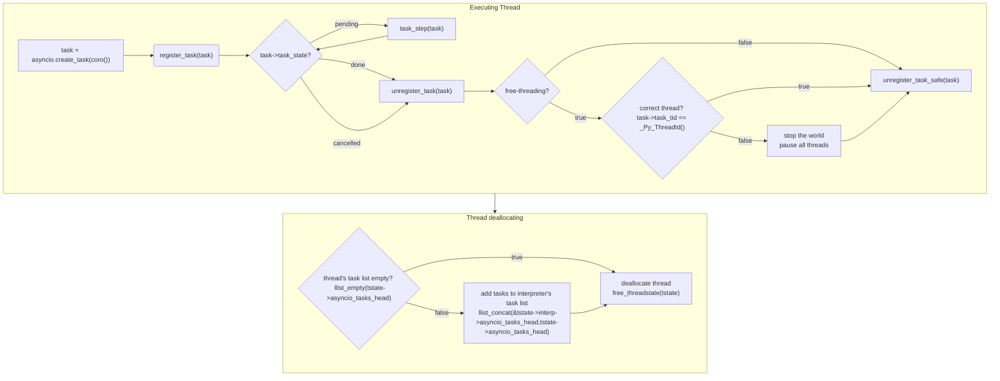

asyncio
=======


This document describes the working and implementation details of C
implementation of the
[`asyncio`](https://docs.python.org/3/library/asyncio.html) module.


## Pre-Python 3.14 implementation

Before Python 3.14, the C implementation of `asyncio` used a
[`WeakSet`](https://docs.python.org/3/library/weakref.html#weakref.WeakSet)
to store all the tasks created by the event loop. `WeakSet` was used
so that the event loop doesn't hold strong references to the tasks,
allowing them to be garbage collected when they are no longer needed.
The current task of the event loop was stored in a dict mapping the
event loop to the current task.

```c
    /* Dictionary containing tasks that are currently active in
       all running event loops.  {EventLoop: Task} */
    PyObject *current_tasks;

    /* WeakSet containing all tasks scheduled to run on event loops. */
    PyObject *scheduled_tasks;
```

This implementation had a few drawbacks:

1. **Performance**: Using a `WeakSet` for storing tasks is
inefficient, as it requires maintaining a full set of weak references
to tasks along with corresponding weakref callback to cleanup the
tasks when they are garbage collected.  This increases the work done
by the garbage collector, and in applications with a large number of
tasks, this becomes a bottleneck, with increased memory usage and
lower performance. Looking up the current task was slow as it required
a dictionary lookup on the `current_tasks` dict.

2. **Thread safety**: Before Python 3.14, concurrent iterations over
`WeakSet` was not thread safe[^1]. This meant calling APIs like
`asyncio.all_tasks()` could lead to inconsistent results or even
`RuntimeError` if used in multiple threads[^2].

3. **Poor scaling in free-threading**: Using global `WeakSet` for
storing all tasks across all threads lead to contention when adding
and removing tasks from the set which is a frequent operation. As such
it performed poorly in free-threading and did not scale well with the
number of threads. Similarly, accessing the current task in multiple
threads did not scale due to contention on the global `current_tasks`
dictionary.

## Python 3.14 implementation

To address these issues, Python 3.14 implements several changes to
improve the performance and thread safety of tasks management.

- **Per-thread double linked list for tasks**: Python 3.14 introduces
  a per-thread circular double linked list implementation for
  storing tasks. This allows each thread to maintain its own list of
  tasks and allows for lock free addition and removal of tasks. This
  is designed to be efficient, and thread-safe and scales well with
  the number of threads in free-threading. This also allows external
  introspection tools such as `python -m asyncio pstree` to inspect
  tasks running in all threads and was implemented as part of [Audit
  asyncio thread
  safety](https://github.com/python/cpython/issues/128002).

- **Per-thread current task**: Python 3.14 stores the current task on
  the current thread state instead of a global dictionary. This
  allows for faster access to the current task without the need for
  a dictionary lookup. Each thread maintains its own current task,
  which is stored in the `PyThreadState` structure. This was
  implemented in https://github.com/python/cpython/issues/129898.

Storing the current task and list of all tasks per-thread instead of
storing it per-loop was chosen primarily to support external
introspection tools such as `python -m asyncio pstree` as looking up
arbitrary attributes on the loop object is not possible
externally. Storing data per-thread also makes it easy to support
third party event loop implementations such as `uvloop`, and is more
efficient for the single threaded asyncio use-case as it avoids the
overhead of attribute lookups on the loop object and several other
calls on the performance critical path of adding and removing tasks
from the per-loop task list.

## Per-thread double linked list for tasks

This implementation uses a circular doubly linked list to store tasks
on the thread states.  This is used for all tasks which are instances
of `asyncio.Task` or subclasses of it, for third-party tasks a
fallback `WeakSet` implementation is used. The linked list is
implemented using an embedded `llist_node` structure within each
`TaskObj`. By embedding the list node directly into the task object,
the implementation avoids additional memory allocations for linked
list nodes.

The `PyThreadState` structure gained a new field `asyncio_tasks_head`,
which serves as the head of the circular linked list of tasks. This
allows for lock free addition and removal of tasks from the list.

It is possible that when a thread state is deallocated, there are
lingering tasks in its list; this can happen if another thread has
references to the tasks of this thread. Therefore, the
`PyInterpreterState` structure also gains a new `asyncio_tasks_head`
field to store any lingering tasks. When a thread state is
deallocated, any remaining lingering tasks are moved to the
interpreter state tasks list, and the thread state tasks list is
cleared.  The `asyncio_tasks_lock` is used protect the interpreter's
tasks list from concurrent modifications.

```c
typedef struct TaskObj {
    ...
    struct llist_node asyncio_node;
} TaskObj;

typedef struct PyThreadState {
    ...
    struct llist_node asyncio_tasks_head;
} PyThreadState;

typedef struct PyInterpreterState {
    ...
    struct llist_node asyncio_tasks_head;
    PyMutex asyncio_tasks_lock;
} PyInterpreterState;
```

When a task is created, it is added to the current thread's list of
tasks by the `register_task` function. When the task is done, it is
removed from the list by the `unregister_task` function. In
free-threading, the thread id of the thread which created the task is
stored in `task_tid` field of the `TaskObj`. This is used to check if
the task is being removed from the correct thread's task list. If the
current thread is same as the thread which created it then no locking
is required, otherwise in free-threading, the `stop-the-world` pause
is used to pause all other threads and then safely remove the task
from the tasks list.



`asyncio.all_tasks` now iterates over the per-thread task lists of all
threads and the interpreter's task list to get all the tasks. In
free-threading, this is done by pausing all the threads using the
`stop-the-world` pause to ensure that no tasks are being added or
removed while iterating over the lists. This allows for a consistent
view of all task lists across all threads and is thread safe.

This design allows for lock free execution and scales well in
free-threading with multiple event loops running in different threads.

## Per-thread current task

This implementation stores the current task in the `PyThreadState`
structure, which allows for faster access to the current task without
the need for a dictionary lookup.

```c
typedef struct PyThreadState {
    ...
    PyObject *asyncio_current_loop;
    PyObject *asyncio_current_task;
} PyThreadState;
```

When a task is entered or left, the current task is updated in the
thread state using `enter_task` and `leave_task` functions. When
`current_task(loop)` is called where `loop` is the current running
event loop of the current thread, no locking is required as the
current task is stored in the thread state and is returned directly
(general case). Otherwise, if the `loop` is not current running event
loop, the `stop-the-world` pause is used to pause all threads in
free-threading and then by iterating over all the thread states and
checking if the `loop` matches with `tstate->asyncio_current_loop`,
the current task is found and returned. If no matching thread state is
found, `None` is returned.

In free-threading, it avoids contention on a global dictionary as
threads can access the current task of thier running loop without any
locking.


[^1]: https://github.com/python/cpython/issues/123089
[^2]: https://github.com/python/cpython/issues/80788