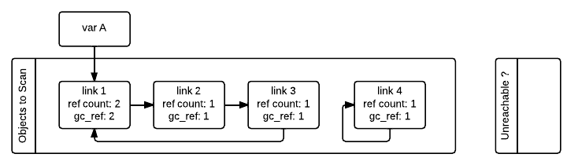
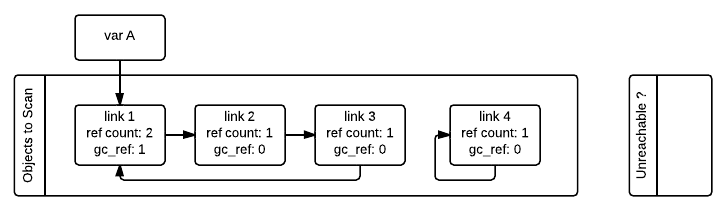
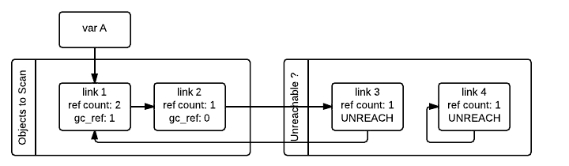
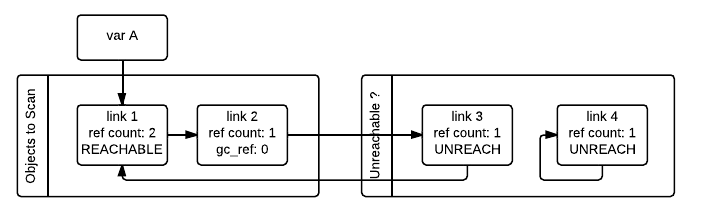
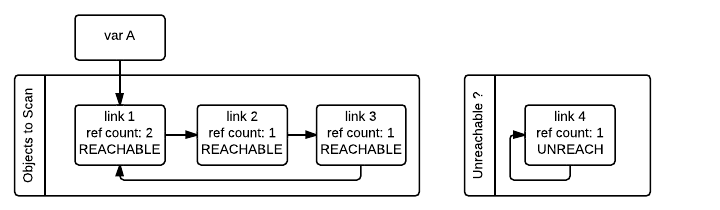

Garbage collector design
========================

Abstract
========

The main garbage collection algorithm used by CPython is reference counting. The basic idea is
that CPython counts how many different places there are that have a reference to an
object. Such a place could be another object, or a global (or static) C variable, or
a local variable in some C function. When an object’s reference count becomes zero,
the object is deallocated. If it contains references to other objects, their
reference counts are decremented. Those other objects may be deallocated in turn, if
this decrement makes their reference count become zero, and so on. The reference
count field can be examined using the `sys.getrefcount()` function (notice that the
value returned by this function is always 1 more as the function also has a reference
to the object when called):

```pycon
>>> x = object()
>>> sys.getrefcount(x)
2
>>> y = x
>>> sys.getrefcount(x)
3
>>> del y
>>> sys.getrefcount(x)
2
```

The main problem with the reference counting scheme is that it does not handle reference
cycles. For instance, consider this code:

```pycon
>>> container = []
>>> container.append(container)
>>> sys.getrefcount(container)
3
>>> del container
```

In this example, `container` holds a reference to itself, so even when we remove
our reference to it (the variable "container") the reference count never falls to 0
because it still has its own internal reference. Therefore it would never be
cleaned just by simple reference counting. For this reason some additional machinery
is needed to clean these reference cycles between objects once they become
unreachable. This is the cyclic garbage collector, usually called just Garbage
Collector (GC), even though reference counting is also a form of garbage collection.

Starting in version 3.13, CPython contains two GC implementations:

- The default build implementation relies on the
  [global interpreter lock](https://docs.python.org/3/glossary.html#term-global-interpreter-lock)
  for thread safety.
- The free-threaded build implementation pauses other executing threads when
  performing a collection for thread safety.

Both implementations use the same basic algorithms, but operate on different
data structures.  See the section on
[Differences between GC implementations](#Differences-between-GC-implementations)
for the details.


Memory layout and object structure
==================================

The garbage collector requires additional fields in Python objects to support
garbage collection.  These extra fields are different in the default and the
free-threaded builds.


GC for the default build
------------------------

Normally the C structure supporting a regular Python object looks as follows:

```
    object -----> +--+--+--+--+--+--+--+--+--+--+--+--+--+--+--+--+ \
                  |                    ob_refcnt                  | |
                  +--+--+--+--+--+--+--+--+--+--+--+--+--+--+--+--+ | PyObject_HEAD
                  |                    *ob_type                   | |
                  +--+--+--+--+--+--+--+--+--+--+--+--+--+--+--+--+ /
                  |                      ...                      |
```

In order to support the garbage collector, the memory layout of objects is altered
to accommodate extra information **before** the normal layout:

```
                  +--+--+--+--+--+--+--+--+--+--+--+--+--+--+--+--+ \
                  |                    *_gc_next                  | |
                  +--+--+--+--+--+--+--+--+--+--+--+--+--+--+--+--+ | PyGC_Head
                  |                    *_gc_prev                  | |
    object -----> +--+--+--+--+--+--+--+--+--+--+--+--+--+--+--+--+ /
                  |                    ob_refcnt                  | \
                  +--+--+--+--+--+--+--+--+--+--+--+--+--+--+--+--+ | PyObject_HEAD
                  |                    *ob_type                   | |
                  +--+--+--+--+--+--+--+--+--+--+--+--+--+--+--+--+ /
                  |                      ...                      |
```


In this way the object can be treated as a normal python object and when the extra
information associated to the GC is needed the previous fields can be accessed by a
simple type cast from the original object: `((PyGC_Head *)(the_object)-1)`.

As is explained later in the
[Optimization: reusing fields to save memory](#optimization-reusing-fields-to-save-memory)
section, these two extra fields are normally used to keep doubly linked lists of all the
objects tracked by the garbage collector (these lists are the GC generations, more on
that in the [Optimization: incremental collection](#Optimization-incremental-collection) section), but
they are also reused to fulfill other purposes when the full doubly linked list
structure is not needed as a memory optimization.

Doubly linked lists are used because they efficiently support the most frequently required operations.  In
general, the collection of all objects tracked by GC is partitioned into disjoint sets, each in its own
doubly linked list.  Between collections, objects are partitioned into "generations", reflecting how
often they've survived collection attempts.  During collections, the generation(s) being collected
are further partitioned into, for example, sets of reachable and unreachable objects.  Doubly linked lists
support moving an object from one partition to another, adding a new object, removing an object
entirely (objects tracked by GC are most often reclaimed by the refcounting system when GC
isn't running at all!), and merging partitions, all with a small constant number of pointer updates.
With care, they also support iterating over a partition while objects are being added to - and
removed from - it, which is frequently required while GC is running.

GC for the free-threaded build
------------------------------

In the free-threaded build, Python objects contain a 1-byte field
`ob_gc_bits` that is used to track garbage collection related state. The
field exists in all objects, including ones that do not support cyclic
garbage collection.  The field is used to identify objects that are tracked
by the collector, ensure that finalizers are called only once per object,
and, during garbage collection, differentiate reachable vs. unreachable objects.

```
    object -----> +--+--+--+--+--+--+--+--+--+--+--+--+--+--+--+--+ \
                  |                     ob_tid                    | |
                  +--+--+--+--+--+--+--+--+--+--+--+--+--+--+--+--+ |
                  | pad | ob_mutex | ob_gc_bits |  ob_ref_local   | |
                  +--+--+--+--+--+--+--+--+--+--+--+--+--+--+--+--+ | PyObject_HEAD
                  |                  ob_ref_shared                | |
                  +--+--+--+--+--+--+--+--+--+--+--+--+--+--+--+--+ |
                  |                    *ob_type                   | |
                  +--+--+--+--+--+--+--+--+--+--+--+--+--+--+--+--+ /
                  |                      ...                      |
```

Note that not all fields are to scale. `pad` is two bytes, `ob_mutex` and
`ob_gc_bits` are each one byte, and `ob_ref_local` is four bytes. The
other fields, `ob_tid`, `ob_ref_shared`, and `ob_type`, are all
pointer-sized (that is, eight bytes on a 64-bit platform).


The garbage collector also temporarily repurposes the `ob_tid` (thread ID)
and `ob_ref_local` (local reference count) fields for other purposes during
collections.


C APIs
------

Specific APIs are offered to allocate, deallocate, initialize, track, and untrack
objects with GC support. These APIs can be found in the
[Garbage Collector C API documentation](https://docs.python.org/3/c-api/gcsupport.html).

Apart from this object structure, the type object for objects supporting garbage
collection must include the `Py_TPFLAGS_HAVE_GC` in its `tp_flags` slot and
provide an implementation of the `tp_traverse` handler. Unless it can be proven
that the objects cannot form reference cycles with only objects of its type or unless
the type is immutable, a `tp_clear` implementation must also be provided.


Identifying reference cycles
============================

The algorithm that CPython uses to detect those reference cycles is
implemented in the `gc` module. The garbage collector **only focuses**
on cleaning container objects (that is, objects that can contain a reference
to one or more objects). These can be arrays, dictionaries, lists, custom
class instances, classes in extension modules, etc. One could think that
cycles are uncommon but the truth is that many internal references needed by
the interpreter create cycles everywhere. Some notable examples:

- Exceptions contain traceback objects that contain a list of frames that
  contain the exception itself.
- Module-level functions reference the module's dict (which is needed to resolve globals),
  which in turn contains entries for the module-level functions.
- Instances have references to their class which itself references its module, and the module
  contains references to everything that is inside (and maybe other modules)
  and this can lead back to the original instance.
- When representing data structures like graphs, it is very typical for them to
  have internal links to themselves.

To correctly dispose of these objects once they become unreachable, they need
to be identified first.  To understand how the algorithm works, let’s take
the case of a circular linked list which has one link referenced by a
variable `A`, and one self-referencing object which is completely
unreachable:

```pycon
>>> import gc
>>> 
>>> class Link:
...    def __init__(self, next_link=None):
...        self.next_link = next_link
...  
>>> link_3 = Link()
>>> link_2 = Link(link_3)
>>> link_1 = Link(link_2)
>>> link_3.next_link = link_1
>>> A = link_1
>>> del link_1, link_2, link_3
>>> 
>>> link_4 = Link()
>>> link_4.next_link = link_4
>>> del link_4
>>> 
>>> # Collect the unreachable Link object (and its .__dict__ dict).
>>> gc.collect()
2
```

The GC starts with a set of candidate objects it wants to scan.  In the
default build, these "objects to scan" might be all container objects or a
smaller subset (or "generation").  In the free-threaded build, the collector
always scans all container objects.

The objective is to identify all the unreachable objects.  The collector does
this by identifying reachable objects; the remaining objects must be
unreachable.  The first step is to identify all of the "to scan" objects that
are **directly** reachable from outside the set of candidate objects.  These
objects have a refcount larger than the number of incoming references from
within the candidate set.

Every object that supports garbage collection will have an extra reference
count field initialized to the reference count (`gc_ref` in the figures)
of that object when the algorithm starts. This is because the algorithm needs
to modify the reference count to do the computations and in this way the
interpreter will not modify the real reference count field.



The GC then iterates over all containers in the first list and decrements by one the
`gc_ref` field of any other object that container is referencing.  Doing
this makes use of the `tp_traverse` slot in the container class (implemented
using the C API or inherited by a superclass) to know what objects are referenced by
each container. After all the objects have been scanned, only the objects that have
references from outside the “objects to scan” list will have `gc_ref > 0`.



Notice that having `gc_ref == 0` does not imply that the object is unreachable.
This is because another object that is reachable from the outside (`gc_ref > 0`)
can still have references to it. For instance, the `link_2` object in our example
ended having `gc_ref == 0` but is referenced still by the `link_1` object that
is reachable from the outside. To obtain the set of objects that are really
unreachable, the garbage collector re-scans the container objects using the
`tp_traverse` slot; this time with a different traverse function that marks objects with
`gc_ref == 0` as "tentatively unreachable" and then moves them to the
tentatively unreachable list. The following image depicts the state of the lists in a
moment when the GC processed the `link_3` and `link_4` objects but has not
processed `link_1` and `link_2` yet.



Then the GC scans the next `link_1` object. Because it has `gc_ref == 1`,
the gc does not do anything special because it knows it has to be reachable (and is
already in what will become the reachable list):



When the GC encounters an object which is reachable (`gc_ref > 0`), it traverses
its references using the `tp_traverse` slot to find all the objects that are
reachable from it, moving them to the end of the list of reachable objects (where
they started originally) and setting its `gc_ref` field to 1. This is what happens
to `link_2` and `link_3` below as they are reachable from `link_1`.  From the
state in the previous image and after examining the objects referred to by `link_1`
the GC knows that `link_3` is reachable after all, so it is moved back to the
original list and its `gc_ref` field is set to 1 so that if the GC visits it again,
it will know that it's reachable. To avoid visiting an object twice, the GC marks all
objects that have already been visited once (by unsetting the `PREV_MASK_COLLECTING`
flag) so that if an object that has already been processed is referenced by some other
object, the GC does not process it twice.



Notice that an object that was marked as "tentatively unreachable" and was later
moved back to the reachable list will be visited again by the garbage collector
as now all the references that that object has need to be processed as well. This
process is really a breadth first search over the object graph. Once all the objects
are scanned, the GC knows that all container objects in the tentatively unreachable
list are really unreachable and can thus be garbage collected.

Pragmatically, it's important to note that no recursion is required by any of this,
and neither does it in any other way require additional memory proportional to the
number of objects, number of pointers, or the lengths of pointer chains.  Apart from
`O(1)` storage for internal C needs, the objects themselves contain all the storage
the GC algorithms require.

Why moving unreachable objects is better
----------------------------------------

It sounds logical to move the unreachable objects under the premise that most objects
are usually reachable, until you think about it: the reason it pays isn't actually
obvious.

Suppose we create objects A, B, C in that order. They appear in the young generation
in the same order. If B points to A, and C to B, and C is reachable from outside,
then the adjusted refcounts after the first step of the algorithm runs will be 0, 0,
and 1 respectively because the only reachable object from the outside is C.

When the next step of the algorithm finds A, A is moved to the unreachable list. The
same for B when it's first encountered. Then C is traversed, B is moved *back* to
the reachable list. B is eventually traversed, and then A is moved back to the reachable
list.

So instead of not moving at all, the reachable objects B and A are each moved twice.
Why is this a win? A straightforward algorithm to move the reachable objects instead
would move A, B, and C once each. The key is that this dance leaves the objects in
order C, B, A - it's reversed from the original order.  On all *subsequent* scans,
none of them will move.  Since most objects aren't in cycles, this can save an
unbounded number of moves across an unbounded number of later collections. The only
time the cost can be higher is the first time the chain is scanned.

Destroying unreachable objects
==============================

Once the GC knows the list of unreachable objects, a very delicate process starts
with the objective of completely destroying these objects. Roughly, the process
follows these steps in order:

1. Handle and clear weak references (if any). Weak references to unreachable objects
   are set to `None`. If the weak reference has an associated callback, the callback
   is enqueued to be called once the clearing of weak references is finished.  We only
   invoke callbacks for weak references that are themselves reachable. If both the weak
   reference and the pointed-to object are unreachable we do not execute the callback.
   This is partly for historical reasons: the callback could resurrect an unreachable
   object and support for weak references predates support for object resurrection.
   Ignoring the weak reference's callback is fine because both the object and the weakref
   are going away, so it's legitimate to say the weak reference is going away first.
2. If an object has legacy finalizers (`tp_del` slot) move it to the
   `gc.garbage` list.
3. Call the finalizers (`tp_finalize` slot) and mark the objects as already
   finalized to avoid calling finalizers twice if the objects are resurrected or
   if other finalizers have removed the object first.
4. Deal with resurrected objects. If some objects have been resurrected, the GC
   finds the new subset of objects that are still unreachable by running the cycle
   detection algorithm again and continues with them.
5. Call the `tp_clear` slot of every object so all internal links are broken and
   the reference counts fall to 0, triggering the destruction of all unreachable
   objects.

Optimization: incremental collection
====================================

In order to bound the length of each garbage collection pause, the GC implementation
for the default build uses incremental collection with two generations.

Generational garbage collection takes advantage of what is known as the weak
generational hypothesis: Most objects die young.
This has proven to be very close to the reality of many Python
programs as many temporary objects are created and destroyed very quickly.

To take advantage of this fact, all container objects are segregated into
two generations: young and old. Every new object starts in the young generation.
Each garbage collection scans the entire young generation and part of the old generation.

The time taken to scan the young generation can be controlled by controlling its
size, but the size of the old generation cannot be controlled.
In order to keep pause times down, scanning of the old generation of the heap
occurs in increments.

To keep track of what has been scanned, the old generation contains two lists:

* Those objects that have not yet been scanned, referred to as the `pending` list.
* Those objects that have been scanned, referred to as the `visited` list.

To detect and collect all unreachable objects in the heap, the garbage collector
must scan the whole heap. This whole heap scan is called a full scavenge.

Increments
----------

Each full scavenge is performed in a series of increments.
For each full scavenge, the combined increments will cover the whole heap.

Each increment is made up of:

* The young generation
* The old generation's least recently scanned objects
* All objects reachable from those objects that have not yet been scanned this full scavenge

The surviving objects (those that are not collected) are moved to the back of the
`visited` list in the old generation.

When a full scavenge starts, no objects in the heap are considered to have been scanned,
so all objects in the old generation must be in the `pending` space.
When all objects in the heap have been scanned a cycle ends, and all objects are moved
to the `pending` list again. To avoid having to traverse the entire list, which list is
`pending` and which is `visited` is determined by a field in the `GCState` struct.
The `visited` and `pending` lists can be swapped by toggling this bit.

Correctness
-----------

The [algorithm for identifying cycles](#Identifying-reference-cycles) will find all
unreachable cycles in a list of objects, but will not find any cycles that are
even partly outside of that list.
Therefore, to be guaranteed that a full scavenge will find all unreachable cycles,
each cycle must be fully contained within a single increment.

To make sure that no partial cycles are included in the increment we perform a
[transitive closure](https://en.wikipedia.org/wiki/Transitive_closure)
over reachable, unscanned objects from the initial increment.
Since the transitive closure of objects reachable from an object must be a (non-strict)
superset of any unreachable cycle including that object, we are guaranteed that a
transitive closure cannot contain any partial cycles.
We can exclude scanned objects, as they must have been reachable when scanned.
If a scanned object becomes part of an unreachable cycle after being scanned, it will
not be collected at this time, but it will be collected in the next full scavenge.

> [!NOTE]
> The GC implementation for the free-threaded build does not use incremental collection.
> Every collection operates on the entire heap.

In order to decide when to run, the collector keeps track of the number of object
allocations and deallocations since the last collection. When the number of
allocations minus the number of deallocations exceeds `threshold0`,
collection starts. `threshold1` determines the fraction of the old
collection that is included in the increment.
The fraction is inversely proportional to `threshold1`,
as historically a larger `threshold1` meant that old generation
collections were performed less frequently.
`threshold2` is ignored.

These thresholds can be examined using the
[`gc.get_threshold()`](https://docs.python.org/3/library/gc.html#gc.get_threshold)
function:

```pycon
>>> import gc
>>> gc.get_threshold()
(700, 10, 10)
```

The content of these generations can be examined using the
`gc.get_objects(generation=NUM)` function and collections can be triggered
specifically in a generation by calling `gc.collect(generation=NUM)`.

```pycon
>>> import gc
>>> class MyObj:
...     pass
...
>>> # Move everything to the old generation so it's easier to inspect
>>> # the young generation.
>>> gc.collect()
0
>>> # Create a reference cycle.
>>> x = MyObj()
>>> x.self = x
>>> 
>>> # Initially the object is in the young generation.
>>> gc.get_objects(generation=0)
[..., <__main__.MyObj object at 0x7fbcc12a3400>, ...]
>>> 
>>> # After a collection of the youngest generation the object
>>> # moves to the old generation.
>>> gc.collect(generation=0)
0
>>> gc.get_objects(generation=0)
[]
>>> gc.get_objects(generation=1)
[]
>>> gc.get_objects(generation=2)
[..., <__main__.MyObj object at 0x7fbcc12a3400>, ...]
```


Optimization: excluding reachable objects
=========================================

An object cannot be garbage if it can be reached. To avoid having to identify
reference cycles across the whole heap, we can reduce the amount of work done
considerably by first identifying objects reachable from objects known to be
alive.  These objects are excluded from the normal cyclic detection process.

The default and free-threaded build both implement this optimization but in
slightly different ways.

Finding reachable objects for the default build GC
--------------------------------------------------

This works by first moving most reachable objects to the `visited` space.
Empirically, most reachable objects can be reached from a small set of global
objects and local variables. This step does much less work per object, so
reduces the time spent performing garbage collection by at least half.

> [!NOTE]
> Objects that are not determined to be reachable by this pass are not necessarily
> unreachable. We still need to perform the main algorithm to determine which objects
> are actually unreachable.
We use the same technique of forming a transitive closure as the incremental
collector does to find reachable objects, seeding the list with some global
objects and the currently executing frames.

This phase moves objects to the `visited` space, as follows:

1. All objects directly referred to by any builtin class, the `sys` module, the `builtins`
module and all objects directly referred to from stack frames are added to a working
set of reachable objects.
2. Until this working set is empty:
   1. Pop an object from the set and move it to the `visited` space
   2. For each object directly reachable from that object:
      * If it is not already in `visited` space and it is a GC object,
        add it to the working set


Before each increment of collection is performed, the stacks are scanned
to check for any new stack frames that have been created since the last
increment. All objects directly referred to from those stack frames are
added to the working set.
Then the above algorithm is repeated, starting from step 2.


Finding reachable objects for the free-threaded GC
--------------------------------------------------

Within the `gc_free_threading.c` implementation, this is known as the "mark
alive" pass or phase.  It is similar in concept to what is done for the default
build GC.  Rather than moving objects between double-linked lists, the
free-threaded GC uses a flag in `ob_gc_bits` to track if an object is
found to be definitely alive (not garbage).

To find objects reachable from known alive objects, known as the "roots", the
`gc_mark_alive_from_roots()` function is used.  Root objects include
`interp->sysdict` (the `sys` module dictionary), `interp->builtins`, and
`interp->types`.  Also included are all objects referred to by active Python
frames.  These objects and the transitive closure of objects reachable from
them have `_PyGC_BITS_ALIVE` set.  Any object with that bit set is excluded
from the rest of the cyclic garbage detection process, since we know it cannot
be unreachable.

> [!NOTE]
> If the `gc.freeze()` function has been used, this phase of the collector is
> skipped. That is done for two reasons.  First, it is unlikely to be a
> performance win if most of the objects have been marked as frozen.  As such,
> they would be excluded for the cyclic garbage detection, without this extra
> work anyhow.  Second, one of the purposes of using `gc.freeze()` is to avoid
> dirtying the memory pages holding frozen objects.  If this phase was executed,
> the toggling of the `ob_gc_bits` flags would dirty pages and defeat that.

Software prefetch hinting
-------------------------

To speed up the "mark alive" phase of the free-threaded GC, an additional
optimization, known as software prefetching, is used.  The GC will execute
explicit prefetch CPU instructions in order to reduce the latency due to
loading data from main memory.  This added complexity can pay off since main
memory is so much slower compared to accessing data in the CPU cache.  This
is enabled only if the number of long-lived objects exceeds a threshold.  If
the set of objects being garbage collected is small, the accessed memory is
likely to fit entirely in the CPU cache and software prefetch is not helpful.

The details of this optimization are intricate, with the source code being the
best reference.  However, the rest of this section gives a high level
description of how it works and explains some design decisions.

Software prefetching is only used during the "mark alive" phase of the GC.
Specifically, when we are performing the transitive closure of the "alive"
status of objects (i.e. objects reachable from known alive objects, known as
roots).  For each object we find, we need to traverse all objects directly
reachable from that object.  If that set of referred objects is in scattered
locations of memory, the hardware prefetch is unlikely to predict the next
accessed memory location.

Making software prefetch work well hinges on a key principle: allow enough time
between issuing the prefetch instruction for a memory location and actually
accessing that location's data.  We can call that time difference the prefetch
window.  If the window is too large, we fill up the CPU caches with data that's
not needed yet.  Worse, the data might be discarded from the cache before we
actually use it.  If the window is too small then the memory system does not
have enough time to finish loading the memory and the CPU will have to wait.
The window is indirectly tuned by the prefetch buffer parameters.  The buffer
will be explained next.

The prefetch buffer is a FIFO queue of fixed size.  When we enqueue an object
reference into the buffer, we also issue a software prefetch instruction for
that memory location.   When we dequeue an object reference from the buffer, we
assume or hope that enough time has elapsed so that the memory has been loaded
into the cache.  This is the mechanism that provides the window.

When performing the transitive closure of "alive" status, the set of objects
yet to visit are stored in one of two places.  First, they can be stored in the
prefech buffer. Second, there is a LIFO stack, of unlimited size.  When object
references are found using `tp_traverse`, they are enqueued in the buffer if
it is not full, otherwise they are pushed to the stack.

We must take special care not to access the memory referred to by an object
pointer until we take that reference out of the prefetch buffer.  That means we
cannot check if an object is a "container" (if the `PyObject_IS_GC()` test is
true) or if the object already has the "alive" flag set.  Both of those tests
would require that the object memory is accessed.  There are some additional
elaborations that try to keep the buffer filled to the optimal size but to keep
things simple we will omit those details here.  Not discussed in details are
"spans", which help reduce the amount of stack used and make it easier to
control the size of the buffer.

As mentioned, the prefetch window is the time delay between the issue of the
prefetch instruction, on buffer enqueue, and the memory access, after buffer
dequeue.  It is tuned by adjusting some buffer parameters.  If processing time
were equal for every object then the buffer length would be proportional to the
window.  Since processing each object can actually take a variable amount of
time, the relation between the buffer length and the prefetch window is only
approximate. However, this proportional relationship is assumed to hold true
and we avoid the overhead of actually measuring object processing times.

The relevant parameters are the maximum buffer size and the low and high
thresholds for filling. The buffer parameters are set as follows: maximum
length is 256, low threshold is 8, high threshold is 16.  These parameters are
used as follows.  If the buffer has reached the maximum size, new object
pointers found while following references are pushed to the stack, rather than
put in the buffer.  When dequeuing objects from the buffer, we will "prime" the
buffer if the current length drops below the low threshold.  Priming means
popping objects from the stack and enqueuing them into the buffer.  While
priming, we will fill it only until the high threshold is reached.

To measure the effectiveness of the buffer, some benchmark programs were run
with a trace log of memory location prefetch and access instructions.  The
prefetch window for each object processed was computed from the trace log.
Each enqueue and dequeue operation were treated as taking one unit of time.
Time to actually process the object was assumed to be zero.  A histogram of the
windows is shown below.  These traces suggest the buffer length is mostly being
kept between the low and high thresholds, which is what we want.  Variations of
the buffer parameters were benchmarked and the best performing parameters were
chosen.  Obviously it is unlikely these parameters will be optimal for all
hardware and programs.

```
Prefetch window stats
mean 52.1
median 14.0
max 256
   25.60 |65,304  | ******************************
   51.20 |5,590   | **
   76.80 |3,562   | *
  102.40 |2,683   | *
  128.00 |2,278   | *
  153.60 |2,285   | *
  179.20 |2,377   | *
  204.80 |2,238   | *
  230.40 |2,753   | *
  256.00 |5,930   | **
-------- |------- | -------
      N= |95,000
```

Using software prefetch instructions is only a win if the set of objects being
examined by the GC does not fit into CPU caches.  Otherwise, using the buffer
and prefetch instructions is just overhead.  Using the long lived object count
seems a good estimate of if things will fit in the cache.  On 64-bit platforms,
the minimum object size is 32 bytes.  A 4MB L2 cache would hold about 130,000
objects.

The current threshold for enabling prefetch is that the number of long-lived
objects must exceed 200,000.  Based on benchmarking, this seems in the range
where prefetch becomes a net gain.  Obviously it depends on hardware details
and also the "shape" of the object graph.  For example, your object graph may
be constructed by linearly allocating objects in memory.  Then, traversing the
object graph might naturally result in mostly ordered memory access.  In that
case, the hardware prefetch is likely to do a nearly perfect job without any
software prefetch hints.

This optimization, as of March 2025, was tuned on the following hardware
platforms:

- Apple M3 Pro, 32 GB RAM, 192+128 KB L1, 16 MB L2, compiled with Clang 19
- AMD Ryzen 5 7600X, 64 GB RAM, 384 KB L1, 6 GB L2, 32 MB L3, compiled with GCC 12.2.0

Benchmarking the effectiveness of this optimization is particularly difficult.
It depends both on hardware details, like CPU cache sizes and memory latencies,
and the specifics of the program's memory access patterns, where objects are
located in memory and in what order they are accessed during the mark alive
phase.  When the program's memory access patterns are favourable, working set
of data larger than the CPU cache, objects allocated in such a way that access
order is not linear, then the speedup from using software prefetching is in the
range of 20% to 40% faster for the entire full GC collection.


Optimization: reusing fields to save memory
===========================================

In order to save memory, the two linked list pointers in every object with GC
support are reused for several purposes. This is a common optimization known
as "fat pointers" or "tagged pointers": pointers that carry additional data,
"folded" into the pointer, meaning stored inline in the data representing the
address, taking advantage of certain properties of memory addressing. This is
possible as most architectures align certain types of data
to the size of the data, often a word or multiple thereof. This discrepancy
leaves a few of the least significant bits of the pointer unused, which can be
used for tags or to keep other information – most often as a bit field (each
bit a separate tag) – as long as code that uses the pointer masks out these
bits before accessing memory.  For example, on a 32-bit architecture (for both
addresses and word size), a word is 32 bits = 4 bytes, so word-aligned
addresses are always a multiple of 4, hence end in `00`, leaving the last 2 bits
available; while on a 64-bit architecture, a word is 64 bits = 8 bytes, so
word-aligned addresses end in `000`, leaving the last 3 bits available.

The CPython GC makes use of two fat pointers that correspond to the extra fields
of `PyGC_Head` discussed in the `Memory layout and object structure`_ section:

> [!WARNING]
> Because the presence of extra information, "tagged" or "fat" pointers cannot be
> dereferenced directly and the extra information must be stripped off before
> obtaining the real memory address. Special care needs to be taken with
> functions that directly manipulate the linked lists, as these functions
> normally assume the pointers inside the lists are in a consistent state.


- The `_gc_prev` field is normally used as the "previous" pointer to maintain the
  doubly linked list but its lowest two bits are used to keep the flags
  `PREV_MASK_COLLECTING` and `_PyGC_PREV_MASK_FINALIZED`. Between collections,
  the only flag that can be present is `_PyGC_PREV_MASK_FINALIZED` that indicates
  if an object has been already finalized. During collections `_gc_prev` is
  temporarily used for storing a copy of the reference count (`gc_ref`), in
  addition to two flags, and the GC linked list becomes a singly linked list until
  `_gc_prev` is restored.

- The `_gc_next` field is used as the "next" pointer to maintain the doubly linked
  list but during collection its lowest bit is used to keep the
  `NEXT_MASK_UNREACHABLE` flag that indicates if an object is tentatively
  unreachable during the cycle detection algorithm.  This is a drawback to using only
  doubly linked lists to implement partitions:  while most needed operations are
  constant-time, there is no efficient way to determine which partition an object is
  currently in.  Instead, when that's needed, ad hoc tricks (like the
  `NEXT_MASK_UNREACHABLE` flag) are employed.

Optimization: delayed untracking containers
===========================================

Certain types of containers cannot participate in a reference cycle, and so do
not need to be tracked by the garbage collector. Untracking these objects
reduces the cost of garbage collection. However, determining which objects may
be untracked is not free, and the costs must be weighed against the benefits
for garbage collection. There are two possible strategies for when to untrack
a container:

1. When the container is created.
2. When the container is examined by the garbage collector.

As a general rule, instances of atomic types aren't tracked and instances of
non-atomic types (containers, user-defined objects...) are.

Tuples containing only immutable objects (integers, strings etc,
and recursively, tuples of immutable objects) do not need to be tracked. The
interpreter creates a large number of tuples, many of which will not survive
until garbage collection. It is therefore not worthwhile to untrack eligible
tuples at creation time. Instead, all tuples except the empty tuple are tracked
when created. During garbage collection it is determined whether any surviving
tuples can be untracked. A tuple can be untracked if all of its contents are
already not tracked. Tuples are examined for untracking in all garbage collection
cycles.

The garbage collector module provides the Python function `is_tracked(obj)`, which returns
the current tracking status of the object. Subsequent garbage collections may change the
tracking status of the object.

```pycon
>>> gc.is_tracked(0)
False
>>> gc.is_tracked("a")
False
>>> gc.is_tracked([])
True
>>> gc.is_tracked(())
False
>>> gc.is_tracked({})
True
>>> gc.is_tracked({"a": 1})
True
```

Differences between GC implementations
======================================

This section summarizes the differences between the GC implementation in the
default build and the implementation in the free-threaded build.

The default build implementation makes extensive use of the `PyGC_Head` data
structure, while the free-threaded build implementation does not use that
data structure.

- The default build implementation stores all tracked objects in a doubly
  linked list using `PyGC_Head`.  The free-threaded build implementation
  instead relies on the embedded mimalloc memory allocator to scan the heap
  for tracked objects.
- The default build implementation uses `PyGC_Head` for the unreachable
  object list.  The free-threaded build implementation repurposes the
  `ob_tid` field to store a unreachable objects linked list.
- The default build implementation stores flags in the `_gc_prev` field of
  `PyGC_Head`.  The free-threaded build implementation stores these flags
  in `ob_gc_bits`.


The default build implementation relies on the
[global interpreter lock](https://docs.python.org/3/glossary.html#term-global-interpreter-lock)
for thread safety.  The free-threaded build implementation has two "stop the
world" pauses, in which all other executing threads are temporarily paused so
that the GC can safely access reference counts and object attributes.

The default build implementation is a generational collector.  The
free-threaded build is non-generational; each collection scans the entire
heap.

- Keeping track of object generations is simple and inexpensive in the default
  build.  The free-threaded build relies on mimalloc for finding tracked
  objects; identifying "young" objects without scanning the entire heap would
  be more difficult.


> [!NOTE]
> **Document history**
>
>   Pablo Galindo Salgado - Original author
>
>   Irit Katriel - Convert to Markdown
