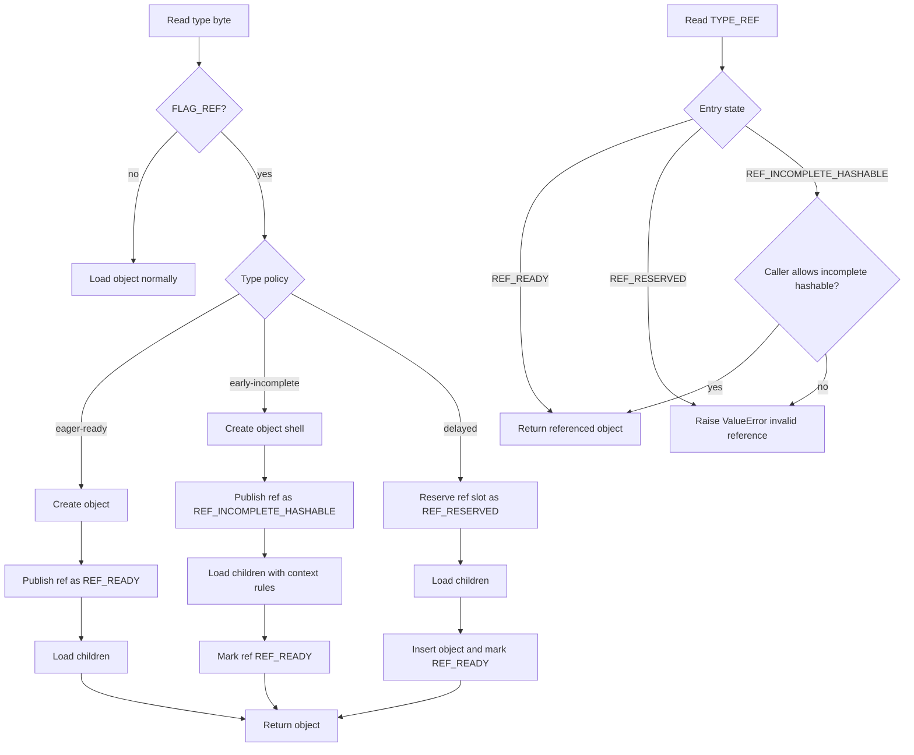
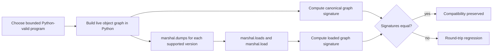

# Marshal Recursive Reference Design

## Problem

`marshal.loads()` currently mixes two incompatible strategies for recursive
objects:

- Some object types publish themselves into the reference table before they are
  fully initialized.
- Other object types reserve a reference slot and only publish the object after
  all children are loaded.

The early-publication path preserves some valid recursive graphs produced by
`marshal.dumps()`, but it can expose partially initialized hashable containers
to hashing sites such as `PySet_Add()` and `PyDict_SetItem()`.

The delayed-publication path avoids the crash, but it rejects valid recursive
graphs emitted by normal Python code, such as:

- `a = ([],); a[0].append(a)`
- `s = slice([]); s.stop.append(s)`
- `fd = frozendict({None: []}); fd[None].append(fd)`

The core requirement is therefore:

1. Preserve valid recursive graphs emitted by `marshal.dumps()`.
2. Reject crafted byte streams that would observe an incomplete hashable object
   in an unsafe position.
3. Keep the acyclic fast path close to the current implementation.

## Design Summary

Use a stateful reference table during unmarshalling.

Each reference-table entry has:

- the object pointer stored in `p->refs`
- a small parallel state byte

The state is one of:

- `REF_READY`: the entry is fully initialized and may be returned anywhere
- `REF_RESERVED`: a placeholder entry with no published object yet
- `REF_INCOMPLETE_HASHABLE`: the entry points to a real object shell that is
  not yet fully initialized and must not be returned in all contexts

The read side also carries a simple caller policy:

- `allow_incomplete_hashable = 1`
- `allow_incomplete_hashable = 0`

This is not a whole-graph algorithm. It is an incremental state machine:

- mutable containers remain on the current fast path
- only a small set of hashable recursive containers use the incomplete state
- `TYPE_REF` becomes context-sensitive

## Context Rule

`TYPE_REF` may return an incomplete hashable object only when the caller is
loading a plain value position that does not itself require the target to be
finalized.

Allowed:

- list elements
- dict values

Rejected:

- tuple elements
- slice fields
- dict keys
- set elements
- frozenset elements
- frozendict values
- frozendict keys

This rule preserves the valid recursive cases that arise in normal Python code:

- tuple/slice/frozendict back-references through a list element
- tuple back-references through a dict value

It also rejects the fabricated cases that directly embed an incomplete hashable
object inside another hash-sensitive or immutable position, such as:

- direct self-containing tuple
- direct self-containing slice
- direct self-containing frozendict value
- set or dict-key uses of incomplete tuple/slice/frozendict

## Type Policy

### Keep current eager publication

These types are already safe to publish immediately because they are mutable and
unhashable:

- `TYPE_LIST`
- `TYPE_DICT`
- `TYPE_SET`

They continue to use the current eager publication path and are marked
`REF_READY` immediately.

### Publish early, but mark incomplete

These types need to be referenceable before all children are loaded in order to
preserve valid recursive graphs, but they must not be observed everywhere while
incomplete:

- `TYPE_TUPLE`
- `TYPE_SLICE`
- `TYPE_FROZENDICT`

Algorithm:

1. Allocate the object shell.
2. Publish it into `p->refs`.
3. Mark the entry `REF_INCOMPLETE_HASHABLE`.
4. Load child objects using the context rule above.
5. When initialization completes, mark the entry `REF_READY`.

### Keep delayed publication

These types remain delayed:

- `TYPE_FROZENSET`
- `TYPE_CODE`

Reasons:

- `TYPE_CODE` already uses reserve/insert and does not need recursive exposure.
- `TYPE_FROZENSET` relies on `PySet_Add()` allowing mutation only while the
  object is effectively brand new. We should not change that path unless we can
  demonstrate a real Python-emittable recursive graph that requires it.

## Frozendict Construction

`TYPE_FROZENDICT` cannot keep the current `dict`-then-wrap strategy, because
back-references see the wrong identity and type.

Instead:

1. Create a real empty `frozendict`.
2. Mark it as "under marshal construction".
3. Publish it as `REF_INCOMPLETE_HASHABLE`.
4. Insert items directly into the frozendict using the internal dict insertion
   path.
5. Clear the construction marker and mark the ref-table entry `REF_READY`.

Implementation note:

- `frozendict` already shares dict storage layout.
- The loader should use an internal sentinel state on `ma_hash` during
  construction so dict internals can distinguish:
  - normal immutable frozendict
  - marshal-only under-construction frozendict

This preserves the correct identity for recursive values while avoiding the
current "nested dict instead of frozendict" behavior.

## Data Structures

Add to `RFILE`:

```c
PyObject *refs;          // existing list of strong references
uint8_t *ref_states;     // parallel state table
Py_ssize_t refs_allocated;
```

State enum:

```c
typedef enum {
    REF_READY = 0,
    REF_RESERVED = 1,
    REF_INCOMPLETE_HASHABLE = 2,
} RefState;
```

## Reader Flow



## Call-Site Policy

Use `r_object(p, allow_incomplete_hashable)`.

Recommended call policy:

- list element: `1`
- dict value: `1`
- everything else: `0`

That gives the smallest rule set that still preserves the known valid recursive
graphs from normal Python code.

## Why This Is Efficient

Fast-path properties:

- Acyclic objects do not hit `TYPE_REF` back-edges, so the added work is just a
  small state write per referenced object and a branch in `TYPE_REF`.
- Mutable recursive containers keep their current eager behavior.
- No whole-stream pre-scan or SCC computation is needed.
- The ref-state table is a byte array indexed in parallel with `p->refs`.

The algorithm is therefore still linear in the number of objects and edges in
the stream, with low constant-factor overhead.

## Why This Is Safer

The invariant becomes:

> An incomplete hashable object may exist in the reference table, but it may
> only be returned through contexts that do not immediately require its final
> hash-sensitive invariants to hold.

This blocks the crash class directly:

- set insertion of incomplete tuple/slice/frozendict
- dict-key insertion of incomplete tuple/slice/frozendict

And it avoids direct immutable self-cycles that are only possible through
crafted marshal bytes.

## Semantic Round-Trip Generator

Serhiy's review point changes how the positive test suite should be framed.

The primary compatibility question is not:

> "Which byte streams should the loader accept?"

It is:

> "Which object graphs can Python construct today and `marshal.dumps()` emit,
> and does `marshal.loads()` reconstruct the same graph?"

That means the positive suite should start from Python-valid construction
programs, not from raw marshal payloads. Raw payloads still matter, but mainly
for negative tests and boundary-policy tests.

### Program Model

The bounded positive generator uses only exact marshal-supported container
types, and only construction orders that Python can actually execute:

1. Allocate one or two mutable bridge shells:
   - `list`
   - `dict`
2. Create one recursive wrapper target whose first outgoing edge points at the
   first mutable bridge:
   - `tuple((bridge0,))`
   - `slice(None, bridge0, None)`
   - `frozendict({None: bridge0})`
3. Populate the bridge chain using only Python-valid mutable operations:
   - list element insertion
   - dict value insertion
4. Close the cycle by storing the target back into the terminal bridge once or
   twice.
5. Optionally expose the graph through a few root layouts to vary traversal and
   aliasing:
   - the target itself
   - the first bridge itself
   - an outer list `[target, terminal_bridge]`
   - an outer dict `{"target": target, "bridge": terminal_bridge}`
6. Separately generate pure mutable self-cycles:
   - list containing itself
   - dict value containing itself

This is the executable grammar used by the test generator:

```text
BridgeStep ::= list | dict_value

WrapperTarget ::=
    tuple(bridge0)
  | slice(None, bridge0, None)
  | frozendict({None: bridge0})

BridgePath ::=
    bridge0
  | bridge0 -> bridge1

TerminalBackref ::=
    target
  | target, target

WrapperRoot ::=
    target
  | first_bridge
  | [target, terminal_bridge]
  | {"target": target, "bridge": terminal_bridge}

MutableSelf ::=
    list(self)
  | dict_value(self)

MutableRoot ::=
    target
  | [target]
  | {"target": target}
```

And this is the positive-test pipeline:



The corresponding test code lives in `Lib/test/test_marshal.py` and generates:

- `2 * 3 * 2 = 12` mutable self-cycle programs
- `3 * (2 + 4) * 4 * 2 = 144` wrapper-target programs

for a total of `156` Python-valid recursive programs before version expansion.

### Why This Bound Is Meaningful

This is a bounded search, not a proof over all Python programs. The bound is
chosen so that every locally distinct recursive construction pattern relevant to
this bug appears at least once.

The key observation is:

- A Python-valid recursive `tuple`, `slice`, or `frozendict` cannot close a
  cycle by mutating itself.
- Therefore any cycle involving one of those targets must pass through at least
  one mutable bridge.
- The only bridge edge kinds that Python can use to close such cycles are:
  - list element
  - dict value

So the safety-relevant local shape is:

```text
wrapper target -> mutable bridge chain -> TYPE_REF back to wrapper target
```

The policy decision in the loader depends on the edge kind at the `TYPE_REF`
site, not on the absolute graph diameter. Once a safe back-edge through a list
element or dict value is covered, adding more safe mutable hops does not create
a new loader policy. It only composes already-covered edge kinds.

That is why the generator stops at bridge-path lengths 1 and 2:

- length 1 covers the minimal SCC that exercises the back-edge directly
- length 2 covers indirection, non-root targets, and nested bridge identity
- longer paths repeat the same safe edge kinds without introducing a new
  `TYPE_REF` context

### Canonical Graph Oracle

Positive round-trip tests must check more than equality. Equality will not catch
all regressions that matter here:

- lost aliasing
- broken cycles
- type corruption such as `frozendict` loading back as `dict`
- accidental graph duplication

So the test suite compares a canonical graph signature of the original and
loaded objects.

The signature records:

- node kind: `list`, `tuple`, `dict`, `frozendict`, `slice`, or atomic value
- ordered outgoing edges for sequence-like nodes
- labeled `start/stop/step` edges for `slice`
- sorted atomic-key/value edges for mappings
- back-references by canonical node id

This gives a deterministic structural fingerprint for the reachable object graph
from the chosen root. It is not a formal bisimulation proof, but it is strong
enough to catch the classes of regression this refactor risks.

### Positive vs Negative Coverage

The suite is intentionally split in two:

1. Positive semantic generator:
   - starts from Python-valid construction programs
   - checks graph-shape preservation after `dumps`/`loads`
   - runs across every marshal version that supports the target type
2. Negative raw-payload tests:
   - start from crafted byte streams that normal Python code cannot produce
   - verify that unsafe observations of incomplete objects raise `ValueError`
   - guard directly against the SIGSEGV class and related malformed-reference
     cases

Keeping those two buckets separate makes the review story clearer:

- semantic tests protect compatibility
- payload tests protect safety

## Test Strategy

Tests should cover four buckets:

1. Python-valid recursive round-trips generated from the bounded semantic model:
   - mutable self-cycles
   - wrapper targets through list bridges
   - wrapper targets through dict-value bridges
   - duplicate back-references in terminal bridges
   - non-root targets and aliasing roots
   - all supported marshal versions for each target type

2. Crafted invalid payloads that should raise `ValueError`:
   - tuple direct self-reference
   - tuple in set element while incomplete
   - slice direct self-reference
   - frozendict direct self-reference in value

3. Shared-reference non-recursive cases:
   - ensure ordinary instancing behavior is unchanged

4. Performance sanity:
   - acyclic small tuple
   - nested dict/list payload
   - code object payload

## Benchmark Summary

This section records the cleaner performance rerun taken after the earlier
noisy measurements.

Baseline commit:

- `7c214ea52efbcf12261128b458db8fe025cbc61b`

Current commit:

- `38351499d915a61a71e9eeefe7b7af571c3a4e21`

### Method

Two benchmark layers were rerun:

1. Targeted `pyperformance` comparison:
   - baseline and current interpreters built locally
   - `pyperformance run --affinity 0`
   - current run used `--same-loops` from the baseline JSON
   - benchmark slice:
     `python_startup, python_startup_no_site, pickle, pickle_dict,
     pickle_list, pickle_pure_python, unpickle, unpickle_list,
     unpickle_pure_python, unpack_sequence`
2. Direct marshal microbenches:
   - both interpreters pinned with `taskset -c 0`
   - 11 repeats per benchmark
   - loop counts increased by 10x over the earlier quick pass
   - report medians as the primary statistic, with mins retained in the raw
     JSON artifacts

Artifacts:

- `/tmp/pyperf-baseline-targeted-rerun.json`
- `/tmp/pyperf-current-targeted-rerun.json`
- `/tmp/marshal-baseline-stable.json`
- `/tmp/marshal-current-stable.json`

### Targeted pyperformance

The official targeted `pyperformance` slice is effectively flat. The earlier
`python_startup` regression did not reproduce under the cleaner rerun.

| Benchmark | Baseline | Current | Delta | Significance |
| --- | ---: | ---: | ---: | --- |
| `python_startup` | `6.64 ms +- 0.28 ms` | `6.61 ms +- 0.09 ms` | `1.00x faster` | not significant |
| `python_startup_no_site` | `4.24 ms +- 0.09 ms` | `4.14 ms +- 0.05 ms` | `1.02x faster` | significant |
| `pickle` | `6.95 us +- 0.07 us` | `6.98 us +- 0.07 us` | `1.01x slower` | not significant |
| `pickle_dict` | `16.4 us +- 0.3 us` | `16.3 us +- 0.4 us` | `1.00x faster` | not significant |
| `pickle_list` | `2.64 us +- 0.04 us` | `2.63 us +- 0.06 us` | `1.01x faster` | not significant |
| `pickle_pure_python` | `182 us +- 3 us` | `183 us +- 2 us` | `1.00x slower` | not significant |
| `unpickle` | `8.66 us +- 0.26 us` | `8.51 us +- 0.20 us` | `1.02x faster` | not significant |
| `unpickle_list` | `2.64 us +- 0.03 us` | `2.69 us +- 0.07 us` | `1.02x slower` | not significant |
| `unpickle_pure_python` | `122 us +- 2 us` | `120 us +- 1 us` | `1.01x faster` | not significant |
| `unpack_sequence` | `20.5 ns +- 0.4 ns` | `20.0 ns +- 0.2 ns` | `1.02x faster` | significant |

Interpretation:

- No marshal-adjacent benchmark in this official slice shows a statistically
  significant regression.
- The earlier `python_startup` slowdown was not stable.
- The two significant wins are small and likely unrelated to marshal itself.

### Direct marshal microbenches

The direct marshal-focused microbenches are more sensitive to this change than
the broader `pyperformance` slice. Here the load path remains consistently
slower, while dumps stay close to flat.

Median results from the pinned stable rerun:

| Benchmark | Operation | Baseline median | Current median | Delta |
| --- | --- | ---: | ---: | ---: |
| `small_tuple` | `loads` | `0.028996168 s` | `0.032467121 s` | `+12.0%` |
| `small_tuple` | `dumps` | `0.015875994 s` | `0.015498953 s` | `-2.4%` |
| `nested_dict` | `loads` | `0.077889564 s` | `0.085107413 s` | `+9.3%` |
| `nested_dict` | `dumps` | `0.072245140 s` | `0.073205785 s` | `+1.3%` |
| `code_obj` | `loads` | `0.090201660 s` | `0.097551488 s` | `+8.1%` |
| `code_obj` | `dumps` | `0.039133891 s` | `0.039431035 s` | `+0.8%` |

Load-path deltas from the same rerun using the best observed sample were
similar:

- `small_tuple` loads: `+12.5%`
- `nested_dict` loads: `+9.3%`
- `code_obj` loads: `+6.9%`

### Conclusion

The benchmark story is mixed but clear:

- The broader targeted `pyperformance` slice does not show a stable
  user-visible regression.
- The marshal-specific hot path does show a repeatable load slowdown of roughly
  `7%` to `12%` on the synthetic microbenches above.
- Dump performance is approximately flat.

So this design currently looks behaviorally correct and broadly acceptable at
the application level, but it is not yet honest to call it performance-neutral
for marshal's load fast path.

## Non-Goals

- Do not add a whole-graph pre-scan.
- Do not change the marshal wire format.
- Do not broaden `frozenset` recursion support without a demonstrated
  Python-emittable use case.
