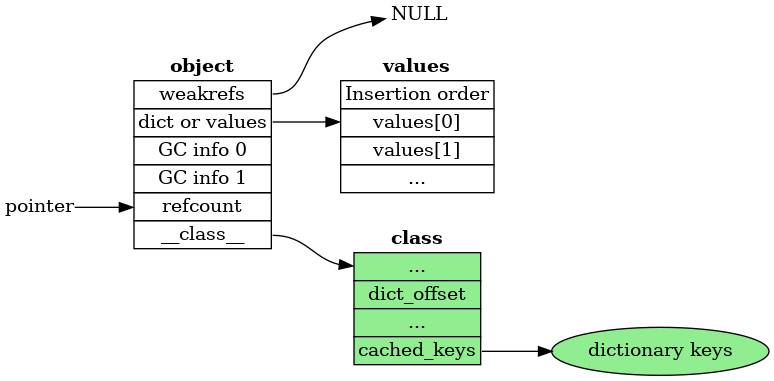
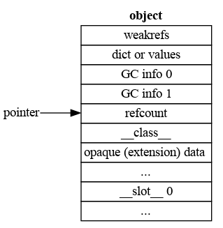

# Object layout

## Common header

Each Python object starts with two fields:

* ob_refcnt
* ob_type

which the form the header common to all Python objects, for all versions,
and hold the reference count and class of the object, respectively.

## Pre-header

Since the introduction of the cycle GC, there has also been a pre-header.
Before 3.11, this pre-header was two words in size.
It should be considered opaque to all code except the cycle GC.

## 3.11 pre-header

In 3.11 the pre-header was extended to include pointers to the VM managed ``__dict__``.
The reason for moving the ``__dict__`` to the pre-header is that it allows
faster access, as it is at a fixed offset, and it also allows object's
dictionaries to be lazily created when the ``__dict__`` attribute is
specifically asked for.

In the 3.11 the non-GC part of the pre-header consists of two pointers:

* dict
* values

The values pointer refers to the ``PyDictValues`` array which holds the
values of the objects's attributes.
Should the dictionary be needed, then ``values`` is set to ``NULL``
and the ``dict`` field points to the dictionary.

## 3.12 pre-header

In 3.12 the pointer to the list of weak references is added to the
pre-header. In order to make space for it, the ``dict`` and ``values``
pointers are combined into a single tagged pointer:

* weakreflist
* dict_or_values

If the object has no physical dictionary, then the ``dict_or_values``
has its low bit set to one, and points to the values array.
If the object has a physical dictionary, then the ``dict_or_values``
has its low bit set to zero, and points to the dictionary.

The untagged form is chosen for the dictionary pointer, rather than
the values pointer, to enable the (legacy) C-API function
`_PyObject_GetDictPtr(PyObject *obj)` to work.

## Layout of a "normal" Python object in 3.12:

* weakreflist
* dict_or_values
* GC 1
* GC 2
* ob_refcnt
* ob_type

For a "normal" Python object, that is one that doesn't inherit from a builtin
class or have slots, the header and pre-header form the entire object.

There are several advantages to this layout:

* It allows lazy `__dict__`s, as described above.
* The regular layout allows us to create tailored traversal and deallocation
  functions based on layout, rather than inheritance.
* Multiple inheritance works properly,
  as the weakrefs and dict are always at the same offset.

The full layout object, with an opaque part defined by a C extension,
and `__slots__` looks like this:

